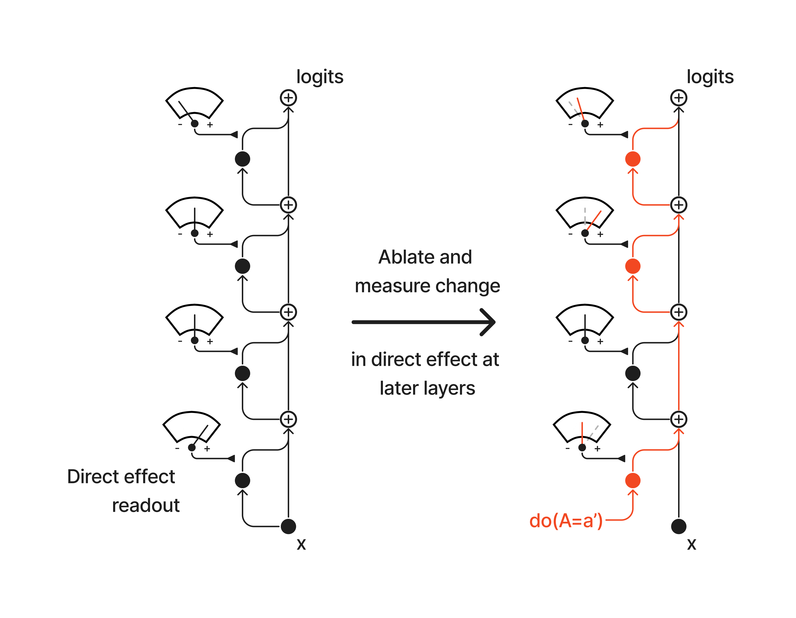
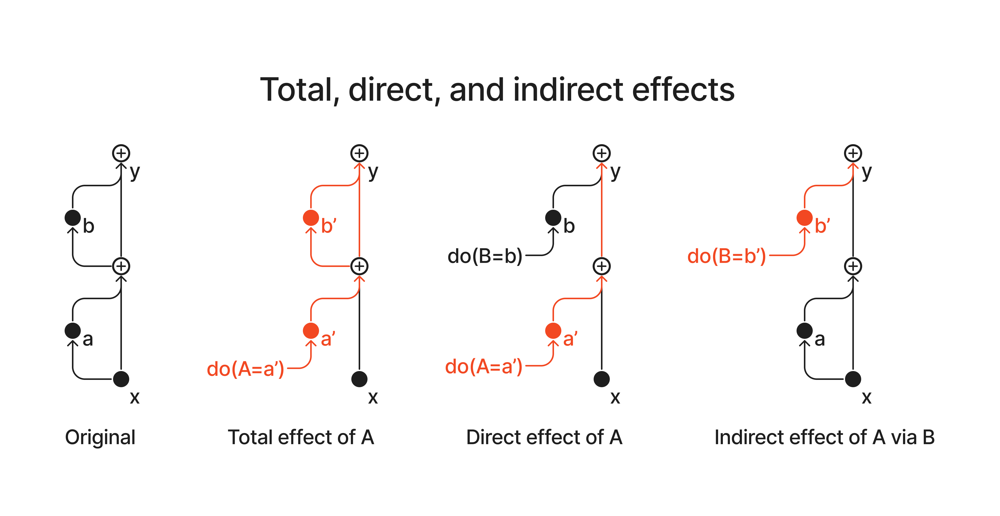
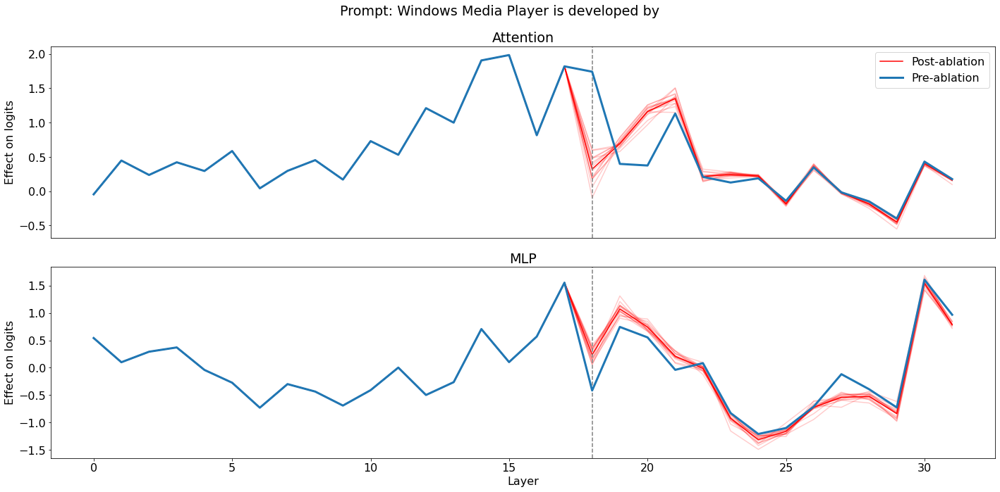
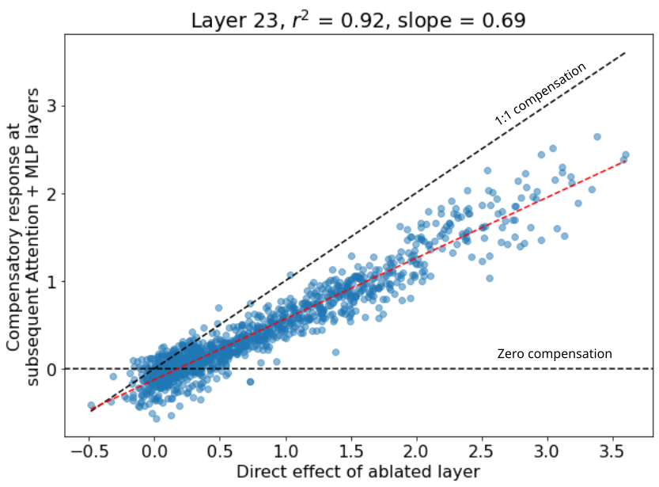

# Hydra Effect：删掉重要的层，模型为什么不塌？

> McGrath et al. 2023, *The Hydra Effect: Emergent Self-repair in Language Model Computations*（arXiv [2307.15771](https://arxiv.org/abs/2307.15771)，DeepMind）
> 好读版综述。技术细节见 `hydra-tech-core.md`。

---

## ① TL;DR

**一句话**：删掉一个对预测很关键的层，模型输出却几乎不变——因为**下游的层会自动顶上来补偿**。McGrath et al. 把这叫 **Hydra effect**：砍掉一个头，又长出一个头。

**为什么颠覆认知**：整个可解释性领域靠"**消融组件 → 看损失多大 → 定它有多重要**"来理解网络。self-repair 让这套系统性失灵——**越重要的组件，反而越可能对消融鲁棒**。于是"删了没事"不能推"这层没用"。

---

## ② 起点：一个反常观察

两把"重要性尺子"画在一起：

- **左**：每层输出接一个**表盘**——把该层输出投影到 logits 的读数 = **logit lens = 直接效应 $\Delta_{\text{unembed}}$**（"这层自己往正确答案写了多少"）。
- **右**：红色 `do(A=a')` 从底部消融掉一个组件、顺残差流往上染红，量下游读数的变化 = **消融 = 总效应 $\Delta_{\text{ablate}}$**（"删了之后实际亏多少"）。

直觉上 $\Delta_{\text{unembed}}$ 大的层删掉该很伤（$\Delta_{\text{ablate}}$ 也该大）。实测却反过来：删掉这些层，最终预测**几乎不动**，$\Delta_{\text{ablate}}$ 很小。

两把本该一致的尺子大面积**对不上**。整篇论文就是去搞清楚：**为什么对不上，以及它意味着什么。**

---

## ③ 两把尺子：脱钩长什么样

横轴 $\Delta_{\text{unembed}}$（直接效应）、纵轴 $\Delta_{\text{ablate}}$（总效应）；一个点 = 一个（层, prompt），颜色 = 层深。对角线 $y=x$ 是 **naive 基线**——三种关系的解读：

| 两把尺子的关系 | 散点位置 | 解读 |
|---|---|---|
| $\Delta_{\text{ablate}} \approx \Delta_{\text{unembed}}$ | 落在对角线上 | 删一层正好亏掉它自己写的、下游没反应 → 独立可加，**无自修复** |
| $\Delta_{\text{ablate}} > \Delta_{\text{unembed}}$ | 对角线**上方** | 删了比自己写的更亏 → **连累下游**（naive 以为普遍如此）|
| $\Delta_{\text{ablate}} < \Delta_{\text{unembed}}$ | 对角线**下方** | 删了没那么亏、下游顶上 → **自修复**（← 实测点云主体全在这）|

两把尺子的定义（都读正确 token $i$ 在 logit 上的值）：

- $\Delta_{\text{unembed},\,l} = \hat{u}(a^l_t)_i$ —— 第 $l$ 层输出**直接 unembed** 的读数。
- $\Delta_{\text{ablate},\,l} = \big[\hat{\pi}_t(x_{\leq t}\mid \mathrm{do}(A^l_t=\tilde{a}^l_t)) - \hat{\pi}_t(x_{\leq t})\big]_i$ —— **消融后** logit 的变化。

一句话：**该落在对角线上方的点，大面积压到了下方**——这就是"脱钩"的真身。

---

## ④ 给"脱钩"正名：TE = DE + IE

把网络当**因果图**（A = 被消融的层，B = 下游中介，y = 输出 logit），`do(·)` = 强行把某个节点钉死。三种效应 = 三种钉法：

- **总效应 TE**（= $\Delta_{\text{ablate}}$）：只钉 A，**下游 B 放开自由反应**，看 y 变多少。
- **直接效应 DE**（= $\Delta_{\text{unembed}}$）：钉 A 的同时**把 B 冻在干净值**，只留 A→y 直连。
- **间接效应 IE**：A 保持干净，只把 B 设成"A 被消融后它该有的值"，看绕道 A→B→y 那部分。
- 残差流线性 ⟹ **$TE = DE + IE$**。
  - ⚠️ 这个**精确相加靠线性**

**self-repair 的精确定义**：下游不是被动跟随，而是**反向补偿** → **IE 为负**，且大到抵掉大半 DE：

$$TE = DE + \underbrace{IE}_{<\,0} \;\ll\; DE$$

这正是 ③ 散点图上"点压到对角线**下方**"。一句话直觉：

> **净重要性 TE ＝ 自己直接写的 DE － 下游会替它补的**（后者记 $CE = -IE$）

---

## ⑤ 两种机制：接棒（Hydra） vs 松绑（erasure）

上图 = 消融第 18 层（竖虚线）后，**逐层直接效应**的前后对比：

- 两条线都是 logit lens 逐层读数：**蓝 = 消融前** $\Delta_{\text{unembed},l}$、**红 = 消融后重算** $\tilde{\Delta}^{18}_{\text{unembed},l}$；y 轴**不是**总损失 $\Delta_{\text{ablate}}$。
- **上游（虚线左）**：红蓝重合 → 消融不影响上游。
- **层 18（虚线处）**：红猛掉 → 这层自己的输出被替换掉了。
- **下游（虚线右）**：红蓝分开，**红 > 蓝 = 补偿**（$\Delta DE>0$）。Attention 层 19–21 红爬到蓝上 = 一个促进者长大顶替 = **接棒（Hydra）**。

> 注：这张只展示 Hydra 那半；erasure 是**深层 MLP 现象**，这里看不到，靠下表判据推断。

两种机制**同表象**（都让 $TE\approx0$、都是"红 > 蓝"的补偿），但**出发点相反**——判据 = **干净跑时那一项的符号**：

| 机制              | 干净跑 DE（蓝）     | 消融后（红）     | 一句话       |
| --------------- | ------------- | ---------- | --------- |
| **Hydra（接棒）**   | **正**（本就促进答案） | 更正（长大顶替）   | 促进者**变大** |
| **Erasure（松绑）** | **负**（本在压制答案） | 没那么负（放松压制） | 压制者**松开** |

> [!info] 两种机制来自因果框架
> 这两行不是拍脑袋——它们正是从 ④ 因果框架里**引申出的两个玩具母题**：同一个"$TE\approx 0$ 但 $DE\neq 0$"的指纹，可由两种最小结构产生（erasure 让中介抵消自己；self-repair 让中介从**旁路**取回真值）。详见 `hydra-tech-core.md` §3.4。

谁负责哪种，由**架构**决定：

- **Hydra 必须是 attention**：补回丢失的信息要**跨位置检索**，MLP 位置局部、够不着别的位置。
- **Erasure 多是 MLP**：压低当前 token = 位置局部操作，MLP 顺手；但 attention 也能压（IOI 负向头 / Copy Suppression）——**倾向，非铁律**。

---

## ⑥ 量化：补偿有多少、多稳、谁在补

把 ⑤ 里下游的"红 − 蓝"全加起来 = **CE**（一层 $m$ 被消融后的**总补偿**）：

$$CE(\tilde{a}^m, u) = \underbrace{\sum_{l=m+1}^{L}\Delta DE(a^l)}_{\text{下游 attention}} + \underbrace{\sum_{l=m}^{L}\Delta DE(m^l)}_{\text{下游 MLP}}, \qquad \Delta DE = \underbrace{\tilde{\Delta}^m_{\text{unembed},l}}_{\text{红}} - \underbrace{\Delta_{\text{unembed},l}}_{\text{蓝}}$$

按 attention / MLP 拆两半，正对应 ⑤ 的两种机制。跨 prompt 把 **CE 对 DE 做线性回归**，就得到全文的量化结论——两个数直接写在图标题上：

| 数 | 图上怎么看 | 含义 |
|---|---|---|
| **$R^2 = 0.92$** | 点贴红线有多紧 | 补偿是**系统性**的——不是碰巧，丢多少就成比例补多少 |
| **斜率 $= 0.69$** | 红线 vs 黑色 1:1 线 | 补偿**补不满**：只补回 ~70%，还漏 ~30% → $TE\neq 0$（所以消融仍留有信号）|

第三个数是**换班**（要看逐层图 `per_layer.png`）：补偿主力随深度换人——**早层 attention（Hydra）→ 深层 MLP（erasure）**。

---

## ⑦ 为什么研究self-repair重要

self-repair 不是趣闻——它同时动摇了"**用消融理解网络**"这套方法，和"**编辑/遗忘一个组件**"这类操作。三条，由远及近：

**① 动摇消融式可解释性的地基**

- 全领域套路："消融 → 看损失 → 定重要性"。self-repair 让它**系统性低估**——**越重要的组件越可能对消融鲁棒**。
- 所有基于消融的电路发现 / 归因（ACDC、attribution patching）都带这个偏差。
- 实例：IOI 的 **Backup Name Mover Heads**——主搬运头被消融，休眠的备份立刻顶上，主头看着"不重要"。

**② 归因 / 责任问题（actual causality）**

- 输出依赖某组件、但有备份顶替——**谁才是责任方**？
- 两刺客比方：甲开枪、乙备份。**「若无则无」检验**（"要不是甲，人就不死吗？"——即消融）说甲无责（乙会顶上）；**实际因果**（先摁住乙不开枪、再问甲）说甲有责——**DE 正是"摁住备份"的那种度量**。
- 安全上：要监控 / 移除某行为，得找**整个冗余责任集**，只盯主组件会漏。

**③ 模型编辑 / unlearning 的直接杀伤**

- 从某处删掉一个知识 / 行为，**self-repair 可能从别处补回来**——编辑很浅、能被微调或换问法翻回。
- unlearning 的著名失败模式：**表面遗忘、实为压制**，可被越狱恢复；self-repair 给了机制解释。
- erasure 的实例 = **Copy Suppression heads**：消融一个抑制头，反而让行为**增强**。

---
