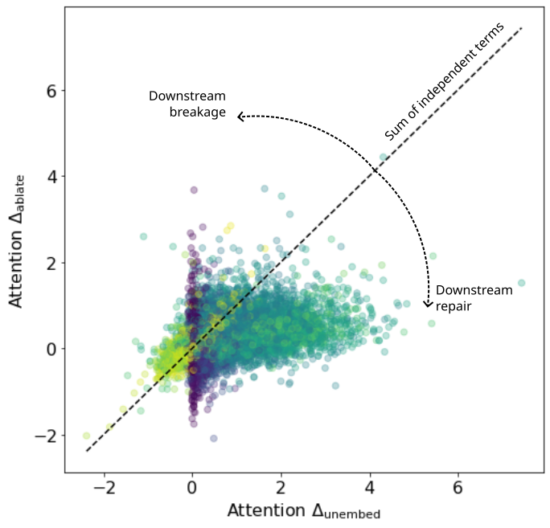
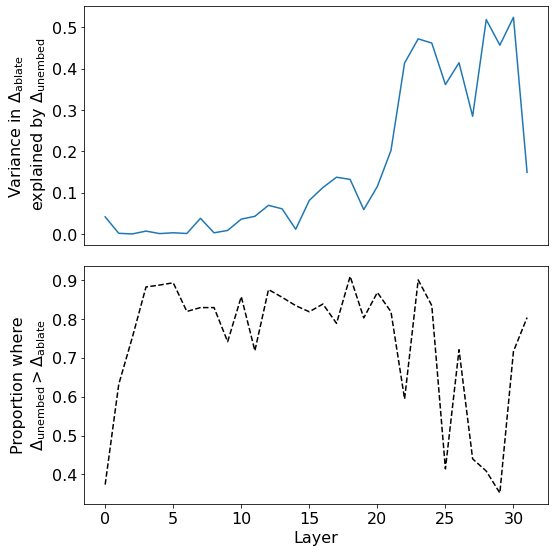
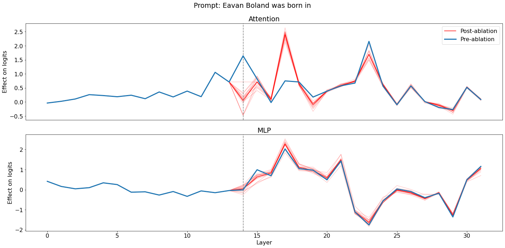

# Hydra Effect · 技术内核笔记

> McGrath et al. 2023,*The Hydra Effect: Emergent Self-repair in Language Model Computations*(arXiv 2307.15771,DeepMind)
> 自用笔记,逐章推进。当前:**§2 观察层**。好读版 summary 留到最后再写。

---

## §2 观察:两种"层重要性"测法互相矛盾

**setup**:任务 = 事实召回(Counterfact,1209 条),prompt = 主语+关系,如 `"Honus Wagner professionally plays the sport of ___"`。目标 token `i = argmax_j [π_t]_j` = 模型自己最想预测的 token(此例 `baseball`)。所有 Δ 都盯这一个 token 的中心化 logit(`π̂ = π − mean_V(π)`)。只用模型答对的 prompt。

### 两个 Δ

对每层 l(attention `a^l_t` 或 MLP `m^l_t`)各量一个数:

**`Δ_unembed`(= 直接效应,logit lens)**:这层自己往答案写了多少。

$$\Delta_{\mathrm{unembed},\,l} = \hat{u}(a^l_t)_i,\qquad \hat u(z)=\Big(\tfrac{z}{\sigma}GW_U\Big)-\mathrm{mean}$$

- σ = RMSNorm 缩放因子,**固定为前向传播时的值** → logits 对各层输出线性 → 单独投影一层 = 直接效应(证明见 §3)。

**`Δ_ablate`(= 总效应,消融)**:真敲掉这层,输出损失多少。

$$\Delta_{\mathrm{ablate},\,l} = \big[\hat{\pi}_t(x_{\leq t}\mid \mathrm{do}(A^l_t = \tilde a^l_t)) - \hat{\pi}_t(x_{\leq t})\big]_i$$

- `do(A^l_t=ã)`:整层输出换成 `ã`,影响自由级联到末端(→ 含下游补偿 → 总效应)。
- `ã` = **resample 消融**:取 15 条别的 prompt 在同层同位置的真实激活,**平均效应**(非平均激活)。不用置零(对无 dropout 模型分布外)、不用均值(平均出的向量本身可能离流形)。

> ⚠️ 符号:定义式 `after−before`,促进层为**负**;但图里按"正=促进"画(即降幅 `before−after`),和 `Δ_unembed` 同向。看**带符号**值,别取绝对值——负号 = erasure/负向层。

### naive expectation vs 观察

- **naive**:重要的层"自己写得多"(`Δ_unembed` 大)就该"敲掉损失大"(`Δ_ablate` 大)→ 两者正相关,且 `Δ_ablate ≥ Δ_unembed`(敲掉还连累下游)。
- **实测**:两者在**除最晚几层外**几乎不相关,且大多 `Δ_unembed > Δ_ablate`(方向反了)。

**图 2c**(所有 attention 层 × 所有 prompt 的散点,颜色=层号,紫=浅→黄=深):



- x=`Δ_unembed`,y=`Δ_ablate`,对角虚线 `y=x` = "无下游反应"基线。
- **线下方 = downstream repair(自修复)**:自己写得多但敲掉不疼 → 下游补了。点云主体压在**线下方偏右** → 自修复是常态。
- 线上方 = downstream breakage(敲掉连累下游)。
- 紫点(浅层)挤在 x≈0(浅层几乎不直接写 logit);绿点(中层)向右铺开(direct 随深度增大)。

**图 2d**(逐层量化):



- 上:`Δ_ablate` 被 `Δ_unembed` 线性解释的方差 R²(= 一元回归决定系数 = Pearson²)。中前层≈0(**脱钩**),晚层升到 ~0.5(**挂钩**,因为后面没层可补)。
- 下:`Δ_unembed > Δ_ablate` 的 prompt 比例。多数层 0.75–0.9(**方向反了**,与 naive 相反)。
- ⚠️ 别和 §4 图 4 混:图 2d 是 direct vs **总效应**;图 4 是 direct vs **补偿效应**。

### 定位法:哪个下游层在补偿?`Δ̃ᵏ_unembed,l`

思路:消融第 k 层,**逐层重算 direct**,看谁变了。

$$\tilde{\Delta}^k_{\mathrm{unembed},\,l} = u\big(a^l_t \mid \mathrm{do}(A^k_t = \tilde a^k_t)\big)$$

- clean run:算全层 `Δ_unembed,l`(不消融)。
- layer-k ablation run:只消融 k,重算每层 direct = `Δ̃ᵏ_unembed,l`。
- 前馈网两条干净性质:
  - l 不在 k 下游 → `Δ̃ᵏ = Δ_unembed`(不变);
  - l = k → `Δ̃ᵏ ≈ 0`(自己被消融;≈ 因 resample 有噪声)。
  - ⟹ **任何变化只可能在 k 的下游**,搜索范围锁死。

读出:对下游 l,`Δ̃ᵏ > Δ_unembed`(direct 变大)= **Hydra**(接棒层);direct 被衰减 = **erasure MLP** 放松压制。

**图 3 实例**(prompt: "Eavan Boland was born in",上=attention 下=MLP):



- 纵轴 = 每层直接效应;**蓝=pre-ablation `Δ_unembed`**,**红=post-ablation `Δ̃ᵏ`**(淡红=15 个 patch,粗红=均值)。
- **虚线(第 14 层)= 消融层 = 红蓝分叉点**:
  - 左边(上游)红≡蓝(消融影响不到上游);
  - 第 14 层本身蓝~1.6→红~0(`l=k → Δ̃≈0`);
  - 右边(下游)才分开。
- **红>蓝 = 自修复(Hydra)**:第 17 层蓝~0.75→红~2.4,接棒补偿。红<蓝 = 该层变弱。
- 效应**局部**(只个别下游层大变,非全网崩);MLP 面板红蓝大体贴合(此例 erasure 衰减不明显)。
- 作者强调:此处仍是 **anecdotal**,严格化 → §3,全数据集量化 → §4。

#### 代码走查(怎么跑出上面这张图)

> 论文用 DeepMind 内部 Chinchilla + JAX,**无官方开源**;下面用本地 `code/Easy-Transformer` 真实 API 示意(可跑 GPT-2 类模型)。hook 点:`blocks.{k}.hook_attn_out` = 第 k 层 attention 整层输出(即 `a^k_t`)。

**① clean run(蓝线)**:不消融,读每层直接效应。

```python
tokens = model.to_tokens("Eavan Boland was born in")
t = -1                                     # 目标位置 = 最后一个 token
clean_logits, clean_cache = model.run_with_cache(tokens)
i = clean_logits[0, t].argmax()            # 目标 token = 模型 argmax

def logit_lens(vec):                       # 直接效应 = 该层输出单独过 unembedding
    normed = model.ln_final(vec)           # σ 固定为前向传播值(见 §3)→ 线性
    logits = normed @ model.W_U
    return (logits - logits.mean(-1, keepdim=True))[..., i]   # 中心化 + 取目标 token

delta_unembed = {l: logit_lens(clean_cache[f"blocks.{l}.hook_attn_out"][0, t])
                 for l in range(model.cfg.n_layers)}          # 蓝线 Δ_unembed,l
```

**② resample 配方**:替换值取自另一条真实 prompt(实际循环 15 条取均值)。

```python
_, alt_cache = model.run_with_cache(model.to_tokens("Miles Davis played the "))
```

**③ layer-k ablation run(红线)**:第 k 层插 resample hook,再读每层直接效应。

```python
k = 14                                     # = 图里虚线
def resample_ablate(attn_out, hook):       # ← 这就是 resample ablation
    attn_out[0, t] = alt_cache[hook.name][0, t]   # 只覆写最后位置,其余不动
    return attn_out

_, abl_cache = model.run_with_cache(        # 一次 run = 一次 "layer-14 ablation run"
    tokens, fwd_hooks=[(f"blocks.{k}.hook_attn_out", resample_ablate)])

delta_tilde = {l: logit_lens(abl_cache[f"blocks.{l}.hook_attn_out"][0, t])
               for l in range(model.cfg.n_layers)}            # 红线 Δ̃^k_unembed,l
```

**④ 两条相减,找 Hydra**:只看下游 `l>k`,红>蓝即接棒层。

```python
for l in range(k+1, model.cfg.n_layers):
    if delta_tilde[l] - delta_unembed[l] > 0:   # 红>蓝 = 顶上来补 = Hydra
        print(f"layer {l}: {delta_unembed[l]:.2f} → {delta_tilde[l]:.2f}")
# boland 图会打印出 layer 17: 0.75 → 2.4
```

**概念 ↔ 代码**:

| 论文概念 | 代码 |
|---|---|
| resample ablation(换成什么值) | `attn_out[0,t] = alt_cache[...][0,t]` |
| layer-k ablation run(在 k 层跑一趟) | `run_with_cache(..., fwd_hooks=[(f"blocks.{k}.hook_attn_out", resample_ablate)])` |
| 只干预最后位置 | 只写 `[0, t]`,`t=-1`;其余位置/层不动 |
| 平均 15 个 patch | 对 15 条 `alt` 循环,`delta_tilde` 取均值(淡红→粗红) |
| clean / ablation run | 蓝线 `delta_unembed` / 红线 `delta_tilde` |
