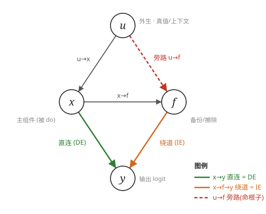
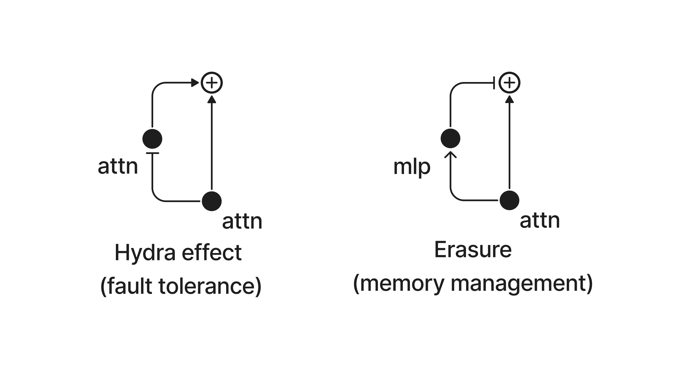

 # Hydra Effect · 技术内核笔记

> McGrath et al. 2023,*The Hydra Effect: Emergent Self-repair in Language Model Computations*(arXiv 2307.15771,DeepMind)
> 自用笔记,逐章推进。当前:**§2 观察层**。好读版 summary 留到最后再写。

---

## §2 观察:两种"层重要性"测法互相矛盾

**setup**:任务 = 事实召回(Counterfact,1209 条),prompt = 主语+关系,如 `"Honus Wagner professionally plays the sport of ___"`。目标 token `i = argmax_j [π_t]_j` = 模型自己最想预测的 token(此例 `baseball`)。所有 Δ 都盯这一个 token 的中心化 logit(`π̂ = π − mean_V(π)`)。只用模型答对的 prompt。

### 两个 Δ

对每层 l(attention `a^l_t` 或 MLP `m^l_t`)各量一个数:

**`Δ_unembed`(= 直接效应,logit lens)**:这层自己往答案写了多少。

$$\Delta_{\mathrm{unembed},\,l} = \hat{u}(a^l_t)_i,\qquad \hat u(z)=\Big(\tfrac{z}{\sigma}GW_U\Big)-\mathrm{mean}$$

- σ = RMSNorm 缩放因子,**固定为前向传播时的值** → logits 对各层输出线性 → 单独投影一层 = 直接效应(证明见 §3)。

**`Δ_ablate`(= 总效应,消融)**:真敲掉这层,输出损失多少。

$$\Delta_{\mathrm{ablate},\,l} = \big[\hat{\pi}_t(x_{\leq t}\mid \mathrm{do}(A^l_t = \tilde a^l_t)) - \hat{\pi}_t(x_{\leq t})\big]_i$$

- `do(A^l_t=ã)`:整层输出换成 `ã`,影响自由级联到末端(→ 含下游补偿 → 总效应)。
- `ã` = **resample 消融**:取 15 条别的 prompt 在同层同位置的真实激活,**平均效应**(非平均激活)。不用置零(对无 dropout 模型分布外)、不用均值(平均出的向量本身可能离流形)。

> ⚠️ 符号:定义式 `after−before`,促进层为**负**;但图里按"正=促进"画(即降幅 `before−after`),和 `Δ_unembed` 同向。看**带符号**值,别取绝对值——负号 = erasure/负向层。

### naive expectation vs 观察

- **naive**:重要的层"自己写得多"(`Δ_unembed` 大)就该"敲掉损失大"(`Δ_ablate` 大)→ 两者正相关,且 `Δ_ablate ≥ Δ_unembed`(敲掉还连累下游)。
- **实测**:两者在**除最晚几层外**几乎不相关,且大多 `Δ_unembed > Δ_ablate`(方向反了)。

**图 2c**(所有 attention 层 × 所有 prompt 的散点,颜色=层号,紫=浅→黄=深):


- x=`Δ_unembed`,y=`Δ_ablate`,对角虚线 `y=x` = "无下游反应"基线。
- **线下方 = downstream repair(自修复)**:自己写得多但敲掉不疼 → 下游补了。点云主体压在**线下方偏右** → 自修复是常态。
- 线上方 = downstream breakage(敲掉连累下游)。
- 紫点(浅层)挤在 x≈0(浅层几乎不直接写 logit);绿点(中层)向右铺开(direct 随深度增大)。

**图 2d**(逐层量化):


- 上:`Δ_ablate` 被 `Δ_unembed` 线性解释的方差 R²(= 一元回归决定系数 = Pearson²)。中前层≈0(**脱钩**),晚层升到 ~0.5(**挂钩**,因为后面没层可补)。
- 下:`Δ_unembed > Δ_ablate` 的 prompt 比例。多数层 0.75–0.9(**方向反了**,与 naive 相反)。
- ⚠️ 别和 §4 图 4 混:图 2d 是 direct vs **总效应**;图 4 是 direct vs **补偿效应**。

### 定位法:哪个下游层在补偿?`Δ̃ᵏ_unembed,l`

思路:消融第 k 层,**逐层重算 direct**,看谁变了。

$$\tilde{\Delta}^k_{\mathrm{unembed},\,l} = u\big(a^l_t \mid \mathrm{do}(A^k_t = \tilde a^k_t)\big)$$

- clean run:算全层 `Δ_unembed,l`(不消融)。
-   = `Δ̃ᵏ_unembed,l`。
- 前馈网两条干净性质:
  - l 不在 k 下游 → `Δ̃ᵏ = Δ_unembed`(不变);
  - l = k → `Δ̃ᵏ ≈ 0`(自己被消融;≈ 因 resample 有噪声)。
  - ⟹ **任何变化只可能在 k 的下游**,搜索范围锁死。

读出:对下游 l,`Δ̃ᵏ > Δ_unembed`(direct 变大)= **Hydra**(接棒层);direct 被衰减 = **erasure MLP** 放松压制。

**图 3 实例**(prompt: "Eavan Boland was born in",上=attention 下=MLP):


- 纵轴 = 每层直接效应;**蓝=pre-ablation `Δ_unembed`**,**红=post-ablation `Δ̃ᵏ`**(淡红=15 个 patch,粗红=均值)。
- **虚线(第 14 层)= 消融层 = 红蓝分叉点**:
  - 左边(上游)红≡蓝(消融影响不到上游);
  - 第 14 层本身蓝~1.6→红~0(`l=k → Δ̃≈0`);
  - 右边(下游)才分开。
- **红>蓝 = 自修复(Hydra)**:第 17 层蓝~0.75→红~2.4,接棒补偿。红<蓝 = 该层变弱。
- 效应**局部**(只个别下游层大变,非全网崩);MLP 面板红蓝大体贴合(此例 erasure 衰减不明显)。
- 作者强调:此处仍是 **anecdotal**,严格化 → §3,全数据集量化 → §4。

#### 代码走查(怎么跑出上面这张图)

> 论文用 DeepMind 内部 Chinchilla + JAX,**无官方开源**;下面用本地 `code/Easy-Transformer` 真实 API 示意(可跑 GPT-2 类模型)。hook 点:`blocks.{k}.hook_attn_out` = 第 k 层 attention 整层输出(即 `a^k_t`)。

**① clean run(蓝线)**:不消融,读每层直接效应。

```python
tokens = model.to_tokens("Eavan Boland was born in")
t = -1                                     # 目标位置 = 最后一个 token
clean_logits, clean_cache = model.run_with_cache(tokens)
i = clean_logits[0, t].argmax()            # 目标 token = 模型 argmax

def logit_lens(vec):                       # 直接效应 = 该层输出单独过 unembedding
    normed = model.ln_final(vec)           # σ 固定为前向传播值(见 §3)→ 线性
    logits = normed @ model.W_U
    return (logits - logits.mean(-1, keepdim=True))[..., i]   # 中心化 + 取目标 token

delta_unembed = {l: logit_lens(clean_cache[f"blocks.{l}.hook_attn_out"][0, t])
                 for l in range(model.cfg.n_layers)}          # 蓝线 Δ_unembed,l
```

**② resample 配方**:替换值取自另一条真实 prompt(实际循环 15 条取均值)。

```python
_, alt_cache = model.run_with_cache(model.to_tokens("Miles Davis played the "))
```

**③ layer-k ablation run(红线)**:第 k 层插 resample hook,再读每层直接效应。

```python
k = 14                                     # = 图里虚线
def resample_ablate(attn_out, hook):       # ← 这就是 resample ablation
    attn_out[0, t] = alt_cache[hook.name][0, t]   # 只覆写最后位置,其余不动
    return attn_out

_, abl_cache = model.run_with_cache(        # 一次 run = 一次 "layer-14 ablation run"
    tokens, fwd_hooks=[(f"blocks.{k}.hook_attn_out", resample_ablate)])

delta_tilde = {l: logit_lens(abl_cache[f"blocks.{l}.hook_attn_out"][0, t])
               for l in range(model.cfg.n_layers)}            # 红线 Δ̃^k_unembed,l
```

**④ 两条相减,找 Hydra**:只看下游 `l>k`,红>蓝即接棒层。

```python
for l in range(k+1, model.cfg.n_layers):
    if delta_tilde[l] - delta_unembed[l] > 0:   # 红>蓝 = 顶上来补 = Hydra
        print(f"layer {l}: {delta_unembed[l]:.2f} → {delta_tilde[l]:.2f}")
# boland 图会打印出 layer 17: 0.75 → 2.4
```

**概念 ↔ 代码**:

| 论文概念 | 代码 |
|---|---|
| resample ablation(换成什么值) | `attn_out[0,t] = alt_cache[...][0,t]` |
| layer-k ablation run(在 k 层跑一趟) | `run_with_cache(..., fwd_hooks=[(f"blocks.{k}.hook_attn_out", resample_ablate)])` |
| 只干预最后位置 | 只写 `[0, t]`,`t=-1`;其余位置/层不动 |
| 平均 15 个 patch | 对 15 条 `alt` 循环,`delta_tilde` 取均值(淡红→粗红) |
| clean / ablation run | 蓝线 `delta_unembed` / 红线 `delta_tilde` |

---

## §3 因果框架:给两个 Δ 焊上严格定义

目的一句话:**把 §2 经验性的两个 Δ,升级成因果推断里有严格定义的效应,证明"脱钩"是机制而非 bug。** §4 的量化(CE、92%、70%)全建在这套定义上。

### 铺垫:计算图 = 因果图(SCM)

把网络当**结构因果模型** `M = ⟨U, V, F, P(u)⟩`:

- **外生变量 U**:输入 tokens(prompt)。**无入边**——网络内部没有任何东西决定它,只由外部 `P(u)` 给定。"源头在模型之外"。
- **内生变量 V**:所有激活(`z, a, m`)+ 输出 `π`。每个由结构方程 `v_i = f_i(pa_i)` 算出(`f_i` = 那层的计算);祖先最终都追溯到 U。
- **边**:`X_i → X_j` ⟺ `X_i` 是 `X_j` 的父节点。**前向计算图本身就是因果图**。自回归掩码 → 位置 `t₁>t₂` 不是 `t₂` 的父节点(信息只从早→晚流)。

**干预 `do(Z=z')`**(消融就是它):

1. 把 `Z` 的结构方程换成常数 `z'`(**钉死**);
2. **切断指向 Z 的入边** → parent 再影响不了它;
3. **保留 Z 的出边** → 被钉死的值继续往下游传 → 照常前向。

> ⚠️ `do` ≠ 条件。`do(Z=z')` = **主动强制**、对图动手术("我强行把它掰成这样");`Z=z'` = 被动观测、不改图("碰巧看到它是这样")。消融是前者。

> ⚠️ 声明:不是说网络在对数据做因果推理,只是它的**前向结构**可当因果图分析。框架对一般前馈网通用,**变的只是图**(→ 迁移 TFM 时框架照用,图要重画)。

### 3.2 三种效应 + 两个等价证明

统一句式:**先 `do`(掰一处)+ 再规定"下游中介能否自由反应"。**


- **总效应 TE** `= Y(u|do(Z=z')) − Y(u|do(Z=z))`:掰完**下游全放开**。→ **证明 = `Δ_ablate`**(消融)。
- **直接效应 DE** `= Y(u|do(Z=z', M=m(u))) − Y(u|do(Z=z))`:掰完**把中介 M 冻在干净值**,只留残差直连。→ **证明 ≈ `Δ_unembed`**(logit lens)。
  - `M`(大写)≠ MLP!是 `M = V\{Z,Y}` = **除 Z 和输出外的所有中介变量**;`m(u)` = 它们的 clean 值。
  - 结构事实:LM 里**只有同 token 位置、经残差直连输出的单元才有直接效应**;跨位置必经 attention 中介 → 属间接。
  - 证明靠 unrolled view:`z^L = Σ_l(m^l + a^l)`,固定 σ → logits 对各层输出**线性** → 敲 `a^l` 的 DE = `u(ã^l)_i − u(a^l)_i`,与 `Δ_unembed` 只差 `u(ã^l)_i`(resample 选好可忽略,zero-ablation 时=0)。
- **间接效应 IE** `= Y(u|do(Z=z, M=m̃)) − Y(u|do(Z=z))`:Z 留干净、**中介换成消融值 `m̃`**,只放行绕道中介的路。

**可加性**:残差网线性(固定 σ)⟹ **`TE = DE + IE`**(配对参照:DE 冻 M 在旧值 `m`,IE 设 M 为新值 `m̃`,拼起来不重不漏)。一般非线性模型会多一个交互项,**本文靠线性化才精确相加**(→ 迁移 TFM 要重验)。

> **自修复 ⟺ IE 与 DE 反号**:DE 大(自己写得多)但下游补偿使 IE 为负,`TE = DE+IE ≪ DE` → 脱钩。Hydra 的 IE 来自下游 attention 顶上,erasure 的 IE 来自下游 MLP 松绑。
>
> 和 IOI 的联系:IOI 的 **path patching** 与 IE 同属"路径限定效应"——机械动作都是"冻其余、放行一条路";区别在粒度:DE/IE 是**二分**(直连 vs 全部中介),path patching 是**单条边**。IE ≈ "对所有非直连路径打包做 path patching"。

### 3.3 干预神经网络:机遇与挑战(方法论自省)

NN 因果分析与现实世界**几乎相反**:

- **机遇**:完全已知模型(精确到参数)、可任意快速干预、可同时读所有变量。
- **挑战**:参数巨量、单元无明显语义、正确分析单元不清楚(superposition)。
- **结论**:所以在**"层"粒度**做消融,并坦承可能太粗。(这解释了 Hydra 层级 vs IOI 头级的差别。)

### 3.4 玩具母题:erasure vs self-repair(点睛)

最简模型:`x(u)=u`,`y = x + f(x,u)`。问:**什么 `f` 让 `do(x=0)` 的总效应=0**?两解:

**对应的因果图**(4 节点 5 边):`u` 外生;`x`(=u,identity)、`f`、`y` 内生。



- 从 x 到 y **两条路**:`x→y`(直连=DE)、`x→f→y`(绕道中介=IE);两条都放开 = TE。
- **命根子 `u→f`**:f 有一条**独立到真值 u 的旁路**。`do(x=0)` 切断的是 `u→x`,但 `u→f` 还在 → 主组件被敲后 f 仍知道正确答案(self-repair 的 `f=u` 才有据)。

**母题一 · Erasure(`f = −x`,常开负反馈)**

自然态基线:y自然 = **0**。效应 = 本场景 y − y自然。

| 场景 | y 的计算 | 本场景 y 值 | 效应 = 本场景 y − y自然(=0) |
|---|---|---|---|
| 自然态(x=u,f=−u) | `u + (−u)` | **0** | —(这就是基线) |
| `do(x=0)`,**TE**(f 自由 → f=−0=0) | `0 + 0` | 0 | TE = 0 − 0 = **0** |
| `do(x=0)`,**DE**(f 冻在自然值 −u) | `0 + (−u)` | −u | DE = (−u) − 0 = **−u** |

x 与 f 当场抵消,**输出钳到 0**;敲 x 后抵消力随之松绑 → TE=0。

**母题二 · Self-repair(`f = u if x≠u else 0`,潜伏备份)**

自然态基线:y自然 = **u**。效应 = 本场景 y − y自然。

| 场景 | y 的计算 | 本场景 y 值 | 效应 = 本场景 y − y自然(=u) |
|---|---|---|---|
| 自然态(x=u,f 睡=0) | `u + 0` | **u** | —(这就是基线) |
| `do(x=0)`,**TE**(x≠u → f 醒=u) | `0 + u` | u | TE = u − u = **0** |
| `do(x=0)`,**DE**(f 冻在自然值 0) | `0 + 0` | 0 | DE = 0 − u = **−u** |

f 平时睡着(y=u 正常),敲 x 才醒来**还原**到 u → TE=0。



**异同**:两者都 **TE=0 而 DE=−u**(同一个脱钩),但——

| | Erasure | Self-repair |
|---|---|---|
| `f` 状态 | 常开(一直抵消) | 潜伏(受扰才启动) |
| 达成 TE=0 靠 | 抵消力松绑 | 备份主动补上 |
| 自然态输出 | 钳到 **0** | 还原到 **u**(功能正常) |

**映射真实网络**:

- **Self-repair 母题 ⟺ Hydra ⟺ IOI Backup Name Mover**(潜伏备份,主头砍才顶上)。
- **Erasure 母题 ⟺ 晚期 erasure MLP ⟺ IOI Negative Name Mover**(常开负反馈,压低最优 token;上游被砍则松绑)。

**迁移**:TFM 上测到某组件 `TE≈0 但 DE≠0` 就落进此框;再看它是"常开负反馈"还是"潜伏备份"即可归类。判据极简——**DE 与 TE 脱钩**就是入场券,不需先懂整个电路。
