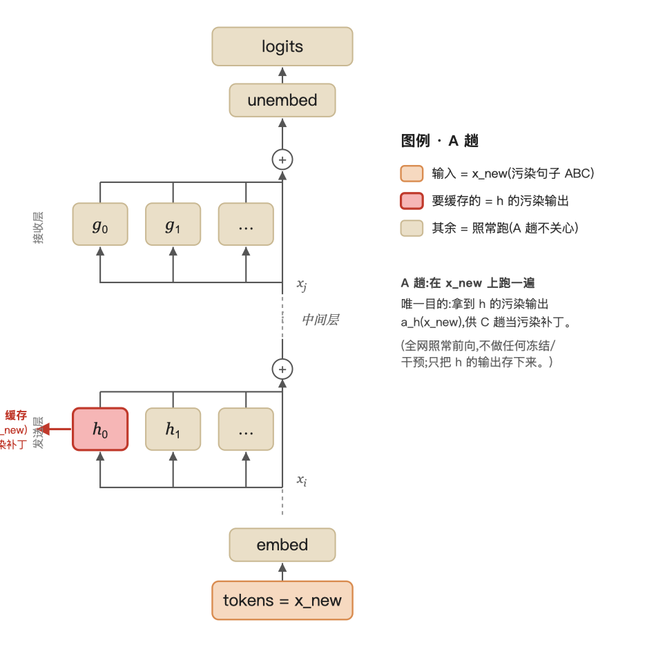
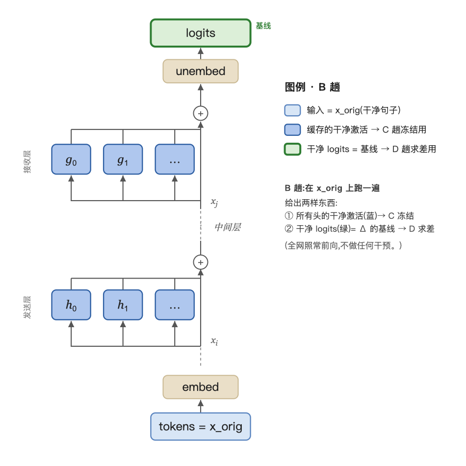
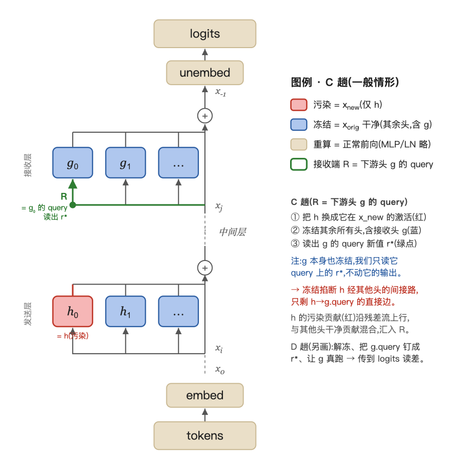
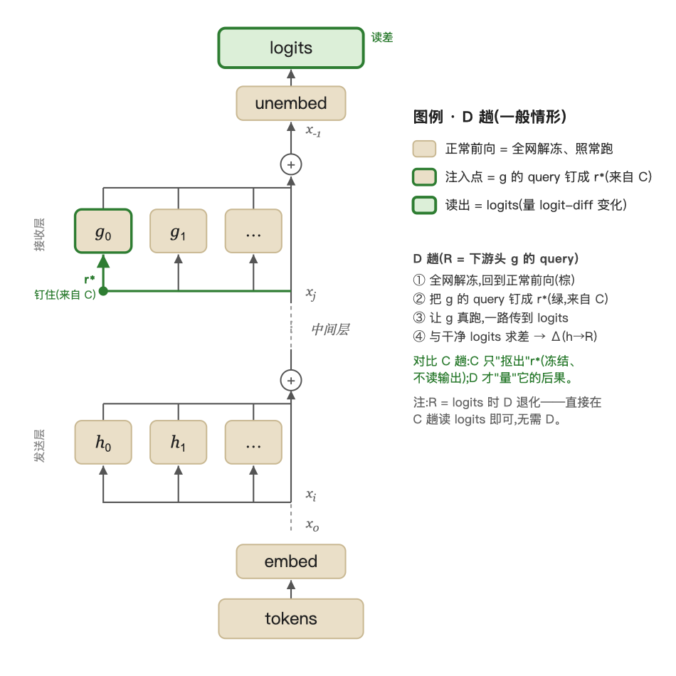

# IOI 技术内核:如何发现并验证一个计算子图

> Wang et al. 2022 (2211.00593) 技术主线精炼版。
> 鸟瞰导读 → [[01-ioi-circuit-wang2022]];详细问答 → [[_scratch-ioi-layer1-concepts]]、[[_scratch-ioi-layer2-path-patching]]。

## 0. 目的

逆向工程 GPT-2 small 完成 IOI 任务("When Mary and John... John gave a drink to __" → Mary)的机制,还原成一张人类可读的计算子图(电路)。两个目的,也对应两类技术:

- **发现**:把电路找出来(path patching…)。
- **验证**:证明它是对的、不是编的(faithfulness / completeness / minimality)。

## 1. 图与子图

- **节点** = (注意力头, token 位置)。同一个头在不同位置做的事可能完全不同。
- **边** = 一个节点向残差流写入、另一个节点从残差流读取(Q/K/V composition)。
  - 残差流线性可加 → 每条边是下游某个 Q/K/V 输入里的一个可分离加数。
  - 三种边:进 **Q/K**(改它往哪看)、进 **V**(改它搬什么)。
- **电路 $C$** = 节点子集的 induced 子图。
- **约定**:只有注意力头可切换(可被消融 / 纳入电路);MLP / LN / 嵌入始终保留,不参与电路。

## 2. knockout:把子图变成可计算的行为 $C(x)$

- **问题**:子图(节点集)本身不是函数、没有输出——"$C$ 算什么"还没定义。
- **解法**:跑完整模型 $M$,把补集 $M\setminus C$ 全部消融,输出定义为 $C(x)$:
	- $C(x) \triangleq M\big(x \mid \mathrm{do}(v=\bar v),\ \forall v\in M\setminus C\big)$
	- 其中 $\bar v = \mathbb{E}_{x'\sim p_{\text{ABC}}}\big[v(x')\big]$ = 节点 $v$ 在 $p_{\text{ABC}}$ 上的均值;$\mathrm{do}(v=\bar v)$ = 前向传播时把 $v$ 强行覆盖成 $\bar v$(因果干预,非观察)。
- **怎么消融**:
  - **零消融**:直接删节点跑 = 把它写成 $0$。但 $0$ 分布外、且误伤恒定基线 → 噪声大。
  - **均值消融 over $p_{\text{ABC}}$**(推荐):换成 $p_{\text{ABC}}$ 上的平均激活 → 只抹掉任务信息、保留语法基线、不把下游推到 OOD。被移除的头"还在正常范围,只是不再携带任务特定信息"。
    - **note($p_{\text{ABC}}$ 干嘛用)**:把原句两个名字(IO 和重复的 S)换成三个互不相同的随机名字 A/B/C → 句子里没有名字被重复、也没有唯一答案。于是"该输出哪个名字""有名字重复"这些任务信号会被平均掉。选它而非 $p_{\text{IOI}}$,正因为这些信号在 $p_{\text{IOI}}$ 里恒定、抹不掉。

## 3. 打分 $F(C)$

$$F(C) = \mathbb{E}_{x\sim p_{\text{IOI}}}\big[\text{logit diff}(C(x))\big],\qquad \text{logit diff} = \text{logit(IO)} - \text{logit(S)}$$

- 取差 → 只留 IO vs S 的较量,抵消掉同时抬高两者的通用信号。
- $x\sim p_{\text{IOI}}$:从 IOI 句子分布(15 模板 × 随机名字/地点/物品)采样一条句子。
- $F(C)$ 越接近完整模型 $F(M)$,子图越能完成 IOI;发现与验证共用这同一把尺子。

---

## 4. 发现:path patching

> 详细四趟机制 + 数学推导 + 类比 → [[_scratch-ioi-path-patching-detailed]]

### 4.0 为什么普通消融不够

消融是**节点操作**(关掉一个头),而电路是一张**图**——我们真正要的是"谁喂给谁"这种**边**的信息。逐个消融只能告诉你"哪些头重要",给不了边,和"还原一张图"的目标根本不匹配。→ 需要一个能做**边级**因果归因的工具:path patching。

> (还有两条更深的理由——混淆直接/间接、被自修复误导——留待读完 Hydra 再补;见 scratch。)

### 4.1 机制(两段式)

**目的**:测头 $h$ 对接收端 $R$ 的**直接(边级)效应**——而非"消融 $h$ 看 logits"那种混了直接+间接的**总效应**。

**要素**:sender $h$、receiver $R$、一对句子 $x_{\text{orig}}$(干净)/ $x_{\text{new}}$(污染 ABC)。先各跑一遍缓存激活(略)。

> **记号**:
> - $a_X$ = 节点 $X$ 的**输出激活**(向量);上标 $^{\text{orig}}/^{\text{new}}$ = 在干净/污染输入上取的值,如 $a_h^{\text{new}} = a_h(x_{\text{new}})$。
> - $\pi$ = 模型输出的 **logits 向量**;$M(\cdot)$ = 整个模型(输入 → logits)。
> - $\mathcal H$ = 全部注意力头;$r^\ast$ = 接收端 $R$ 被干预后的新值。

- **C 趟(抠)**:$x_{\text{orig}}$ 上,$h$ 换成它在 $x_{\text{new}}$ 的激活、**冻结其他所有头在干净值**、重算 → 读出 $R$ 的新值 $r^\ast$。冻结掐断了 $h$ 经其他头的**间接路**,故 $R$ 的变化只来自 $h\to R$ 这条**直接边**。

$$r^\ast = a_R\big(x_{\text{orig}} \mid \mathrm{do}(h=a_h^{\text{new}}),\ \mathrm{do}(p=a_p^{\text{orig}}\ \forall p\in\mathcal H\setminus\{h\})\big)$$

- **D 趟(量)**:回到**正常网络**,只把 $R$ 钉成 $r^\ast$,让下游真实反应 → 读 logits。

$$\pi^\ast = M\big(x_{\text{orig}} \mid \mathrm{do}(R=r^\ast)\big)$$

一句话:**C 用冻结当手术刀,抠出"$R$ 因这条边变成什么";D 把它注入正常网络,量后果。**

**四趟图示**(一般情形:R = 下游头 g 的 query;详解见 [[_scratch-ioi-path-patching-detailed]]):

**A / B** — 照常跑存激活(A → C 的污染补丁🔴;B → C 冻结值🔵 + D 基线🟢):

<p align="center">


</p>

**C(抠)** — 冻结全网、污染 $h$、读出 $g$ 的 query 新值 $r^\ast$:

<p align="center"></p>

**D(量)** — 解冻、把 $g$ 的 query 钉成 $r^\ast$、跑到 logits 读差:

<p align="center"></p>

### 4.2 它算什么

$$\Delta_{h\to R} = \mathbb{E}_{(x_{\text{orig}},\,x_{\text{new}})}\big[\,\mathcal L(\pi^\ast) - \mathcal L\big(M(x_{\text{orig}})\big)\,\big]\qquad(\mathcal L = \text{logit diff})$$

干预后 vs 干净的 logit diff 之差,对 $N>200$ 对句子求平均。

- **读法**:$\Delta$ 越负(掉得越多)→ 边 $h\to R$ 越关键。
- **是什么效应**:$h\to R$ 的**路径特定(边级)效应**——比"消融 $h$"的总效应更精细(剔除 $h$ 经其他头的间接路),又保留了"$R\to$输出"的真实下游反应。
- **补丁怎么取(resample)**:$h$ 的补丁值 = **单个** $x_{\text{new}}$ 上的激活 $a_h(x_{\text{new}})$;$\mathbb{E}$ 只加在**最终分数** $\Delta_{h\to R}$ 上(见上式)。
  - 顺带:这与 Layer 1 的**均值消融**不同——后者把补丁值取成均值 $\bar v = \mathbb{E}_{x'\sim p_{\text{ABC}}}[v(x')]$,别混。

### 4.3 发现链

**本质:反向递归遍历**——从 $R=$ logits 出发,反复"找发送头 → 把发送头的 Q/K/V 当新靶"往上递归,直到触及输入端:

```
explain(R):
    senders ← 用 path patching 扫 h,找对 R 有大直接效应的头
    for s in senders:
        explain(s 的 Q/K/V)      # 递归往上游
# 从 R = logits 开始,直到发送头落到输入端(嵌入)为止
```

具体形式 = **双重循环**:外层把靶 $R$ 往上游挪,内层固定 $R$ 扫遍所有 $h$。(以上对任何任务通用。)

下表是**论文在 IOI 上的具体扫描过程**——追哪个 $R$、每步瞄哪个 Q/K/V、找到哪些头,全是这个任务的结果;换个任务都不同:

| 步   | 靶 $R$                    | 找到                          |
| --- | ------------------------ | --------------------------- |
| 1   | logits                   | Name Mover(+ Negative NM)   |
| 2   | NM 的 **query**           | S-Inhibition                |
| 3   | S-Inhibition 的 **value** | Duplicate Token + Induction |
| 4   | Induction 的 **key**      | Previous Token              |

- **瞄 Q/K/V 定功能**:进 Q/K = 改下游头"往哪看",进 V = 改它"搬什么" → 拼出的是"算法"(找名字 → 划掉重复 → 输出剩下),不是"一袋头"。
- **结果是 DAG**:真实电路有分叉(每类多个头)、并行子机制、跨层复用 → 是 DAG(论文图 1);四步表只是把主干拉直。
- (Wang 2022 是人工引导的递归;全自动版 = ACDC。)

## 5. 验证

### 5.0 为什么要验证

用 path patching 挖出 $C$,只是"找到了",不等于它就是模型真正在用的机制。要判断 $C$ 是不是一个**好的解释**,得用几个都建立在同一把尺子 $F$ 上的判据来检验。

### 5.1 三判据

| 判据 | 问的问题 | 类比 | 堵谁的漏 |
|---|---|---|---|
| **Faithfulness** 忠实 | 单独跑像不像 $M$? | coverage | — |
| **Completeness** 完整 | 敲除下还像不像? | recall | 忠实盲区:漏冗余 |
| **Minimality** 最小 | 有没有多余节点? | precision | 忠实+完整仍可能臃肿 |

三者层层递进,后者补前者盲区。都基于 $F$;**忠实、完整要"小"(要\_像\_),最小要"大"(节点\_不可省\_)**。

- **忠实**:

$$\big|F(M)-F(C)\big|\ \text{要小}$$

但不够:机制可能是两条冗余规则的 OR($M=C_1\text{ OR }C_2$)。此时两条**各自都忠实**:

$$F(C_1)\approx F(C_2)\approx F(C_1\cup C_2)\approx F(M)\quad\Rightarrow\quad \big|F(M)-F(C_1)\big|\ \text{也小}$$

于是只挖到 $C_1$ 就"通过"了忠实,却漏了 $C_2$——正是 self-repair / backup head 的结构。

- **完整**:

$$\forall K\subseteq C:\quad \big|F(C\setminus K)-F(M\setminus K)\big|\ \text{要小}$$

取 $C=C_1$(只挖到 $C_1$)、令 $K=C_1$:

$$F(C\setminus K)=F(\varnothing)\approx 0,\qquad F(M\setminus K)\approx F(M)$$

$$\Rightarrow\quad \big|F(C\setminus K)-F(M\setminus K)\big|\approx F(M)\ \ (\textbf{大})$$

$C\setminus K$ 空了(崩),$M\setminus K$ 还有 $C_2$(照常)→ 不完整分大,抓出漏网。

- **最小**:

$$\forall v\in C,\ \exists K\subseteq C\setminus\{v\}:\quad \big|F(C\setminus(K\cup\{v\}))-F(C\setminus K)\big|\ \text{要大}$$

有冗余时单独去掉 $v$ 可能不掉分(顶替者补上);先去掉顶替者 $K$、再去 $v$,才看得出 $v$ 必要。

> **聚合方式**:$F$ 内部对样本求平均;判据对 $K/v$ 是 **max/min**(由 $\forall/\exists$ 决定,非相加);三判据之间不合并,各自达标。

### 5.2 结果 + 串联

IOI 上的实测:

- **忠实**:$|F(M)-F(C)|=0.46$ → 达完整模型的 $87\%$。
- **完整**:随机 / 按类采样都显示"完整",但**贪心**能找到不完整分高达 $87\%$ 的 $K$ → 作者坦白电路**并非真正完整**(解释的漏洞)。
- **最小**:每个节点都有非平凡影响(至少 $1\%$ logit diff),但有些头单独贡献很小。

一句话串联:**忠实 = 够像;完整 = 别漏(专治自修复的假象);最小 = 别多。**

---

## 6. 附:compensation 的发现始末(self-repair 的最早观察)

这是"self-repair"现象最早的实验记录,但**论文自己不叫 self-repair**——它叫 **compensation / Backup Name Mover / redundant behavior**;"self-repair"是后续工作(Hydra、Rushing & Nanda)的命名。它也是全文唯一一段"实验轶事",恰好把 §4(path patching)与 §5(验证)缝在一起。

- **怎么发现的(一次自查)**——小节原题就叫 *"Did we miss anything?"*:
  - 动机:发现电路里**每一类头都有多个副本**,疑心模型有冗余,想确认没漏掉 Name Mover 的副本。
  - 动作:**一次性把所有 Name Mover Heads 全消融**。
  - 意外:电路**没崩**,logit diff 只掉 **5%**(原文 *"To our surprise, the circuit still worked"*)。
- **怎么定位的**:消融后**重跑同一个 path patching**(§4 那个),找此刻直接影响 logits 的头 → 取直接影响最大的 **8 个**,命名 **Backup Name Mover Heads**。这是 path patching 的第二次登场。
- **这些头平时干嘛**:未消融时**并不**把 IO 搬到输出;行为杂(4 个近似 Name Mover、2 个对 IO·S 同等注意并 copy、1 个偏 S1、1 个追踪从句主语 copy S2),主头被砍后才接手——即"平时潜伏、受扰才启动"。
- **成因:论文只给假说**:推测源于训练时的 **dropout**(模型被优化得对"部件失灵"鲁棒),但**明说** *"More work is needed"*,并未声称理解。
- **它在论文里的作用(回指 §5)**:正是这次意外让作者写下 *"faithfulness alone is not enough"* → 催生 **completeness / minimality** 两个判据。Backup 头因此成了"忠实度会骗人"的活教材。
