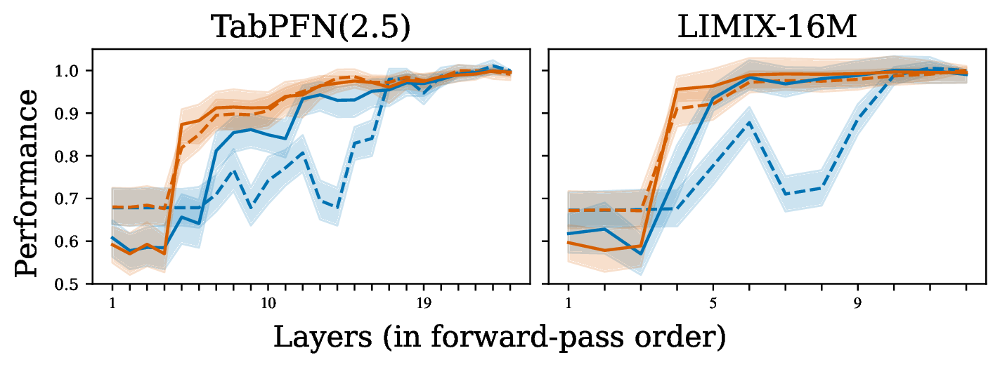
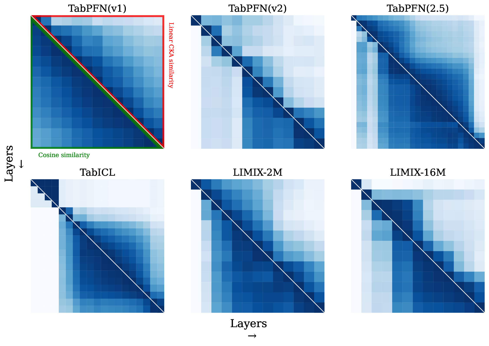

# Is One Layer Enough? Understanding Inference Dynamics in Tabular Foundation Models

**Source:** https://arxiv.org/abs/2605.06510
**Title:** Is One Layer Enough? Understanding Inference Dynamics in Tabular Foundation Models
**Date ingested:** 2026-05-25
**Type:** paper
**Authors:** Amir Rezaei Balef, Mykhailo Koshil, Katharina Eggensperger
**Venue:** ICML 2026
**Code:** https://github.com/amirbalef/is_one_layer_enough

## Summary

- **What:** Whether LLM mechanistic-interpretability findings transfer to tabular foundation models (TFMs) is unknown.
- **How:** Six layer-wise experiments across six SOTA TFMs, plus a looped-block proof-of-concept.
- **So what:** TFM inference is iteratively refined with heavy depth-redundancy in middle/late layers, motivating shallower or recurrent TFM architectures.

## Challenges & Novelty

Prior work on TFM internals is small and TabPFN-only. This paper is the first systematic, cross-model mechanistic study and translates the LLM mechanistic-interpretability toolkit into a form usable for set-invariant TFMs.

- **Tabular Logit Lens.** A logit lens that uses per-layer decoders continued-pretrained on TabICL priors. Necessary because TFM decoders are tied to the final-layer residual representation, so the raw "logit lens" is brittle. See [tabular-logit-lens](tabular-logit-lens.md).
- **Separation gap.** A class-distance metric (intra- vs inter-class cosine distance, PCA-projected) tracked per layer — adapted to TFMs' fixed classification setting, which LLMs lack.
- **TFM-specific inference stages.** Four-stage taxonomy (latent mapping → feature engineering & labeling → prediction ensembling → prediction calibration) refining the LLM stages of Lad et al. 2025. See [tfm-inference-stages](tfm-inference-stages.md).
- **Looped nanoTabPFN.** First demonstration in the TFM setting that a single block applied recurrently matches a 6-layer model. See [looped-transformer-tfm](looped-transformer-tfm.md).

## Relation to Prior Work

| Work | Domain | Method | Models studied | Finding |
| --- | --- | --- | --- | --- |
| nostalgebraist 2020 (logit lens) | LLM | Apply final decoder to each layer | GPT-2 | Final-decoder readout is interpretable but brittle |
| Belrose et al. 2023 (tuned lens) | LLM | Learned affine per layer | GPT-2/Pythia | Smooth, low-loss per-layer predictions |
| Sun et al. 2025 (Layers as Painters) | LLM | CKA + layer interventions | Llama-2/Mistral | Middle layers share representation; single-layer repeating hurts |
| Lad et al. 2025 | LLM | Layer delete/swap + circuits | Llama-2/Pythia | Four inference stages; middle layers robust |
| McCarter 2024 | TFM | OOD probing | TabPFN v1/v2 | TabPFN struggles outside synthetic prior |
| Zheng et al. 2025 | TFM | Frequency-response analysis | TabPFN v2 | Inductive bias scales with support size |
| Ye et al. 2025 | TFM | Feature reuse | TabPFN v2 | TFM embeddings are downstream-useful |
| **This work** | TFM | 6 layer-wise experiments + looped TFM | 6 TFMs | Iterative refinement, depth redundancy, looping suffices |

- **vs LLM mechanistic work:** TFM redundancy concentrates in *middle* layers (LLMs: late) and TFMs are far more sensitive to layer swaps.
- **vs prior TabPFN-only studies:** generalizes across TabPFN v1/v2/v2.5, TabICL, LimiX-2M/16M, exposing differences driven by upstream encoders (TabICL's row-wise interaction, LimiX-2M's RBF preprocessing).
- **vs looped transformer literature** (Dehghani 2018, Gong 2025, Zhu 2025, McLeish 2025): first transfer of the looped-block idea into the TFM regime with depth-redundancy evidence to justify it.

## Technical Details

**Models.** Six TFMs, all encoder-only and set-invariant:

| Model | Architecture | Params |
| --- | --- | --- |
| [TabPFN v1](hollmann2023tabpfnv1.md) | 12-layer vanilla Transformer | 26M |
| [TabPFN v2](hollmann2025tabpfnv2.md) | 12-layer per-feature Transformer (item + feature attention) | 7M |
| TabPFN(2.5) | ~24-layer scaling of v2 | — |
| [TabICL](qu2025tabicl.md) | Column embedder + row-wise interaction + ICL transformer | — |
| LimiX-2M | TFM + RBF-kernel preprocessing | 2M |
| LimiX-16M | TFM, no RBF preprocessing | 16M |

**Benchmarks.** 15 binary-classification tasks from TabArena (≤10K samples, ≤100 features) and 34 small tasks from PMLBmini (≤500 samples). Multiclass and regression checked in appendix.

**Six experiments.**

1. **Embedding similarity.** Cosine similarity and linear CKA between every pair of layer outputs; blocks of high intra-block similarity emerge in larger models.

2. **Separation gap.** PCA-project hidden states (95% variance), then `mean_inter-class − mean_intra-class` cosine distance per layer. Increases incrementally; label embedding lags feature embedding.
3. **Probing classifiers.** Logistic regression on query embeddings. Probes trained on layer `i` generalize forward (`j>i`) but not backward → each layer adds features.
4. **Tabular Logit Lens.** Train fresh per-layer decoders on TabICL synthetic priors, then read predictions from intermediate layers. Reveals decisive representations form early. See [tabular-logit-lens](tabular-logit-lens.md).
5. **Layer ablation.** Skip / repeat / swap layers in the forward pass. Skipping early layers is catastrophic; middle/late layers are robust; repeating helps LimiX-16M and TabPFN v1; swaps universally hurt.
6. **Self-repair.** Apply the tabular logit lens after each skip. Middle/late skips are repaired by subsequent layers; early skips are not.

**Looped nanoTabPFN.** Matched-compute comparison of a 6-layer, a 1-layer, and a 1-layer-looped-6× nanoTabPFN; the looped variant isolates compute from parameter count. Details in [looped-transformer-tfm](looped-transformer-tfm.md).

## Experiments

- Embedding-similarity blocks emerge in TabPFN(2.5) and LimiX-16M but not in TabPFN v1 or TabICL — block structure correlates with model depth/size.
- Separation gap grows monotonically across depth for all 6 models; label embedding rises after feature embedding, supporting a "features first, then labels" inference pattern.
- Probing classifiers asymmetrically transfer forward, consistent with cumulative-feature accumulation in the residual stream.
- Tabular logit lens reaches high ROC-AUC in the first few layers; the original decoder needs more layers to catch up, exposing a *prediction-ensembling* gap.
- Layer-ablation: early layers are uniquely important, middle/late are nearly free to skip. TabICL and LimiX-2M are robust even to early-layer skips — their upstream encoders front-load the [latent-mapping stage](tfm-inference-stages.md).
- Self-repair occurs after middle/late skips, especially in TabPFN v2; first-layer skips cannot be repaired.
- `nanoTabPFN_{looped}` matches `nanoTabPFN_{6l}` AUC on PMLBmini and TabArena; `nanoTabPFN_{1l}` is clearly worse — depth-via-loop suffices.
- TFMs vs LLMs: middle-layer redundancy is *larger* in TFMs; final layer matters *less* in TFMs; TFMs are *more* swap-sensitive (most pronounced in TabPFN v2).

## Limitations

- No systematic study of when effective depth becomes necessary (e.g. by task complexity).
- Tabular logit lens uses TabICL priors; may under-fit models trained with richer priors (TabPFN(2.5), LimiX).
- Single seed, no ensembling, two benchmark suites; results are average-case.
- See also [looped-transformer-tfm](looped-transformer-tfm.md#caveats) for looped-experiment caveats.

## Entities & Concepts

- [tabular-logit-lens](tabular-logit-lens.md) — per-layer decoders for TFM mechanistic interpretability
- [looped-transformer-tfm](looped-transformer-tfm.md) — recurrent single-block TFM design
- [tfm-inference-stages](tfm-inference-stages.md) — four-stage TFM inference taxonomy
- [tabular-learning](tabular-learning.md) — TFM family context
- [hollmann2023tabpfnv1](hollmann2023tabpfnv1.md), [hollmann2025tabpfnv2](hollmann2025tabpfnv2.md), [qu2025tabicl](qu2025tabicl.md), [qu2026tabiclv2](qu2026tabiclv2.md), [muller2022pfn](muller2022pfn.md)
