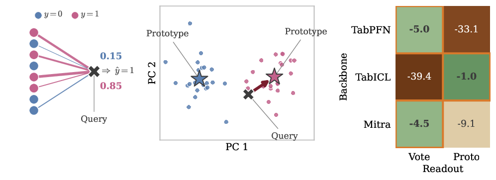

# A Mechanistic Study of Tabular Foundation Models

**Source:** https://arxiv.org/abs/2605.21288
**Title:** A Mechanistic Study of Tabular Foundation Models
**Date ingested:** 2026-07-14
**Type:** paper
**Authors:** Marin Biloš, James T. Wilson, Anderson Schneider, Yuriy Nevmyvaka (Machine Learning Research, Morgan Stanley)
**Venue:** NeurIPS 2026 (preprint)

## Summary

- **What:** Three tabular foundation models (TFMs) — [TabPFNv2](hollmann2025tabpfnv2.md), [TabICLv2](qu2026tabiclv2.md), and Mitra — converge to near-identical benchmark accuracy, but a leaderboard cannot say whether they run the same in-context algorithm.
- **How:** A mechanistic audit — layer-wise probes, per-block knockouts, causal interventions, readout-rule surrogates + transplantation, symmetry edits, and mechanism-grounded attacks across 49 classification + 10 regression datasets.
- **So what:** The models score alike but compute differently: two distinct **readouts** (an attention-weighted vote vs. a nearest-class-prototype) that are jointly designed with their backbones, plus redundant depth, nearly-free permutation invariance, and readout-specific failure modes.

## Challenges & Novelty

Benchmark convergence hides mechanistic divergence. This work opens the black box of three released TFMs and shows their inductive biases govern both accuracy and characteristic failures.

- **Distinct, non-transferable readouts.** [TabPFN](hollmann2025tabpfnv2.md) and Mitra read out via an attention-weighted **vote** over context-row labels at a late layer (L9); [TabICL](qu2026tabiclv2.md) reads out via a **nearest-class-prototype** on its final representation. Swapping a readout onto another backbone costs 33–40pp — readout and backbone are co-designed, not interchangeable.
- **Much of each backbone is dead weight.** TabICL's ~26M-param ICL trunk (≈95% of its parameters) adds only ~4pp over its column embedder; nearly all per-block knockouts cost <3pp. Each model has exactly *one* dominant early "coordinate-setting" block.
- **Permutation invariance is nearly free.** One-line edits grant *exact* column invariance at no accuracy cost; a One-vs-All wrapper grants exact class invariance. Mitra is column-invariant *by construction*.
- **Representation collapse is architectural, not fundamental.** A proven orbit-counting expressiveness bound is sidestepped in practice by a *redundant* within-row defense stack in the v2 models — and entirely by Mitra, which has no within-row symmetry-breaker yet does not collapse.
- **Mechanism-grounded attacks confirm the picture.** Perturbations engineered against each readout reproduce the predicted, readout-specific failures, isolating them from refit (MLP/XGBoost/Ridge) baselines.

*Left: attention-weighted vote at L9 concentrates mass on same-class context rows. Middle: TabICL assigns each query to the nearest class-mean prototype. Right: each backbone's native readout stays within a few pp of end-to-end accuracy; cross-backbone readouts collapse.*

## Relation to Prior Work

This is a cross-TFM mechanistic study contemporaneous with — and complementary to — [balef2026onelayer](balef2026onelayer.md). Where balef studies *inference dynamics across depth* (iterative refinement, looped-block equivalence) on the TabPFN/TabICL/LIMIX families, this paper studies *the readout mechanism, its symmetries, and its adversarial failure surface* across TabPFNv2 / TabICLv2 / Mitra, and turns each mechanism into a causal test.

| Aspect | This paper (Biloš 2026) | [balef2026onelayer](balef2026onelayer.md) | [qu2025tabicl](qu2025tabicl.md) |
|---|---|---|---|
| Central question | *How* does each model read out a prediction? | *Where/when* is the prediction built across depth? | How to scale ICL + avoid representation collapse |
| Models | TabPFNv2, TabICLv2, Mitra (+v1 variants) | TabPFN v1/v2/2.5, TabICL, LIMIX-2M/16M | TabICL (proposes it) |
| Key method | Readout surrogates + causal transplant + attacks | Probes, logit lens, layer ablation, self-repair | Column embedding + circular feature grouping |
| Collapse stance | Architectural + redundant; Mitra avoids it natively | (not addressed) | Introduces the collapse concern; RoPE + grouping fix |
| Invariance | One-line edits + OvA give *exact* invariance, ~free | (not addressed) | Approximate, via architecture + ensembling |

- **[qu2025tabicl](qu2025tabicl.md) / [qu2026tabiclv2](qu2026tabiclv2.md):** revisits TabICL's representation-collapse concern and finds it does not materially affect the released v2 model; localizes the redundant within-row defenses that prevent it.
- **[balef2026onelayer](balef2026onelayer.md):** shares the probing/ablation toolkit and the "depth is largely redundant" finding, but adds readout identification, symmetry edits, and mechanism-grounded attacks.
- **ICL-as-algorithm views** (gradient descent / Bayesian inference under a prior / function-class learning): the readout rules make precise which view each backbone instantiates.
- **Set/context expressiveness** (Deep Sets, Neural Processes): the orbit-counting collapse bound applies the permutation-invariance bottleneck to the column-permutation case.

## Technical Details

### Two readout mechanisms (falsifiable surrogate rules)

A surrogate rule is **faithful** when it meets all four: (i) predicted-probability Pearson $r \geq 0.85$; (ii) accuracy within $\leq 3$pp; (iii) argmax agreement Cohen's $\kappa \geq 0.8$; (iv) survives an intervention that preserves only the components the rule names.

- **TabPFN / Mitra — attention-weighted vote at L9.** Read the L9 row-attention weights and take a weighted vote over context labels. Tracks native probabilities at mean $r = 0.89$; met on 40/49 datasets (TabPFN). Fidelity decreases with class count ($\rho = -0.60$: binary 0.93 → 10-class 0.80). *Causal test:* replacing L9 attention with a uniform pattern collapses accuracy 0.87 → 0.49 (majority baseline). The rule is a **learned similarity** over the context set, not a metric $k$NN on final features (final-layer $k$NN agrees on only ~half of points). Mitra sits in the same family but falls just short of the faithful bar (4.5pp gap), its column-attention pathway carrying the residual.
- **TabICL — nearest class-prototype.** Average the final-block representations of context examples per class into a prototype; assign each query to the nearest prototype (Euclidean/cosine). Parameter-free, recovers nearly all accuracy; the class-clustered geometry is laid down *before* the ICL stack (linear probe 0.812 at column-embedder output vs. 0.864 native). Regression readout is non-linear — no simple surrogate reproduces it.

### Readout transplantation (each readout needs its own backbone)

Applying each readout to each frozen backbone at its preferred layer (49-dataset grid, 5 seeds):

| Backbone | Native | Vote (TabPFN/Mitra) | $k$NN5 | Prototype (TabICL) | Linear head |
|---|---|---|---|---|---|
| TabPFN | 0.854 | **0.804** (−5.0) | 0.547 (−30.7) | 0.523 (−33.1) | 0.617 (−23.7) |
| TabICL | 0.864 | 0.470 (−39.5) | 0.856 (−0.8) | **0.854** (−1.1) | 0.859 (−0.5) |
| Mitra | 0.860 | **0.815** (−4.5) | 0.789 (−7.0) | 0.769 (−9.0) | 0.776 (−8.3) |

TabICL admits a class-clustered linear readout family; TabPFN does not (a fresh logistic head reaches only 0.582 on the shared subset, below its 0.78 L9 probe).

### Where representations form

- **Depth of readability.** TabPFN sits near chance until a sharp L8→L9 jump (0.47 → 0.78); Mitra peaks at L9. TabICL is readable *throughout* — most class structure exists at the ICL input, so the deep trunk is nearly redundant.
- **One dominant early block per model** — block 0 (TabPFN/Mitra) and ColEmb-2 (TabICL) — each sets up a coordinate frame the rest of the network reads; knocking it out breaks the *frozen* probe but a retrained probe still recovers labels (frame change, not information loss).
- **Geometry.** TabPFN compresses early (effective rank ~40 → ~10 by block 2); TabICL expands rank monotonically through two-thirds of the stack (consistent with well-separated prototypes).

### Permutation invariance — installable without retraining

- **TabPFN:** zero the per-feature positional weight matrix $W$ (keep bias) → exact group-permutation invariance, benchmark accuracy unchanged.
- **TabICLv2:** remove RoPE → exact circular-column-shift invariance, free. Same ablation on v1 is catastrophic (−15pp): v1 lacks v2's circular-grouping fallback.
- **Mitra:** column-invariant *by construction* (single shared cell embedding, no positional encoding) — mean $|\Delta p| \leq 0.3\%$ under row/column permutation.
- **Class invariance:** One-vs-All wrapper → exact class-order agreement on any model; costs linear-in-$C$ (parallelizable) inference.
- **Cost of not being invariant:** column permutation alone causes up to 8pp accuracy spread — a key reason released models rely on ensembling. Retraining an invariant TabICLv1 from scratch: each lever ~free (RoPE −0.8pp, class-invariant head −0.3pp), combined −2.6pp.

### Representation collapse — architectural, provable, redundantly defended

- **Definition (from [qu2025tabicl](qu2025tabicl.md)):** a per-sample within-row identifiability failure — when columns share a marginal and the row aggregator is fully column-permutation-invariant, two rows that are column-permutations receive identical representations even with different labels (canonical: balance-scale).
- **Expressiveness bound:** any fully column-invariant model is constant on the orbits of $S_m$, so it cannot exceed the orbit-counting bound (0.75 for the binary Tasks A/B at $m{=}3$).
- **Hand-crafted M0–M3 models** pin down what each device does: M0 (naive shared-cell mean-pool) hits the 0.75 bound; **M1** = content route (TabPFN positional embeddings); **M2** = structural route (TabICL column-stream attention); **M3** = pair-grouped super-cells (the only one solving XOR / Task B).
- **Redundant defenses:** each v2 architecture carries *two* within-row routes; removing any single one is free, but removing *both* exposes latent collapse (TabICL drops to majority on a $d{=}12$ stress). Mitra has *no* within-row symmetry-breaker yet stays robust — collapse is architectural, not fundamental.

### Design prescription for the next TFM

Adopt all three (complementary, not interchangeable): (i) column-invariant *by construction*; (ii) inject the label early as a slot visible to column attention from layer 1; (iii) read out from in-context labels (e.g. one-hot) rather than a fixed class-conditional head. Mitra already adopts all three.

## Experiments

Mechanism-grounded attacks on a 24-dataset classification grid (×5 seeds); within-model Δpp, `*` = Holm-corrected significant:

| Attack | TabPFN Δpp | TabICL Δpp | Mitra Δpp |
|---|---|---|---|
| Hub poison | −3.7* | −3.3* | −2.8* |
| Rank warp | −8.0* | −10.1* | −0.4 |
| SVD burial | −8.3* | −5.0* | −8.9* |
| Soft-exp warp | −2.2* | −2.3* | −2.5* |
| Boundary poison | −1.7* | −1.2 | −1.5 |

- **Geometry attacks isolate the readouts:** hub poison (flip labels of the most-attended points) and rank warp (replace values by per-column rank) hurt the vote/prototype models more than a refit MLP on the same poisoned context.
- **Mitra is immune to rank warp** (−0.4pp) thanks to its quantile front-end, but shares the $k$NN-style hub-poison weakness.
- **Context corruptions** (noise pad, centroid/boundary injection, SVD burial) hurt a refit MLP at least as much — these reflect generic sensitivity, not readout-specific weakness.
- **Monotone warps** (cube, soft-exp) hurt the MLP ~2× more, consistent with the TFMs' pretraining prior already covering smooth warps.
- A pre-specified Wilcoxon test on (rank warp, hub poison) vs. (cube warp, centroid injection) rejects at $p < 10^{-3}$ for TabPFN/TabICL.

## Entities & Concepts

- [hollmann2025tabpfnv2](hollmann2025tabpfnv2.md) — TabPFNv2, one of the three audited backbones (vote readout at L9)
- [qu2025tabicl](qu2025tabicl.md), [qu2026tabiclv2](qu2026tabiclv2.md) — TabICL / TabICLv2, the prototype-readout backbone; source of the representation-collapse concern
- [balef2026onelayer](balef2026onelayer.md) — contemporaneous cross-TFM mechanistic study (inference dynamics across depth)
- [gupta2026tabpfnheads](gupta2026tabpfnheads.md) — cited here as concurrent work; narrow causal probe of TabPFN-2.5's feature-attention *heads* (finds one dominant head + late computation heads)
- [tabular-learning](tabular-learning.md) — TFM family context (Mitra is a third dedicated-architecture TFM, no dedicated page yet)
- [probing-classifier](probing-classifier.md) — linear probes used to locate class-readable depth
- [layer-ablation](layer-ablation.md) — per-block knockouts identify the one dominant early block
- [self-repair](self-repair.md) — retrained-probe recovery distinguishes frame change from information loss
- [ferrando2024primer](ferrando2024primer.md) — LLM mech-interp toolkit ported here (causal interventions, patching)
