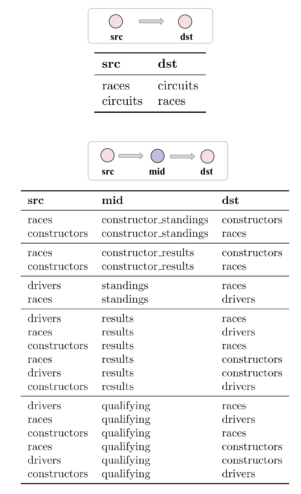

# RelGNN: Composite Message Passing for Relational Deep Learning

**Source:** https://arxiv.org/abs/2502.06784
**Title:** RelGNN: Composite Message Passing for Relational Deep Learning
**Date ingested:** 2026-04-29
**Type:** paper
**Authors:** Chen, Kanatsoulis, Leskovec
**Venue:** ICML 2025

## Summary

- **What:** Standard heterogeneous GNNs systematically mishandle junction tables (bridge/hub nodes) in Relational Entity Graphs, causing redundant information flow and source-node underweighting.
- **How:** RelGNN auto-derives *atomic routes* from the PK-FK schema and applies a FUSE operation that combines the intermediate node with the source node before destination attention — all in a single message-passing step.
- **So what:** SOTA on 27/30 RelBench v1 tasks with up to 25% improvement on regression tasks; no manual meta-path design required.

## Challenges & Novelty

Prior heterogeneous GNNs (HGT, R-GCN) were designed for knowledge graphs where edge types carry semantic meaning. In Relational Entity Graphs, edges arise from PK-FK relationships that are structurally, not semantically, determined — a mismatch that causes two specific failures when junction tables (bridge and hub nodes) are present.

- **Bridge redundancy:** With exactly 2 FKs, a bridge node appears twice in 2-hop message passing — once as intermediate, once as part of the standard aggregation — so its signal is double-counted while the true source node's signal is diluted.
- **Hub entanglement:** Hub nodes with 3+ FKs mediate multiple unrelated entity types simultaneously; a single aggregation step conflates their contributions, destroying type-specific signal.
- **Schema-derived routes eliminate manual meta-path design:** prior methods like HAN require expert selection of meta-paths; atomic routes are extracted deterministically from the FK graph.

## Relation to Prior Work

| Model | Bridge/hub-aware | Schema-derived routing | Single-step source-dest | Temporal |
|---|---|---|---|---|
| HeteroGraphSAGE ([fey2024rdlposition](fey2024rdlposition.md)) | No | No | No | Yes |
| HGT ([hu2020hgt](hu2020hgt.md)) | No | No | No | No |
| R-GCN ([schlichtkrull2018rgcn](schlichtkrull2018rgcn.md)) | No | No | No | No |
| HAN | No | Manual meta-paths | No | No |
| **RelGNN** | Yes | Yes (automatic) | Yes | Yes |

- [fey2024rdlposition](fey2024rdlposition.md): RDL blueprint uses HeteroGraphSAGE as the standard baseline; RelGNN is a drop-in GNN replacement that fixes the structural mismatch the blueprint didn't address.
- [dwivedi2025relgt](dwivedi2025relgt.md): RelGT applies rich positional encodings on the same REG; RelGNN shows that correcting message-passing topology yields large gains without positional encodings.
- [hu2020hgt](hu2020hgt.md): HGT's heterogeneous attention assumes edge-type semantics that don't exist in PK-FK links — RelGNN's analysis explains why HGT underperforms on RDL graphs.

## Technical Details

**Bridge and hub classification.** Every table is classified by FK count:
- 0–1 FKs → dimension node (standard GNN node)
- Exactly 2 FKs → bridge node
- 3+ FKs → hub node

**Atomic route construction.** For a source entity type $A$ and destination type $B$ connected via junction table $M$:
- Single FK ($A \to B$ directly): atomic route is the direct edge $A \to B$
- $M$ bridges $A$ and $B$: atomic route is the 2-hop path $A \to M \to B$, treated as a *single logical step*

Routes are enumerated automatically from the schema graph — $O(|E_\text{schema}|)$ time.

**Composite message passing.** For each atomic route $r = (A \to M \to B)$, RelGNN fuses the intermediate embedding with the source embedding before aggregation at the destination:

$$\mathbf{h}_\text{fuse}^{(r)} = W_1^{(r)} \mathbf{h}_M + W_2^{(r)} \mathbf{h}_A$$

Multi-head attention from each destination node $b \in B$ over all fused messages:

$$\mathbf{h}_b^{(\ell+1)} = \text{Agg}\!\left(\left\{\text{Attn}\!\left(\mathbf{h}_b^{(\ell)},\, \mathbf{h}_\text{fuse}^{(r)}\right) : r \in \mathcal{R}_b\right\}\right)$$

Separate $W_1^{(r)}, W_2^{(r)}$ per route prevent cross-route interference.

## Experiments

- SOTA on 27/30 RelBench v1 tasks; strongest gains on junction-table-heavy schemas (rel-trial site-success: +25% vs. HeteroGraphSAGE).
- Ablations confirm both FUSE terms matter: removing $W_2 \mathbf{h}_\text{src}$ (source term) hurts most, confirming source underweighting is the dominant failure mode.
- Composite routing with separate weights per route outperforms a single shared weight matrix.

## Entities & Concepts

- [relational-deep-learning](relational-deep-learning.md)
- [relational-entity-graph](relational-entity-graph.md)
- [relbench](relbench.md)
- [heterogeneous-graph-transformer](heterogeneous-graph-transformer.md)
