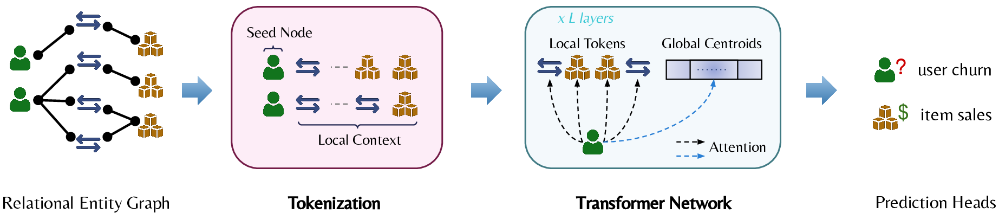
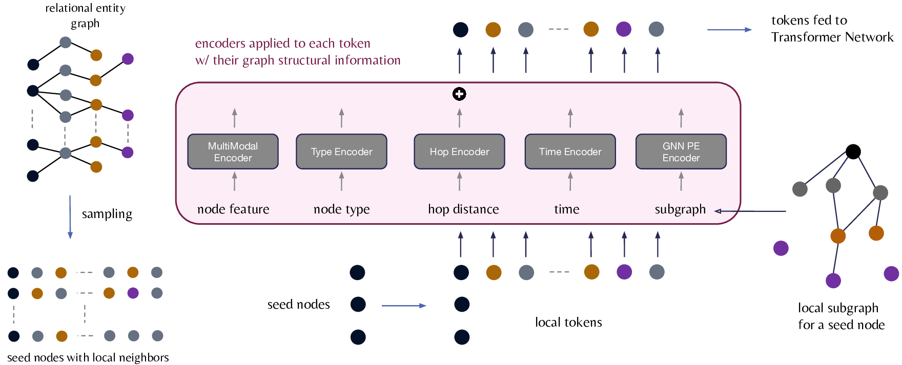

# Relational Graph Transformer (RelGT)

**Source:** https://arxiv.org/abs/2505.10960
**Title:** Relational Graph Transformer
**Date ingested:** 2026-04-28
**Type:** paper
**Authors:** Vijay Prakash Dwivedi, Sri Jaladi, Yangyi Shen, Federico López, Charilaos I. Kanatsoulis, Rishi Puri, Matthias Fey, Jure Leskovec
**Venue:** ICLR 2026
**Year:** 2025

## Summary

- **What:** Graph Transformers cannot handle relational entity graphs because existing PEs are too expensive to precompute at scale, and no GT jointly models schema-defined heterogeneity, temporality, and multimodal attributes.
- **How:** RelGT decomposes each node into five independently-encoded token elements (features, type, hop distance, relative time, subgraph GNN PE) and processes them with a hybrid local+global Transformer — no global precomputation required.
- **So what:** RelGT matches or outperforms the GNN baseline on 19 of 21 RelBench tasks, with gains of up to 18%, establishing Graph Transformers as a viable architecture for Relational Deep Learning.

## Challenges & Novelty

GNNs on relational entity graphs (REGs) suffer from limited expressiveness and cannot capture long-range dependencies, but existing Graph Transformers fail on REGs too — no prior GT jointly handles heterogeneity, temporality, and multimodal attributes without expensive global precomputation. RelGT solves this with a 5-element tokenization that assigns one encoder per REG property, requiring no global computation.

- **Static graphs only:** Most GTs ([rampavsek2022graphgps](rampavsek2022graphgps.md), [ying2021graphormer](ying2021graphormer.md), [kreuzer2021san](kreuzer2021san.md)) assume no temporal dimension; REGs require time-aware sampling to prevent future leakage.
- **Homogeneous types:** Standard GTs treat all nodes identically; heterogeneous variants ([hu2020hgt](hu2020hgt.md), [mao2023hinormer](mao2023hinormer.md)) exist but cannot handle the combination of heterogeneity, temporality, and rich multimodal entity attributes.
- **PE precomputation infeasible at scale:** Laplacian eigenvectors, random-walk PEs, and node2vec must be computed on the full graph; at REG scale (millions of nodes) this is prohibitively expensive and doesn't generalize to heterogeneous or temporal graphs.

## Relation to Prior Work

| Model                                                                                   | Heterogeneous | Temporal | Graph PE               | Handles REGs                   |
| --------------------------------------------------------------------------------------- | ------------- | -------- | ---------------------- | ------------------------------ |
| [rampavsek2022graphgps](rampavsek2022graphgps.md)                                       | No            | No       | Yes (RWSE/LapPE)       | No                             |
| [hu2020hgt](hu2020hgt.md)                                                               | Yes           | No       | Optional               | No — PE cost, no temporal      |
| HTGformer ([wang2025htgformer](wang2025htgformer.md))                                   | Yes           | Yes      | No                     | Partial — no PE, no multimodal |
| [zhao2021gophormer](zhao2021gophormer.md) / [chen2022nagphormer](chen2022nagphormer.md) | No            | No       | No                     | No — homogeneous only          |
| **RelGT**                                                                               | **Yes**       | **Yes**  | **Yes (subgraph GNN)** | **Yes**                        |

- [rampavsek2022graphgps](rampavsek2022graphgps.md): architectural backbone — RelGT adapts the hybrid local+global design but replaces MPNN+Performer with full Transformer attention and the 5-element tokenization.
- [wang2025htgformer](wang2025htgformer.md): closest prior work handling both heterogeneity and temporality, but uses separate iterative modules, omits graph PEs, and doesn't address multimodal attributes.
- [hu2020hgt](hu2020hgt.md): main GT baseline; consistently underperforms HeteroGNN and adding Laplacian PE costs up to 8.62× per-epoch overhead for inconsistent gains.
- [kong2023goat](kong2023goat.md): RelGT's global module is directly adapted from GOAT's EMA K-Means centroid mechanism.
- [kanatsoulis2025pearl](kanatsoulis2025pearl.md): RelGT's subgraph GNN PE is a stochastic relaxation of this learnable PE, using randomly resampled node init to preserve equivariance while gaining expressivity.
- [ranjan2025relationaltr](ranjan2025relationaltr.md): same RDL problem but opposite philosophy — RT omits all PEs for zero-shot generalization while RelGT uses schema-specific encodings for supervised performance.

## Technical Details

**Tokenization.** For each training seed node $v_i$, RelGT samples $K$ neighboring nodes $v_j$ from within 2 hops via temporal-aware sampling (only nodes with $\tau(v_j) \leq \tau(v_i)$ are included). Each token is a **5-tuple**:

1. **Node features** — multimodal attributes encoded via PyTorch Frame's MultiModalEncoder (numerical, categorical, text, image):
   $$h_{\text{feat}}(v_j) = \text{MultiModalEncoder}(x_{v_j}) \in \mathbb{R}^d$$

2. **Node type** — learnable one-hot embedding of the entity's source table:
   $$h_{\text{type}}(v_j) = W_{\text{type}} \cdot \text{onehot}(\phi(v_j)) \in \mathbb{R}^d$$

3. **Hop distance** — relative structural distance between seed and neighbor:
   $$h_{\text{hop}}(v_i, v_j) = W_{\text{hop}} \cdot \text{onehot}(p(v_i, v_j)) \in \mathbb{R}^d$$

4. **Relative time** — temporal difference, enforces leakage prevention:
   $$h_{\text{time}}(v_i, v_j) = W_{\text{time}} \cdot (\tau(v_j) - \tau(v_i)) \in \mathbb{R}^d$$

5. **Subgraph GNN PE** — lightweight GNN on the local subgraph with randomly resampled node init (resampled each training step):
   $$h_{\text{pe}}(v_j) = \text{GNN}(A_{\text{local}}, Z_{\text{random}})_j \in \mathbb{R}^d$$

The five embeddings are concatenated and projected:
$$h_{\text{token}}(v_j) = O \cdot [h_{\text{feat}} \| h_{\text{type}} \| h_{\text{hop}} \| h_{\text{time}} \| h_{\text{pe}}], \quad O \in \mathbb{R}^{5d \times d}$$

**Transformer network.** Two-stage attention:

- **Local module** — full all-pair attention over $K=300$ tokens; yields $h_{\text{local}}(v_i) = \text{Pool}(\text{FFN}(\text{Attention}(v_i, \{v_j\}_{j=1}^K))_L)$
- **Global module** — attention to $B=4096$ EMA-updated centroid tokens: $h_{\text{global}}(v_i) = \text{Attention}(v_i, \{c_b\}_{b=1}^B)$
- **Output** — $h_{\text{output}}(v_i) = \text{FFN}([h_{\text{local}}(v_i) \| h_{\text{global}}(v_i)])$

**Ablation highlights** (relative drop when removing each component, averaged over 8 tasks):

| Removed | Avg drop |
|---|---|
| No Relative Time | −9.91% |
| No GNN PE | −5.95% |
| No Global Module | −3.87% |
| No Hop Distance | −2.19% |
| No Node Type | −1.75% |

Relative time and GNN PE are the two most critical components. The global module is task-dependent: essential for `rel-trial site-success` (−19%) but harmful for `rel-avito user-clicks` (+7.85% without it).

## Experiments

- RelGT matches or outperforms the HeteroGNN baseline on 19 of 21 RelBench tasks, with clear wins (>1%) on 10 tasks and losses on only 2, with the largest gain of 18.43% on `rel-trial site-success`.
- Ablations show subgraph GNN PE is the most critical component (avg −5.95% when removed), followed by relative time encoding (avg −9.91% — dominated by a single large drop on `rel-hm item-sales`).
- The global attention module is task-dependent: essential for some tasks (`rel-trial site-success`: −19%) but harmful for others (`rel-avito user-clicks`: +7.85% without it).
- HGT underperforms the GNN baseline on most tasks and adding Laplacian PE costs up to 8.62× per-epoch slowdown for inconsistent gains, confirming existing GTs are ill-suited for the RDL setting.

## Entities & Concepts

- [relational-deep-learning](relational-deep-learning.md)
- [relational-entity-graph](relational-entity-graph.md)
- [graph-transformer](graph-transformer.md)
- [multi-element-tokenization](multi-element-tokenization.md)
- [subgraph-gnn-pe](subgraph-gnn-pe.md)
- [relbench](relbench.md)
- [heterogeneous-graph-transformer](heterogeneous-graph-transformer.md)

