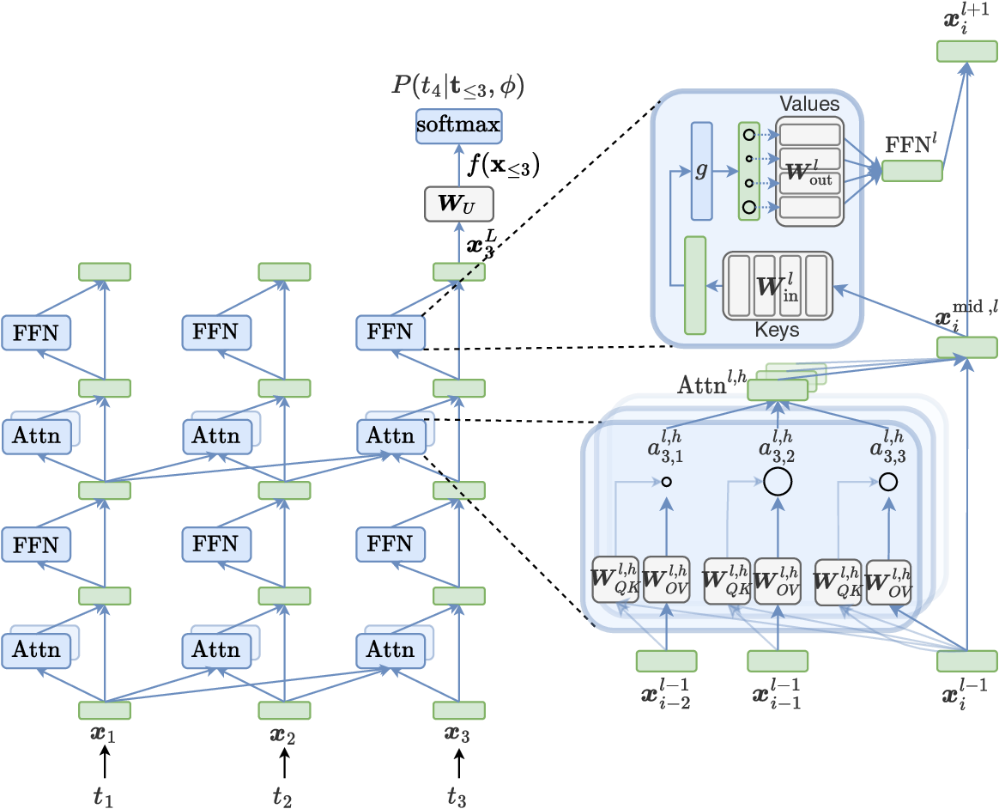
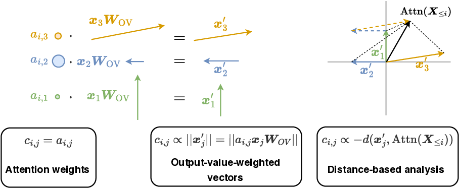
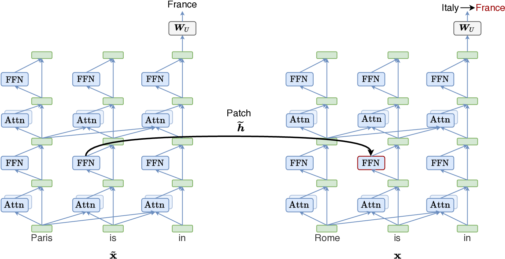
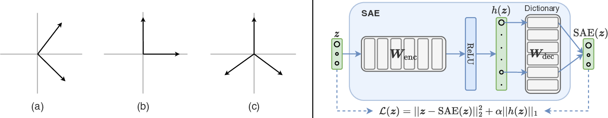

# A Primer on the Inner Workings of Transformer-based Language Models

**Source:** https://arxiv.org/abs/2405.00208
**Title:** A Primer on the Inner Workings of Transformer-based Language Models
**Date ingested:** 2026-05-28
**Type:** survey / primer
**Authors:** Javier Ferrando, Gabriele Sarti, Arianna Bisazza, Marta R. Costa-jussà
**Venue:** arxiv 2024 (concurrent with ICLR 2024 blog ecosystem)

## Summary

- **Two-axis taxonomy** of LM mech-interp: **localize** (which inputs/components drove the prediction) and **decode** (what features live in a representation).
- **Unified residual-stream notation** ties every method (DLA, patching, circuits, lens, SAEs) back to a shared algebraic view.
- **Synthesis catalogue** of discovered inner behaviors — attention head types, FFN neuron types, residual-stream phenomena, multi-component circuits (IOI, factual recall).

## Why this primer

Earlier interpretability surveys either pre-dated decoder-only LMs (BERTology) or surveyed XAI broadly. Ferrando et al. fill the gap with:

- a **concise, equation-first** introduction to mech-interp methods specific to autoregressive Transformers,
- **unified notation** across previously fragmented literatures (probing, patching, SAEs, lens),
- explicit mapping of methods to the **residual-stream perspective** (Elhage et al. 2021).

Concurrent broader survey: Bereska & Gavves 2024 (AI-safety-oriented).

## Background: residual-stream view & unified notation

The whole primer hinges on this perspective. Worth internalising before reading any method section.

- **Residual stream.** Each token's embedding $\vx_i$ is updated **additively** by every attention head and FFN: $\vx^l_i = \vx^{l-1}_i + \text{Attn}^l(\cdot) + \text{FFN}^l(\cdot)$. The unembedding $\mW_U$ reads the final state.
- **Attention as read-write.** Per-head decomposition collapses $\mW_V \mW_O$ into the **OV circuit** (what gets written) and $\mW_Q \mW_K^\top$ into the **QK circuit** (where to read from).
- **FFN as key-value memory.** Rewrite $\text{FFN}(\vx) = \sum_u n_u \vw_{\text{out}_u}$: each neuron $u$ contributes a fixed value vector scaled by its activation. Neurons are a **privileged basis** because of the nonlinearity.
- **Forward pass = sum of component contributions** (Prediction-as-sum). Logits decompose as $\sum_{l,h} \text{Attn}^{l,h}\mW_U + \sum_l \text{FFN}^l \mW_U + \vx \mW_U$ — this single rewrite enables Direct Logit Attribution and circuit decomposition.
- **Shallow-network ensemble view.** A two-layer attention-only model expands into 4 paths: **direct**, **full OV circuits**, **virtual heads (V-composition)**. Q/K-composition extend this to full Transformers.

## The two-axis taxonomy

| Axis | Question | Representative methods |
|---|---|---|
| **Behavior Localization** | Which *inputs* or *components* are responsible for a prediction? | input attribution, DLA, activation patching, circuit discovery |
| **Information Decoding** | What *features* are encoded in a representation, and where? | probing, SAEs, logit/tuned lens, Patchscopes |

The other two sections of the survey are syntheses — *Discovered Inner Behaviors* (results gathered using these tools) and *Tools* (software libraries).

## Behavior Localization

### Input attribution

Estimate contribution of input *tokens* to model output. Faithfulness debates abound; methods often disagree.

- **Gradient-based.** $\norm{\nabla_{\vx_i} f_w(\vx)}_p$; sensitivity to embedding $i$. Variants address gradient saturation/shattering:
    - **Integrated Gradients** — integrate gradients along a path from a baseline.
    - **SmoothGrad** — average over input perturbations.
    - **LRP / AttnLRP** — custom propagation rules; sum-preserving.
    - **Gradient × Input** — convert sensitivity to importance.
- **Perturbation-based.** Ablate/noise an input element, measure prediction change. Family includes **LIME** (local surrogate), **SHAP** (Shapley values). Suffers from OOD inputs and cost.
- **Context mixing.** Use attention weights, value-weighted norms, or vector distances to estimate inter-token contribution; aggregate per-layer via **attention rollout** or **DecompX** linearization.
- **Contrastive attribution.** Explain $w$ *instead of* $o$: $\norm{\nabla_{\vx_i}(f_w - f_o)}_p$. Addresses competing-tokens-in-vocab problem.
- **Training data attribution (TDA).** Influence functions, TRAK, simulator-based methods — locate *training examples* driving a prediction.

**Limitations.** Insensitivity to model/data; methods disagree; provably unreliable for counterfactuals (IG, SHAP); OOD issues for perturbation.

### Component importance

#### Logit Attribution

- **Direct Logit Attribution (DLA).** Decompose the logit of token $w$ into per-component contributions $f^c(\vx) \mW_{U[:,w]}$. Component $c$ = head, FFN, or single neuron.
- **Direct Logit Difference Attribution (DLDA).** Contrastive form for token pair $(w, o)$.
- Extends to **per-path** attributions inside an attention head (Ferrando et al. 2023): $a^{l,h}_{n,j} \vx^{l-1}_j \mW_{OV}^{l,h} \mW_{U[:,w]}$.

#### Causal interventions / activation patching

Express model as a causal DAG; intervene on a node, measure prediction change.

- **Patch sources:**
    - **Resample** — single example from a counterfactual distribution $P_{\text{patch}}$.
    - **Mean** — average activation over $P_{\text{patch}}$.
    - **Zero** — null vector (risk: OOD).
    - **Noise** — Gaussian-perturbed input.
- **Direction:**
    - **Noising** — patch into clean run.
    - **Denoising** — patch clean activation into corrupted run (Causal Tracing style).
- **Subspace patching / DII.** Intervene only on a learned linear subspace $U$, not the whole activation; respects the **linear representation hypothesis**.
- **Component modeling** — learn a linear estimator predicting effects of subset interventions.

#### Circuits Analysis

Reverse-engineer **subgraphs** of components solving a task.

- **Edge / path patching** — patch a single edge in the computational graph; measures **direct vs indirect** effects (Pearl mediation).
- **ACDC** — iterative edge removal, fully automated but $O(\text{edges})$ forward passes.
- **EAP / EAP-IG** — linear approximation of patching with **one forward + one backward pass**; orders of magnitude cheaper. **AtP\*** patches false-negative cases.
- **Information flow routes** — patch-free, single forward pass via context-mixing aggregation.
- **DAS / Boundless DAS** — distributed alignment search; find non-basis-aligned subspaces with causal influence via gradient descent.
- **Causal Proxy Models** — interpretable proxies trained to mimic counterfactual behavior.

**Limitations of circuit discovery.** (1) requires designing $P_{\text{patch}}$, (2) needs human inspection for subgraph isolation, (3) interventions can trigger **second-order self-repair** that confounds the analysis.

## Information Decoding

### Probing

- A supervised classifier $p: f^l(\vx) \mapsto z$ on frozen activations.
- **Tension:** probe accuracy conflates *amount of info in $f^l$* with *probe expressivity*. Mitigations:
    - **Control tasks** (random labels) and **control functions** baselines.
    - **MDL probes** — measure description length, not just accuracy.
- **Limits.** Correlation, not causation — high probe accuracy doesn't mean the model *uses* that feature.

→ Full page: [probing-classifier](probing-classifier.md).

### Linear Representation Hypothesis & SAEs

**LRH.** Features encoded as **linear subspaces** (directions) of the representation space.

- **Evidence.** Word2vec analogies; concept directions found via linear probes; interpretable monosemantic neurons.
- **Linear interventions.**
    - **Concept erasure** (Ravfogel, LEACE, OracleLEACE) — project out a direction; verifies probed info is used.
    - **Activation addition / steering** — add $-\alpha \vu$ to flip sentiment, refusal, etc.
    - **Difference-in-means** vectors for refusal, truthfulness.

**Polysemanticity & superposition.** Models pack *more features than dimensions* by storing them in non-orthogonal directions — explains why most neurons fire on apparently unrelated inputs.

**Sparse Autoencoders (SAEs).** Disentangle superposed features via overcomplete dictionary learning. Trained to reconstruct $\vz$ with sparsity penalty on activations $h(\vz)$.

- **Variants:**

    | SAE | Activation | Sparsity term | Strength |
    |---|---|---|---|
    | **Standard** (ReLU) | ReLU | $\alpha \norm{h}_1$ | baseline; suffers *shrinkage* |
    | **Gated (GSAE)** | ReLU × gated step | $\norm{h}_1$ on gate path | decouples magnitude from detection; Pareto-improves baseline |
    | **TopK** | TopK | none — only reconstruction | constrains exactly $k$ active features; outperforms ReLU |
    | **BatchTopK** | TopK over batch | none | per-sample flexibility |
    | **JumpReLU** | JumpReLU($\theta$) | $L_0$ on $\theta$-gated features | decouples activation decision from magnitude |

- **Evaluation:** Pareto frontier of **L0 norm** vs **loss recovered**; feature density histogram; manual or LLM-automated interpretability scoring.
- **Caveats:** SAE error term ($\epsilon$) shifts predictions more than random noise — faithfulness concern. Marks et al. 2024 incorporate $\epsilon$ as a node in causal graph for **sparse feature circuits**.

### Decoding in Vocabulary Space

Use $\mW_U$ (or $\mW_E$) as an interpretable readout from any representation.

- **Logit lens** (nostalgebraist) — project intermediate $\vx^l$ by $\mW_U$. Fails on some models (Belrose).
- **Tuned lens** (Belrose et al. 2023) — learned affine *translator* before $\mW_U$.
- **Attention lens** — translator on attention head outputs.
- **Patchscopes** — generalize patching: pick target model $f^*$, target prompt $\vx^*$, target component $c^*$, mapping $m$. Decodes information context-independently. **Future lens** is a special case.
- **Decoding weights.** Project $\mW_{OV}, \mW_{\text{out}}$ rows through $\mW_U$ to inspect what tokens they promote. **SVD decomposition** reveals dominant directions; **low-rank approximation** improves accuracy in later layers (LASER).
- **Logit spectroscopy** — split right singular vectors of $\mW_U$ into bands; subspace-level lens.
- **Maximally-activating inputs** — examples that fire a neuron/feature most strongly; risk of "interpretability illusions" across activation ranges.
- **Natural-language self-explanation** — prompt an LLM to describe what a neuron fires for (GPT-4 → GPT-2 XL). Often unfaithful.
- **Backward lens** — project FFN *gradient* matrices to study how new information is stored.

→ Related page: [tabular-logit-lens](tabular-logit-lens.md) (TFM adaptation).

## Discovered Inner Behaviors

Findings catalogued by the survey — exploration is non-exhaustive but representative.

### Attention head types

- **Interpretable attention patterns:**
    - **Positional heads** — attend to self / previous / next token.
    - **Previous-token heads** — substrate for induction; copy previous token info.
    - **Subword joiner heads** — attend to prior subwords of the same word.
    - **Syntactic heads** — specialize in `obj`, `nsubj`, `advmod`, `amod` dependencies; emerge suddenly during training.
    - **Duplicate token heads** — attend to prior occurrences of current token.
- **Interpretable QK/OV circuits:**
    - **Copying heads** — diagnosed by positive eigenvalues of $\mW_E \mW_{OV} \mW_U$.
    - **Induction heads** — prev-token + copying composition; substrate of ICL.
    - **Name mover / S-inhibition / negative mover heads** — IOI circuit components.
    - **Copy suppression heads** — downweight tokens already attended.
    - **Attention sink** — disproportionate attention to BOS / first tokens; acts as no-op valve.

### FFN neuron types

- **Input-side:** position-range neurons, skill neurons, concept-specific neurons (Python, French, German), grammatical/linguistic neurons.
- **Output-side:** knowledge neurons (factual associations), linguistic-acceptability neurons, space/time neurons, language-specific neurons, **token-frequency neurons** (push toward/from unigram), suppression-of-improbable-continuations neurons.
- **Polysemantic / structural:** n-gram detector neurons in early layers, dead neurons (OPT), **de-/re-tokenization neurons**, **universal neurons** (1-5% shared across seeds), **entropy neurons** (modulate output uncertainty via $\mW_U$ null space).
- **High-level structure.** Early ≈ sensory (n-grams), middle ≈ abstract concepts, late ≈ motor (push token distribution).

### Residual stream phenomena

- **Exponential norm growth** along layers (in $\vx$ and in output matrices $\mW_O, \mW_{\text{out}}$).
- **Memory management** — components with negative-eigenvalue OV or anti-aligned FFN keys/values *delete* prior writes.
- **Outlier dimensions** — rogue dims with anisotropic effect; ablating breaks performance; correlate with training frequency; complicate quantization.
- **SAE features in residual stream** — local context features, partition features (promote/suppress dual sets), suppression features, abstract / safety / code-error features (Anthropic Claude-3 SAEs).

### Emergent multi-component behaviors

- **IOI circuit** (Wang et al. 2023) — duplicate token + induction → S-inhibition → name mover; canonical mech-interp case study.
- **Function / task vectors** (Hendel, Todd) — middle-layer activations that, when patched into novel zero-shot prompts, induce the task.
- **Factual recall circuit** (Meng, Geva, Chughtai) — early-middle FFNs at subject-last-token enrich subject; later attention heads extract attribute via additive subject-head + relation-head mechanism.
- **In-context vs memory heads** — competing mechanisms for grounded vs memorized answers.
- **Retrieval heads** — long-context Needle-in-Haystack solvers.
- **Grokking as circuit emergence** — generalizing sparse circuit replaces dense memorizing subnetwork.
- **Circuit generality** — same low-level components participate in many tasks; circuits robust to fine-tuning.

## Tools

| Category | Tools |
|---|---|
| Input attribution | Captum, Transformers Interpret, ferret, Ecco, Inseq, SHAP, Saliency, LIT |
| Component importance / circuits | **TransformerLens**, **NNsight**, **Pyvene**, Pyreft |
| SAE training / inspection | SAELens, dictionary-learning, sae-vis, Neuronpedia |
| Visualization | BERTViz, exBERT, InterpreT, LM-Debugger, VISIT, Ecco, Tuned Lens, CircuitsVis, Penzai, LM-TT, TDB |
| RASP / Tracr | human-readable Transformer spec → compiled weights |
| Vision/multimodal | ViT Prisma, MAIA |

## Conclusion & Future Directions

- **From functional grounding → actionable insights.** Move beyond toy benchmarks to debugging real models.
- **From component space → feature/NL space.** LMs as verbalizers; feature-based circuits.
- **Open access to LM internals** — prerequisite for the field.

## Bridge: techniques used in [balef2026onelayer](balef2026onelayer.md) vs not

| Family | Technique | balef uses? | Notes |
|---|---|---|---|
| **Input attribution** | Gradient / IG / SHAP / LIME / LRP | ❌ | tabular ICL has no LLM-style input-token sequence |
| | Context mixing (attention rollout, ALTI) | ❌ | |
| | Training data attribution | ❌ | |
| **Component importance** | DLA / DLDA | ❌ | no per-component logit decomposition |
| | Activation patching (resample/mean) with $P_{\text{patch}}$ | ❌ | no counterfactual datasets |
| | Zero/identity intervention | ⚠️ partial | [layer-ablation](layer-ablation.md): skip/repeat/swap ≈ identity patching |
| | Subspace patching / DII | ❌ | |
| | Path / edge patching | ❌ | |
| | ACDC / EAP / EAP-IG / AtP* | ❌ | no circuit discovery |
| | DAS / causal abstraction | ❌ | |
| **Decoding — probing** | Linear probe per layer + cross-layer matrix | ✅ | [probing-classifier](probing-classifier.md) |
| | Control tasks / MDL | ❌ | |
| | Concept erasure (LEACE) | ❌ | |
| **Decoding — linear rep** | SAEs (any variant) | ❌ | |
| | Activation addition / steering | ❌ | |
| | Difference-in-means / refusal direction | ❌ | |
| **Decoding — vocab space** | Logit lens | ✅ (adapted) | [tabular-logit-lens](tabular-logit-lens.md) — closer to tuned lens (trained translator) |
| | Tuned lens | ✅ (closest analog) | |
| | Patchscopes / SVD weights / spectroscopy / max-activating inputs | ❌ | |
| **Discovered behaviors** | Head taxonomy (induction, copy-suppression, …) | ❌ | depth-level only, no per-head analysis |
| | Knowledge / entropy / language neurons | ❌ | |
| | Residual-stream norm growth, outlier dims | ❌ | |
| | Multi-component circuits (IOI, factual recall) | ❌ | TFM ICL queries lack a clean (subject, relation, attribute) factorization |
| | **Self-repair (Hydra)** | ✅ | [self-repair](self-repair.md) — lens-after-skip trajectory |
| **Representation analysis** | Representation similarity (CKA / cosine) | ✅ | [representation-similarity](representation-similarity.md) — not central in this survey but adjacent |

**Headline.** balef occupies a narrow, **layer-level, behavioral** slice — probing + lens + ablation + self-repair + repr-similarity. The big LLM mech-interp toolboxes it skips:

- **SAEs / linear-rep tooling** — no feature-direction dictionary.
- **Causal interventions with counterfactuals** — TFM ICL queries don't have clean templates like IOI / `(s, r, a)`.
- **Circuit discovery** — depth-level not head-level granularity.
- **Input attribution** — TFM "tokens" are columns + rows, not a 1-D text sequence; standard attribution methods don't transfer cleanly.

Plausible reason: TFMs are still small enough that **depth-level** behavior is the open frontier, and the *tabular-ICL setup* makes feature-direction / circuit decomposition methodologically awkward.

## Entities & Concepts

- [probing-classifier](probing-classifier.md)
- [tabular-logit-lens](tabular-logit-lens.md)
- [self-repair](self-repair.md)
- [layer-ablation](layer-ablation.md)
- [representation-similarity](representation-similarity.md)
- [balef2026onelayer](balef2026onelayer.md)
