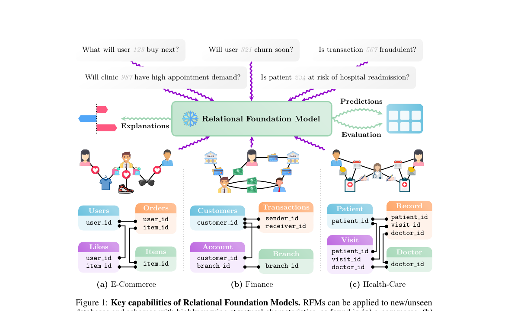
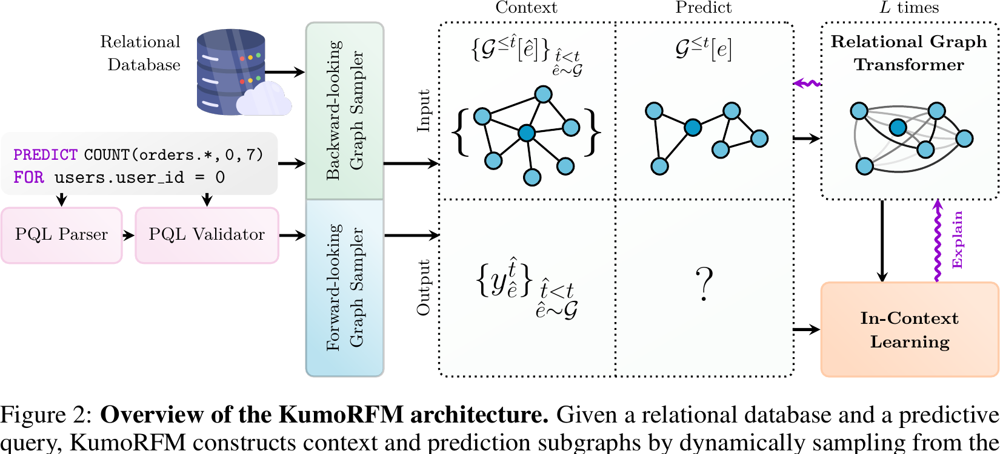
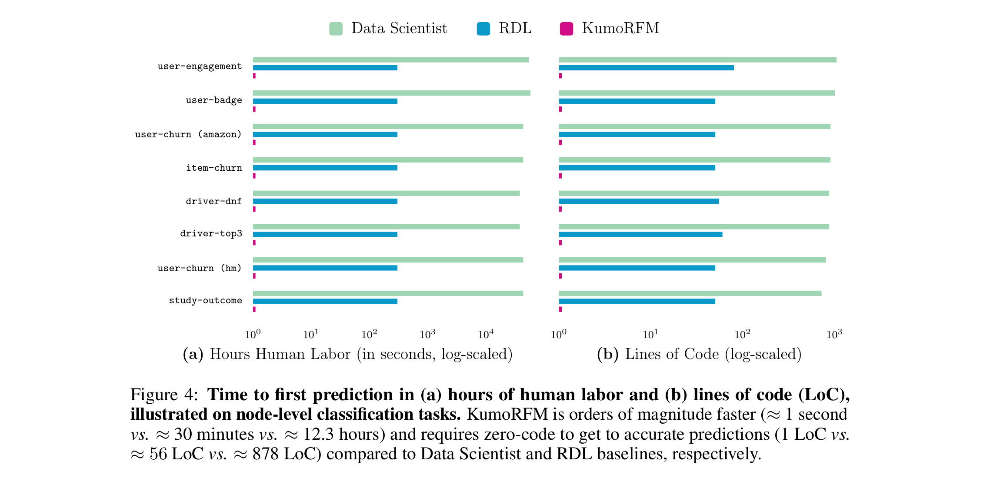

# KumoRFM: A Foundation Model for In-Context Learning on Relational Data

**Source:** https://kumo.ai/research/kumo_relational_foundation_model.pdf
**Title:** KumoRFM: A Foundation Model for In-Context Learning on Relational Data
**Date ingested:** 2026-04-29
**Type:** paper (whitepaper)
**Authors:** Matthias Fey, Vid Kocijan, Federico Lopez, Jan Eric Lenssen, Jure Leskovec
**Venue:** Kumo AI technical whitepaper (2025)

## Summary

- **What:** No foundation model existed for multi-table relational databases — all prior RDL methods required task-specific supervised training per database and task.
- **How:** KumoRFM (v1) combines a table-invariant row encoder, RelGT for cross-table attention, and an ICL Transformer that conditions on context subgraphs and their labels at inference; task labels are generated on-the-fly from historical database states via PQL.
- **So what:** First RFM — achieves 76.71 avg AUROC ICL-only on RelBench v1 (beating supervised HeteroGraphSAGE at 75.83), fine-tunes to 81.14; predictions in ~1 second with 1 line of code vs. hours and hundreds of lines for supervised methods.

*Figure 1 (from the paper): RFMs adapt to unseen databases/schemas (e-commerce, finance, healthcare), to any predictive task type (one-off or temporal), produce predictions without task-specific tuning, and provide both explanations and quantitative evaluation.*

## Related Work

KumoRFM sits at the intersection of two research lines, each with limitations that motivate the design.

**Relational Deep Learning (RDL)** ([fey2024rdlposition](fey2024rdlposition.md))

- Recasts relational tables as a temporal heterogeneous graph; GNNs/Graph Transformers learn end-to-end → no manual feature engineering.
- *Limitation:* every (dataset, task) pair needs its own model trained from scratch — no transfer.
- KumoRFM keeps the RDL graph view but swaps per-task training for ICL over a frozen pre-trained model.

**Foundation models for structured data** — three families, all insufficient for relational DBs:

| Family | Examples | Why insufficient for relational DBs |
|---|---|---|
| LLMs on textified tables/graphs | TabLLM, GraphText | Brittle prompting, hallucinations, weak with numerics, leakage risk; mismatched objective (next-token vs. forecast); fails on data without textual grounding. |
| Graph foundation models via text-attributed graphs | OFA, ZeroG, GFT | Each node must be LLM-encoded (expensive); positive transfer is mostly within-domain because structural patterns differ across graphs. |
| Tabular foundation models | [hollmann2023tabpfnv1](hollmann2023tabpfnv1.md), [hollmann2025tabpfnv2](hollmann2025tabpfnv2.md), [qu2025tabicl](qu2025tabicl.md) | Confined to a *single flat* table; limited context length, feature count, class size; multi-table data must be manually joined and flattened. |

→ KumoRFM extends the tabular-FM ICL paradigm to native multi-table relational DBs while keeping RDL's schema-agnostic graph view.

**Direct lineage / contrasts**

- [dwivedi2025relgt](dwivedi2025relgt.md) — RelGT is reused as the cross-table attention block (Stage 2 of the architecture).
- [hollmann2025tabpfnv2](hollmann2025tabpfnv2.md) — tabular ICL ancestor; KumoRFM lifts the same prior-fitted-network idea from one table to a database.
- [wang2025griffin](wang2025griffin.md) — schema-agnostic but uses meta-learning instead of ICL.
- [fey2025kumorfm2](fey2025kumorfm2.md) — v2 replaces the 3-stage pipeline with unified hierarchical 4-axis attention and early label injection.

| Model | Multi-table | ICL | Schema-agnostic | No task training |
|---|---|---|---|---|
| HeteroGraphSAGE ([fey2024rdlposition](fey2024rdlposition.md)) | Yes | No | No | No |
| [hollmann2025tabpfnv2](hollmann2025tabpfnv2.md) | No | Yes | Yes | Yes |
| [wang2025griffin](wang2025griffin.md) | Yes | No (meta-learning) | Yes | Yes |
| **KumoRFM v1** | Yes | Yes | Yes | Yes |
| [fey2025kumorfm2](fey2025kumorfm2.md) | Yes | Yes | Yes | Yes |

## Technical Details

The whole system (excluding PQL) is summarized

$$\tilde y_e^{(t)} = \mathrm{KumoRFM}_\theta^{\text{❄}}\!\left(\mathcal G_k^{\le t}[e],\; \big\{\mathcal G_k^{\le \hat t}[\hat e],\, y_{\hat e}^{\hat t}\big\}_{\hat t<t,\,\hat e\sim\mathcal G}\right)$$

- $\mathrm{KumoRFM}_\theta^{\text{❄}}$ (the **architecture** (Sec. 2.3) — pre-trained model with weights $\theta$, **frozen** (❄) at inference; adaptation happens via the context, not via gradient updates.
	- given the **test subgraph** $\mathcal G_k^{\le t}[e]$ and the **context set** $\{(\mathcal G_k^{\le \hat t}[\hat e],\, y_{\hat e}^{\hat t})\}$, predict the label $\tilde y_e^{(t)}$ for entity $e$ at time $t$ in a single forward pass (using in-context learning).
- The arguments inside the parentheses are produced by **Online Context Generation** (Sec. 2.2); 
	- $\mathcal G_k^{\le t}[e]$ — the **test subgraph**: $k$-hop neighborhood of seed entity $e$ at prediction time $t$ (only events $\le t$).
	- $\big\{\mathcal G_k^{\le \hat t}[\hat e],\, y_{\hat e}^{\hat t}\big\}_{\hat t<t,\,\hat e\sim\mathcal G}$ — the **context set**: pairs of past subgraphs and their ground-truth labels, sampled at past timestamps $\hat t<t$ for entities $\hat e$ drawn from the database graph $\mathcal G$.

### 1. PQL — defining the task

A SQL-like declarative language with `PREDICT` / `FOR` / `WHERE` clauses. The query alone determines:

- The task type (binary/multi-class/multi-label classification, regression, link prediction) 
- And the time window. 

One line of PQL replaces the ~hundreds of lines of pipeline code a data scientist would otherwise write.

### 2. Online Context Generation — building the inputs to Eq. 1

Because the predictive query is unknown until inference, training tables cannot be precomputed. KumoRFM generates the contents of Eq. 1 on the fly:

- **Backward-looking sampler** → *context subgraphs* $\mathcal G_k^{\le \hat t}[\hat e]$ and the test subgraph $\mathcal G_k^{\le t}[e]$, sampled from $\mathcal G$ around an entity $e$ at time $t$ (k-hop neighbours, time-respecting).
- **Forward-looking sampler** → *context labels* $y_{\hat e}^{\hat t}$, computed by evaluating the PQL aggregation against future events relative to $\hat t$.
- The resulting context triples $(\hat e, \hat t, y_{\hat e}^{\hat t})$ are bundled into a *dynamic training table* $\hat T$ that is attached to the entity table via PK–FK links, so context labels enter the graph itself. This expresses both autoregressive (same-entity history) and relational (neighbour) proximity.

### 3. The KumoRFM architecture — three stages

The architecture stacks **three Transformer modules**, one per stage:

1. **Row-encoder Transformer** (Stage 1) — over the cell grid $\mathbf C_T$, turns rows into embeddings $\mathbf H_T^{(0)}$.
2. **Relational Graph Transformer** (Stage 2) — $L$ layers of cross-table self-attention over the subgraph (RelGT, [dwivedi2025relgt](dwivedi2025relgt.md)).
3. **ICL Transformer** (Stage 3) — attends over $\mathbf H_{\text{train}}^{(L)}$, $y_{\text{train}}$, $\mathbf H_{\text{test}}^{(L)}$ to emit the prediction.

#### Stage 1 — Table-invariant row encoder (row-level encoding)

Turns each row of any table into a fixed-size vector.

- Per-cell encoders specialised by *semantic type*: numerical, categorical, multi-categorical, timestamp, text, embedding, hashed ID.
- Cells of table $T$ form a grid $\mathbf C_T \in \mathbb R^{N_T\times C_T\times F}$.
- A Transformer over this grid yields row embeddings $\mathbf H_T^{(0)} \in \mathbb R^{N_T\times F}$.
	- Cells *within* a row attend as a **set** (Set-Transformer, Lee et al. 2019) and pool to one $F$-dim vector; rows don't attend to each other yet (**left to Stage 2**).
- Attention is agnostic to row/column count → generalises to any schema.

#### Stage 2 — Relational Graph Transformer (row encoding improvement)

Exchanges info across tables ([dwivedi2025relgt](dwivedi2025relgt.md)).

- $L$ layers of self-attention over all rows in the subgraph, *including* the dynamically attached context table $\hat T$.
- Four positional encodings:
	- *node type* (which table the row comes from),
	- *hop distance* from the seed entity,
	- *relative time* of the event w.r.t. prediction time $t$,
	- *subgraph GNN-PE* (local structural signature).
- Output: entity readout $h_{T,e}^{(L)}$ (embeddings).

#### Stage 3 — ICL head (TabPFN/PFN-style)

Predicts the label by attending over context.

- **Tokens.** One per example: context = $\mathbf H_{\text{train},i}^{(L)}$ ⊕ embedding of $y_i$; test = $\mathbf H_{\text{test}}^{(L)}$ with a `[PRED]` placeholder.
- **Attention.** Standard Transformer over the full sequence; test tokens attend to all context tokens (TabPFN/PFN-style, no causal mask).
- **Readout.** Test-token output → task-specific head → class logits or scalar.
- **Why it works.** Pre-training amortises the map (context pairs → posterior over test label); inference is one forward pass, no gradient steps.
- Two granularities: *within-subgraph* (entity history via $\hat T$, baked in at Stage 2) + *cross-subgraph* (Stage 3 attention across context tokens). Link prediction reuses the same head with user/item pair tokens.

### 4. Advanced capabilities (Sec. 2.4)

- **Explainability.** Global cohort-level column importance via prediction variance across cohorts, plus local cell-level gradient saliency adapted to multi-modal inputs. An LLM turns both into natural-language summaries.
- **Quantitative evaluation.** Self-reports AUROC / AP / MAE / MAPE / MAP@k plus behavioural metrics (diversity, popularity bias) by replaying the query on recent historical snapshots.
- **Fine-tuning.** Swap the table-invariant encoder for dataset-specific ones and the ICL head for a task-specific one, then train supervised on a generated training table. Especially helpful for link prediction (inductive → transductive).

## Experiments

- ICL-only: avg AUROC 76.71 on RelBench v1 classification, beating supervised HeteroGraphSAGE (75.83) — first RFM to surpass a supervised RDL baseline.
- Fine-tuned: avg AUROC 81.14 (+7% relative over best supervised baseline); regression normalized MAE 0.862 vs. 1.0 for supervised.
- ~1 second to first prediction vs. ~30 min (RDL training) vs. ~12.3 hours (data scientist pipeline).

**Why so much faster than RDL?**

- RDL trains from scratch per (database, task) → ~30 min.
- KumoRFM is pre-trained once; new task = one forward pass.
- **ICL is the key**: per-task *training* → per-task *reading*.
- Pre-training amortises the cost; ICL spends it in one forward pass.
- Fine-tuning trades this speed for extra accuracy.

## Entities & Concepts

- [relational-foundation-model](relational-foundation-model.md)
- [relational-deep-learning](relational-deep-learning.md)
- [relational-entity-graph](relational-entity-graph.md)
- [relbench](relbench.md)
- [graph-transformer](graph-transformer.md)
