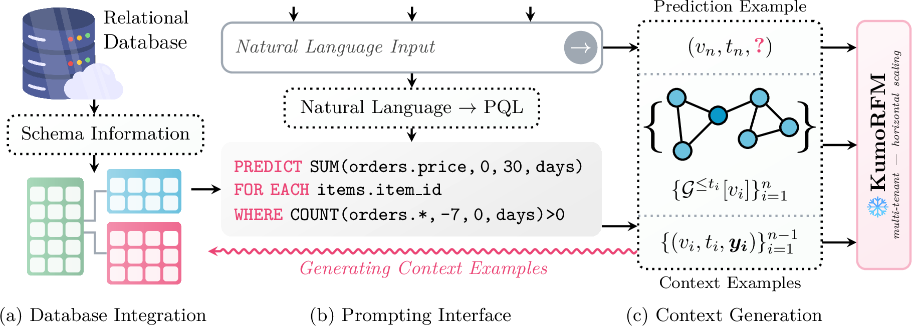
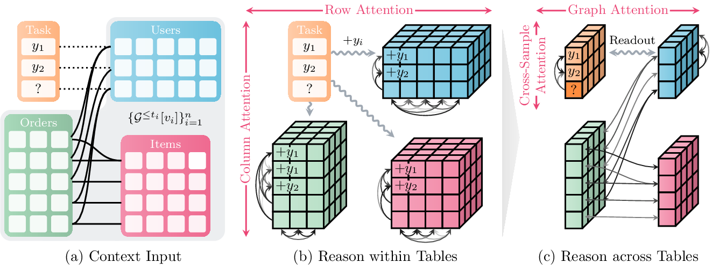
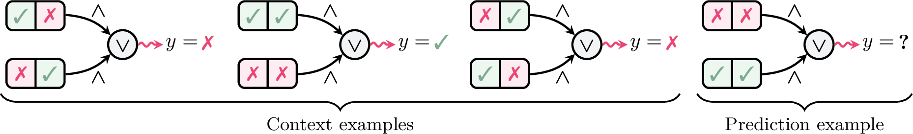
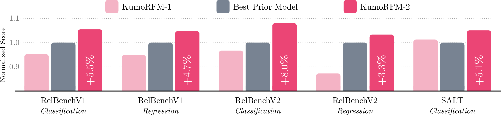

# KumoRFM-2: Scaling Foundation Models for Relational Learning

**Source:** https://arxiv.org/abs/2604.12596
**Title:** KumoRFM-2: Scaling Foundation Models for Relational Learning
**Date ingested:** 2026-04-29
**Type:** paper
**Authors:** Matthias Fey, Vid Kocijan, Nhat Hoang, Jonathan Lehmann, Jan E. Lenssen, Jure Leskovec
**Venue:** NeurIPS 2025 (preprint)

## Summary

- **What:** Tabular FMs applied to relational data via fixed-function flattening (DFS-style column-wise aggregation) suffer a fundamental expressivity gap — they cannot capture row-level conjunctions — and [fey2025kumorfm](fey2025kumorfm.md) was limited to in-memory datasets.
- **How:** Hierarchical 4-axis attention (column + row within tables, FK + cross-sample across tables) with early task-label injection, pre-trained on synthetic + real relational data, scales to 500B+ rows via SQL pushdown or a memory-mapped graph engine.
- **So what:** First few-shot foundation model to surpass supervised relational approaches (RelGNN) on RelBenchV1 (avg AUROC 79.60 vs. 78.06), with ~16% further improvement from fine-tuning.

*Figure 1 (from the paper): the KumoRFM system. (a) Direct connection to a relational database. (b) Predictive tasks specified via PQL or natural language. (c) Automatic context generation — context examples $(v_i, t_i, y_i)$ + input subgraphs $\mathcal G^{\le t_i}[v_i]$ — pushed down to the database for scale.*

## Related Work

KumoRFM-2 sits between three lines of prior work, each with a specific limitation:

| Family | Examples | Limitation |
|---|---|---|
| Tabular FMs | [hollmann2025tabpfnv2](hollmann2025tabpfnv2.md), [qu2025tabicl](qu2025tabicl.md), [qu2026tabiclv2](qu2026tabiclv2.md) | Single flat table only — relational data must be joined/flattened first. |
| TFM + fixed-function flattener | DFS+AutoGluon, RDB-Learn, Reliclsynthetic | Column-wise pre-aggregation loses *row-level conjunctions* (see Expressivity below); task-agnostic features add noise. |
| Supervised RDL | [dwivedi2025relgt](dwivedi2025relgt.md) (RelGT), RelGNN | Strong accuracy but needs per-task training from scratch, no transfer. |
| Cell-tokenised relational FM | [ranjan2025relationaltr](ranjan2025relationaltr.md) (RT) | Schema-agnostic via cell tokens; trades expressivity for PE-free generality. |
| KumoRFM v1 | [fey2025kumorfm](fey2025kumorfm.md) | Single-stage architecture, in-memory only, no task-conditioned feature extraction. |

| Model                                               | Tokenisation     | Multi-table        | Few-shot        | Scale          |
| --------------------------------------------------- | ---------------- | ------------------ | --------------- | -------------- |
| DFS+AutoGluon                                       | Column-wise flat | Yes (fixed-fn)     | No              | Large          |
| [ranjan2025relationaltr](ranjan2025relationaltr.md) | Cell             | Yes (4 attn masks) | Yes (zero-shot) | Moderate       |
| [fey2025kumorfm](fey2025kumorfm.md) (v1)            | Row (subgraph)   | Yes                | Yes             | In-memory only |
| [dwivedi2025relgt](dwivedi2025relgt.md) (RelGT)     | Row (5-element)  | Yes                | No (supervised) | Moderate       |
| **KumoRFM-2**                                       | Row (subgraph)   | Yes (hierarchical) | Yes             | 500B+ rows     |

## KumoRFM v1 vs v2

| Aspect                                          | KumoRFM v1                                                                                                                                                                          | KumoRFM v2                                                                                                                                                                                          |
| ----------------------------------------------- | ----------------------------------------------------------------------------------------------------------------------------------------------------------------------------------- | --------------------------------------------------------------------------------------------------------------------------------------------------------------------------------------------------- |
| **Architecture shape**                          | **3 sequential stages**: row encoder → RelGT → ICL head                                                                                                                             | **2 stages, each with 2 attention axes** (hierarchical 4-axis)                                                                                                                                      |
| **Stage 1 — intra-table**                       | Set Transformer row encoder: cells in a row attend as a *set*, pool to one $F$-vector. No column attention; rows don't attend to each other.                                        | **Column attention + row attention** (alternating, à la TabPFNv2 / TabICL). Both columns and rows explicitly attended to.                                                                           |
| **Stage 2 — inter-table**                       | **RelGT** ([dwivedi2025relgt](dwivedi2025relgt.md)): $L$ layers of full self-attention over *all rows in the subgraph at once*, with 4 PEs (node type, hop, time, subgraph-GNN-PE). | **FK/graph attention** (restricted to PK-FK neighbours, PE-light — topology is encoded by the attention *mask*) **+ cross-sample attention** (fused into Stage 2, replaces v1's separate ICL head). |
| **ICL mechanism**                               | **Separate Stage 3** TabPFN-style head over context tokens. ICL runs *after* graph mixing.                                                                                          | **Cross-sample axis of Stage 2** — ICL fused with graph attention, no separate head.                                                                                                                |
| **Label injection**                             | **Late**: context labels live in a dynamic table $\hat T$ stitched into the graph via PK-FK; only "reach" other tables after RelGT mixes them.                                      | **Early**: context label $y_i$ is broadcast into *every row of every table* in the example's subgraph **before any attention runs**. All four axes are task-conditioned from the start.             |
| **Task-conditioning of features**               | Feature extraction (Stages 1-2) is **task-agnostic**; only Stage 3 sees labels.                                                                                                     | Feature extraction is **task-conditioned at every scale**.                                                                                                                                          |
| **Tokenisation**                                | Row-level (one token per row) — same as v2.                                                                                                                                         | Row-level (one token per row) — **unchanged**. Both avoid the conjunction-counter-example expressivity trap.                                                                                        |
| **Cost layout**                                 | Three roughly equal Transformer blocks; row encoder runs over every cell in the subgraph.                                                                                           | **Asymmetric**: cheap lightweight Stage 1 filters noise; heavy Stage 2 focused on cross-table + cross-sample reasoning.                                                                             |
| **Scale / deployment**                          | **In-memory only** — capped by RAM.                                                                                                                                                 | Three modes: in-memory, **SQL pushdown** (recursive SQL along metapaths), **memory-mapped graph engine** (SSD-backed, ~5 GB/s, ~20M lookups/s). Scales to **500B+ rows**.                           |
| **Pre-training data**                           | Synthetic SCM tables/graphs + real RDBs with PQL queries.                                                                                                                           | Same recipe, **larger** + curriculum from single tables → richer relational structures.                                                                                                             |
| **Ensembling**                                  | Column/class shuffles.                                                                                                                                                              | Column/class shuffles **+ hop-count** ensembling.                                                                                                                                                   |
| **Fine-tuning**                                 | Supported (swap encoder + ICL head, train supervised).                                                                                                                              | Supported, **reduced dependence on context selection** — useful when training data exceeds the ~10k context cap.                                                                                    |
| **Headline result (RelBenchV1 classification)** | Avg AUROC **76.71** (ICL), **81.14** (fine-tuned); beats supervised HeteroGraphSAGE (75.83).                                                                                        | Avg AUROC **79.60** (ICL); beats supervised **RelGNN** (78.06) → **first few-shot model to surpass supervised RDL**.                                                                                |
| **RFM equation**                                | $\tilde y_e^{(t)} = \mathrm{KumoRFM}_\theta^{\text{❄}}(\mathcal G^{\le t}[e], \{(\mathcal G^{\le \hat t}[\hat e], y_{\hat e}^{\hat t})\})$                                          | **Identical equation**; only the *internals* of $\mathrm{RFM}_\theta$ change.                                                                                                                       |

**One-liner difference:** 

- v1 = tabular row encoder → RelGT → ICL (three stages, late label injection). 
- v2 = column/row attention (intra-table) → **FK ∥ cross-sample** attention (inter-table) — two stages, label injected upfront so feature extraction is task-conditioned everywhere, and ICL becomes one axis of attention instead of a separate Transformer head.

## Technical Details

*Figure 2 (from the paper): (a) context input — task table + connected tables; (b) within-table reasoning via alternating **column** and **row** attention; targets $y_i$ are injected directly into the input tables for task-conditioning; (c) across-table reasoning via **graph attention** over PK–FK edges and **cross-sample attention** over context examples.*

The same RFM equation as v1 — frozen model, context examples, single forward pass:

$$\hat{y}_n = \mathrm{RFM}_{{\theta}}^{\text{❄}}\!\left(\mathcal{G}^{\le t_n}[v_n],\; \{(\mathcal{G}^{\le t_i}[v_i],\, y_i)\}_{i=1}^{n-1}\right)$$

What changes from v1 is the *internals* of $\mathrm{RFM}_{{\theta}}$: a hierarchical 4-axis attention scheme.

### 1. Hierarchical 4-axis attention

Two stages, each attending along two axes — avoids the quadratic cost of flat all-cell attention while preserving expressivity across rows, columns, FKs, and context samples.

**Stage 1 — intra-table (lightweight network):**

- **Column attention** — across columns within a row → multi-modal attribute understanding.
- **Row attention** — across rows within a table → entity-level relationships.
- Context targets $y_i$ are injected into the task and child tables *here*, so all four axes are task-conditioned from the start.

> *Lineage:* alternating column/row attention itself is borrowed from the tabular-FM line — [somepalli2021saint](somepalli2021saint.md) (column + intersample), [hollmann2025tabpfnv2](hollmann2025tabpfnv2.md) (cell-level alternating row/col), [qu2025tabicl](qu2025tabicl.md) / [qu2026tabiclv2](qu2026tabiclv2.md) ($\mathrm{TF}_{\text{col}} \to \mathrm{TF}_{\text{row}}$). KumoRFM-2's contribution is lifting this single-table block into a *hierarchical* scheme with FK + cross-sample axes on top, plus early label injection so Stage 1 is already task-conditioned.

**Stage 2 — inter-table (larger network):**

- **Foreign-key (graph) attention** — across tables via PK-FK edges → relational topology.
- **Cross-sample attention** — across context examples → in-context learning signal.

This staged design lets noisy or irrelevant data be filtered early (cheap lightweight stage) and keeps the heavyweight stage focused on cross-table reasoning.

> *Contrast with v1's RelGT.* v1 ([fey2025kumorfm](fey2025kumorfm.md)) uses [dwivedi2025relgt](dwivedi2025relgt.md) as a single cross-table block: $L$ layers of **full self-attention over all rows in the subgraph at once**, with rich PEs (node type, hop distance, relative time, subgraph-GNN-PE) and a *separate* Stage 3 ICL head on top. v2's Stage 2 replaces this with **two decoupled axes**:
>
> - **FK axis** restricts attention to PK-FK neighbours, so topology is encoded by the *attention mask* — most of RelGT's PEs (node type, hop) become redundant.
> - **Cross-sample axis** absorbs what was v1's Stage 3 ICL head: context-vs-test interaction is now just one of the four attention axes, not a separate Transformer.
>
> The net effect: drops RelGT entirely; trades one heavy PE-rich graph-transformer block (+ ICL head) for two cheaper, semantically distinct passes. Works because labels were already injected upstream at Stage 1 — FK attention can stay topology-only and cross-sample attention can stay ICL-only.

### 2. Smarter context selection

Context size is capped at ~10k examples — on large databases this is as little as **0.2%** of available training data. To compensate, the context is structured:

- *Local* context — the prediction entity's own lagged-target history (its past subgraphs and labels).
- *Global* context — most recent database snapshots from other entities.

Local context conditions on what the model already "knows" about $v_n$; global context provides up-to-date world state.

### 3. Expressivity — the conjunction counter-example

*Figure 3 (from the paper): label is positive iff features $A$ **and** $B$ co-occur in the same child row. Column-wise marginals are uninformative → fixed-function flatteners get AUROC = 0.5.*

- Task: predict $y=1$ iff features $A$ and $B$ co-occur in at least one child row.
- Fixed-function *column-wise encoders* (DFS etc.): **AUROC 0.5** — column marginals are identical across classes.
- KumoRFM-2 with *row attention* + task-conditioning: **AUROC 1.0**.

This is a fundamental limitation of any task-agnostic flattener — not a tuning issue.

This illustrates that column-wise encoders has expression gap, which can be addressed by row-level tokenization.
### 4. Scale — three deployment modes

- **In-memory** — exploration, small-scale experiments (same as v1).
- **SQL pushdown** — context retrieval and subgraph construction executed as recursive SQL along metapaths; no intermediate graph materialised.
- **Memory-mapped graph engine** — SSD-backed, optimised for fast ingestion + neighbour retrieval. 500B+ rows, ~5 GB/sec bandwidth, ~20M lookups/sec.

### 5. Training, ensembling, fine-tuning

- **Pre-training data** — synthetic tables/graphs from Structural Causal Models + publicly available relational databases with diverse PQL queries; curriculum from single tables → richer relational structures.
- **Ensembling** — column/class shuffles + hop-count ensembling reduce permutation sensitivity and run-to-run variance.
- **Fine-tuning** — specialise weights to one (dataset, task). Reduces reliance on context selection; especially useful when training data exceeds context size.

## Experiments

*Figure 4 (from the paper): scores normalised to the strongest supervised baseline on each suite. KumoRFM-2 beats both v1 and the best prior model across RelBenchV1/V2 (classification + regression) and SALT.*

- **RelBenchV1 classification:** avg AUROC 79.60, beating RelGNN supervised (78.06) and KumoRFM-1 (76.71) — first few-shot model to surpass supervised RDL.
- **RelBenchV2 classification:** avg AUROC 79.96 vs. GraphSAGE supervised 78.19.
- **SAP SALT** (8 enterprise multi-class tasks): beats AutoGluon ensembles by ~8%, [TabICLv2](qu2026tabiclv2.md) by ~25% (MRR).
- **Fine-tuning** adds ~16% on top of ICL, with reduced dependence on context selection.
- **Robustness:** graceful degradation under cold-start (10 context examples), feature sparsity, link sparsity, and feature noise.

## Entities & Concepts

- [relational-foundation-model](relational-foundation-model.md)
- [relational-deep-learning](relational-deep-learning.md)
- [relbench](relbench.md)
- [relational-entity-graph](relational-entity-graph.md)
- [graph-transformer](graph-transformer.md)
- [tabular-learning](tabular-learning.md)
