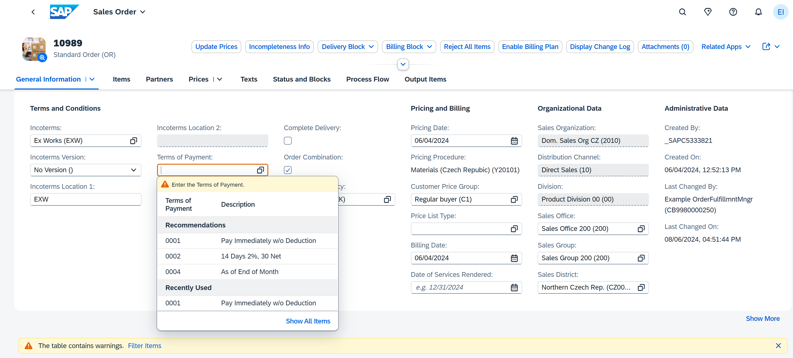

# RelBench v2: A Large-Scale Benchmark and Repository for Relational Data

**Source:** https://arxiv.org/abs/2602.12606
**Title:** RelBench v2: A Large-Scale Benchmark and Repository for Relational Data
**Date ingested:** 2026-04-28
**Type:** paper
**Authors:** Justin Gu, Rishabh Ranjan, Charilaos Kanatsoulis, Haiming Tang, Martin Jurkovic, Valter Hudovernik, Mark Znidar, Pranshu Chaturvedi, Parth Shroff, Fengyu Li, Jure Leskovec
**Venue:** ICLR 2026

## Summary

- **What:** RelBench v1's 7 datasets and forecasting-only task type were insufficient to benchmark foundation models that need scale, domain diversity, and non-forecasting tasks.
- **How:** Adds 4 new real-world datasets (22M+ new rows), 23 autocomplete tasks (predict existing column values rather than future events), and integrates TGB/ReDeLEx/4DBInfer as external data sources.
- **So what:** 11 datasets, 29 tables, broader task coverage; positioned as an ecosystem hub for relational ML research and foundation model pretraining.

## Challenges & Novelty

RelBench v1 covered only 7 databases and one task paradigm (forecasting: predict a future value from historical events). As relational foundation models scale up, two gaps emerge: (1) more diverse pretraining data is needed, and (2) the autocomplete use case (predicting missing attribute values in existing records — the dominant enterprise ML use case) has no benchmark representation.

- **Autocomplete as a task type:** unlike forecasting tasks that predict a future outcome, autocomplete predicts an existing but masked/missing column value at inference time (e.g., SAP S/4HANA sales order completion). Autocomplete has no intrinsic temporal structure but still benefits from relational context — RDL outperforms tabular baselines because the signal spans multiple tables.
- **Scale gap:** v1 datasets had at most ~3M rows; v2 adds rel-arxiv (1.5M papers + citation network), rel-mimic (MIMIC-IV ICU records), rel-salt (enterprise ERP), and rel-ratebeer (20+ years of reviews) — pushing the benchmark into the range where foundation model pretraining is meaningful.
- **Ecosystem integration:** rather than collecting new data from scratch, v2 reuses existing datasets (TGB temporal interactions, ReDeLEx's 70+ databases) by translating them into the relational schema format, enabling cross-community benchmarking.

## Relation to Prior Work

| Benchmark | Datasets | Task types | Temporal leakage prevention | Foundation model pretraining data |
|---|---|---|---|---|
| OGB | 9 | Classification/regression on static graphs | N/A | No |
| TGB ([huang2023tgb](huang2023tgb.md)) | 7 | Temporal link pred + node pred | Yes | No |
| RelBench v1 ([robinson2024relbench](robinson2024relbench.md)) | 7 | Forecasting | Yes | No |
| **RelBench v2** | 11 | Forecasting + autocomplete | Yes | Yes (ReDeLEx) |

- [robinson2024relbench](robinson2024relbench.md): v2 is the direct successor; all v1 tasks remain; v2 adds autocomplete and dataset diversity.
- [huang2023tgb](huang2023tgb.md): TGB datasets are integrated into v2 via relational schema translation, bridging temporal graph and RDL evaluation.
- [fey2025kumorfm2](fey2025kumorfm2.md): KumoRFM-2 uses ReDeLEx (integrated via v2) for pretraining; v2's scale is a direct enabler for foundation model research.

## RelBench v1 vs v2

Both versions share the same core abstractions — relational DB + training table with seed time, val/test temporal cutoffs, leakage-safe neighbor sampling, and the same RDL stack (PyTorch Frame ResNet encoder → temporal subgraph sampling → heterogeneous GraphSAGE with sum aggregation).

| Axis | v1 ([robinson2024relbench](robinson2024relbench.md)) | **v2** |
|---|---|---|
| Datasets | 7 | **11** (+ `rel-arxiv`, `rel-salt`, `rel-ratebeer`, `rel-mimic`) |
| Scale | ~3M rows max per DB | +22M rows across 29 new tables |
| Task paradigms | Forecasting only (SQL-constructed future labels) | Forecasting **+ autocomplete** (predict existing masked column values at seed time) |
| Total tasks | 30 | +13 forecasting + **23 autocomplete** |
| Entity classification | Binary only | + **Multiclass** (e.g. `arxiv.author-category`) |
| Recommendation models | GraphSAGE + BPR loss | + **ID-GNN** (entity-specific MLP head, cross-entropy) |
| External ecosystem | Standalone | Integrates **TGB** (event streams ⇒ relational schema), **ReDeLEx** (70+ DBs for pretraining), **4DBInfer** (multi-table eval) |
| Stated purpose | Empirical proof RDL beats data-scientist + LightGBM | Substrate for **relational foundation models** ([fey2025kumorfm](fey2025kumorfm.md), [wang2025griffin](wang2025griffin.md), [ranjan2025relationaltr](ranjan2025relationaltr.md)) |

**One-liner:** v1 proved RDL works on forecasting; v2 scales the benchmark up and adds autocomplete + external integrations to support foundation-model research.

## Technical Details

**New datasets:**
- `rel-arxiv`: 222K physics papers + 1.5M citation links; tasks include paper acceptance prediction, citation count forecasting
- `rel-salt`: SAP enterprise sales order ERP data; autocomplete tasks for sales order field prediction
- `rel-ratebeer`: 20+ years of beer reviews; user preference forecasting and review attribute autocomplete
- `rel-mimic`: MIMIC-IV ICU EHR data; clinical outcome prediction and diagnosis code autocomplete (medical)

**Autocomplete task construction.** A row's target column is masked at a seed time $t_v$; the model predicts the column value using only relational context from rows with $\tau \leq t_v$. Unlike forecasting, the label comes from the row itself (not a future aggregation), so no time-window SQL is needed — but temporal leakage prevention still applies to neighbor sampling.

**Why autocomplete matters.**
1. *Dominant enterprise use case* — most real predictive work is "fill in a missing field" (SAP sales-order completion, EHR diagnosis codes, CRM imputation), not forecasting a future aggregate.
2. *Labels free from the schema* — every (table, column) pair is a candidate task; no expert SQL design; benchmarks scale with the schema, not human labor.
3. *Isolates inter-table reasoning* — RDL's potential gain decomposes into three channels:
   - *intra-table reasoning* — already saturated by tabular baselines (LightGBM, TabPFN) on the entity row's own features.
   - *temporal aggregation* — counting/summing/windowing past events of the same entity; LightGBM with hand-crafted temporal features captures most of this.
   - *inter-table reasoning* — propagating signal across PK-FK edges to neighbor tables; this is the only channel where RDL has a unique edge.
   - Forecasting bundles all three; autocomplete strips temporal aggregation (label lives in the present row), so the RDL-minus-LightGBM gap is close to a **direct estimate of the inter-table contribution** — the cleanest diagnostic for new RDL architectures (RelGT, RelGNN, RT, Griffin).
1. *Aligned with FM pretraining* — masked-cell prediction matches RT's MTP objective and KumoRFM's targets, so one pipeline covers pretraining + evaluation. Makes v2 a foundation-model substrate, not just a bigger benchmark.
2. *New leakage class* — beyond v1's *temporal* leakage discipline, autocomplete adds *intra-row column* leakage: same-row correlates of the target (e.g. `review_text` ↔ `review-rating`) must be dropped or the task collapses to trivial sentiment prediction.

**External integrations:**
- *TGB* ([huang2023tgb](huang2023tgb.md), [arxiv](https://arxiv.org/abs/2307.01026), [site](https://tgb.complexdatalab.com/)): temporal interaction datasets translated to relational schema — each interaction becomes a row in an events table with FK references to node tables.
- *ReDeLEx* (Peleška & Šír 2025, [arxiv:2506.22199](https://arxiv.org/abs/2506.22199)): uniform API to 70+ real-world relational databases (built on the [CTU Prague Relational Learning Repository](https://relational.fel.cvut.cz/)); used as pretraining corpus for foundation models.
- *4DBInfer* (Wang et al. 2024, [arxiv:2404.18209](https://arxiv.org/abs/2404.18209)): 4D benchmarking toolbox spanning datasets × tasks × graph-construction strategies × predictive models for multi-table evaluation.

**Evaluation metrics.** Forecasting: AUROC (classification), MAE/RMSE (regression). Autocomplete: AUC (binary), accuracy (multiclass), R² (regression).

## Experiments

- HeteroGraphSAGE outperforms LightGBM on all autocomplete task types, confirming relational structure is informative for attribute inference beyond what a single-table model can capture.
- RDL gains are largest on tasks where the target column is correlated with information in linked tables (not visible in the target row alone).

## Entities & Concepts

- [relbench](relbench.md)
- [autocomplete-tasks](autocomplete-tasks.md)
- [relational-deep-learning](relational-deep-learning.md)
- [temporal-graph](temporal-graph.md)
- [relational-foundation-model](relational-foundation-model.md)
