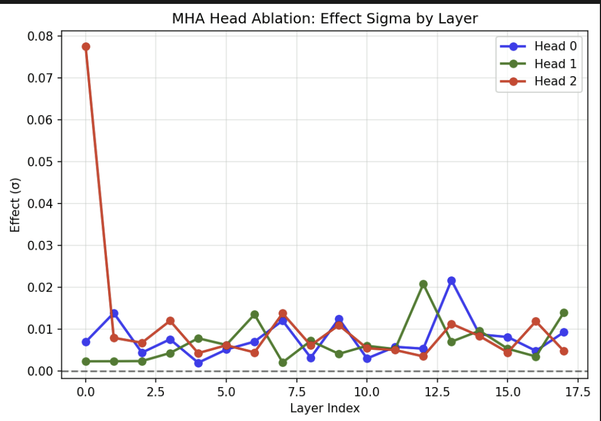

# Where Computation Lives Inside TabPFN: Causal Localisation of Attention Head Function

**Source:** https://arxiv.org/abs/2606.12917
**Title:** Where Computation Lives Inside TabPFN: Causal Localisation of Attention Head Function
**Date ingested:** 2026-07-14
**Type:** paper
**Authors:** Atharva Gupta, Dhruv Kumar, Murari Mandal, Saurabh Deshpande (BITS Pilani / KIIT / Birla AI Labs)
**Venue:** ICML 2026 Workshop on Tabular & Structured Data
**Code:** https://github.com/atharva7-g/tabfm-interp

## Summary

- **What:** Where inside [TabPFN](hollmann2025tabpfnv2.md)-2.5 does computation actually live — which attention heads are *causally* responsible, and at which layers?
- **How:** Head-level activation patching + ablation + attention-entropy on the `self_attn_between_features` module, across two synthetic regression tasks, plus a contrastive activation-steering probe.
- **So what:** Feature-wise attention splits into two functional head classes (one dominant "specialist" head + two symmetric late-layer heads), and pure-ICL structure makes activation steering fail to transfer — a boundary for steering-based interpretability on TFMs.

## Challenges & Novelty

A narrow but deep *causal* probe of a single TabPFN module, contrasting with the broader-but-shallower cross-TFM surveys. It trades breadth (one model, one module, two synthetic tasks) for causal depth (per-head patching/ablation with converging entropy evidence).

- **Head specialization is causal, not just correlational.** Prior TabPFN interpretability was post-hoc attribution or correlational neuron selectivity; this work uses activation patching and ablation to assign causal responsibility to individual heads and layers.
- **Selectivity ≠ causal necessity.** A head can attend sharply (low entropy) at a layer yet be non-load-bearing — demonstrated by Head 0 being co-selective with Head 2 at L0 but having near-zero ablation effect there. Guards against reading attention maps as mechanism.
- **A structural limit on steering TFMs.** Contrastive steering directions that transfer in LLMs (via function-vector heads) do *not* transfer here; the authors argue pure-ICL architectures encode the task in context-dependent attention, leaving no injectable parametric task direction.
- **Honest scope.** Two synthetic datasets cannot establish the head classes as general properties; the paper repeatedly flags this and treats the task-complexity depth-shift as tentative.

## Relation to Prior Work

One of three contemporaneous 2026 mechanistic studies of tabular foundation models. This is the narrowest and most causal (single module, per-head interventions); the other two are broader audits. [bilos2026mechanistic](bilos2026mechanistic.md) already cites this paper as concurrent work ("traces task-relevant logic into the middle layers"), so the three are best read as complementary rather than competing for a "first" claim.

| Aspect | This paper (Gupta 2026) | [bilos2026mechanistic](bilos2026mechanistic.md) | [balef2026onelayer](balef2026onelayer.md) |
|---|---|---|---|
| Unit of analysis | Individual **attention heads** (one module) | **Readout mechanism** + backbone | **Layers** across depth |
| Models | TabPFN-2.5 (regression) | TabPFNv2, TabICLv2, Mitra | TabPFN v1/v2/2.5, TabICL, LimiX |
| Data | 2 synthetic regression tasks | 49 cls + 10 reg real datasets | TabArena + PMLBmini real |
| Causal tools | Activation patching, head ablation, steering | Uniform-attention intervention, readout transplant | Layer skip / repeat / swap, self-repair |
| Headline | Head 2 dominant; steering fails (no FV heads) | Vote vs. prototype readouts; free invariance | Iterative inference; looped block ≈ full depth |

- **[bilos2026mechanistic](bilos2026mechanistic.md):** finds TabPFN's readout is an attention-weighted *vote* at a late layer — consistent in spirit with this paper's "late computation heads" (Heads 0/1 at L12–13), though at different granularity (module vs. head).
- **[balef2026onelayer](balef2026onelayer.md):** shares the "early layers uniquely critical, distributed elsewhere" theme; here it appears as Head 2's L0 dominance on the simple task and ~100% layer-patching recovery everywhere.
- **[ferrando2024primer](ferrando2024primer.md):** the LLM mech-interp toolkit (activation patching, steering, function-vector heads) that this work ports to TabPFN — and whose steering method it finds does *not* transfer.
- **LLM function-vector heads** (Todd 2024) and **activation steering** (Turner 2023, Panickssery 2023): the parametric-task-direction mechanism whose *absence* in TabPFN is the paper's explanation for steering failure.

## Technical Details

**Model.** `TabPFNRegressor` (TabPFN-2.5): 18 transformer layers, $H{=}3$ heads, $d_h{=}64$, $d_\text{model}{=}192$. Two sequential attentions per layer — `self_attn_between_items` (across samples) and `self_attn_between_features` (across feature blocks). The study targets the latter, the only cross-feature module. The default pipeline expands $d$ raw features to $d'=2d{+}1$, groups every 3 into a token, and appends a label token → $\lceil d'/3 \rceil + 1$ feature blocks.

**Interventions (hierarchy).**
- **Layer patching** — replace the full residual stream at depth $\ell$; recovers ~100% at *every* layer → highly distributed representation.
- **Feature-block patching** — replace one block's post-$W_O$ output; localizes only token-local interactions ($a\cdot b$), near-zero on the global $y=(\sum x)^2$ task.
- **Head patching** — replace one head's pre-$W_O$ output $\hat{V}_\ell[:,:,h^*,:]$, isolating that head's causal contribution.
- **Restoration score:** $\mathrm{Restore}(\ell,S) = \dfrac{\hat{y}(x^{\mathrm{patched}}_{\ell,S}) - \hat{y}(x^{\mathrm{corr}})}{\hat{y}(x^{\mathrm{clean}}) - \hat{y}(x^{\mathrm{corr}})}$ under `mean_shift` corruption.
- **Attention entropy:** normalized Shannon entropy $\tilde H = \bar H / \log F$ per head/layer (computed per-sample *then* averaged — averaging matrices first overestimates entropy by Jensen).

**Two functional head classes.**

- **Head 2 (dominant specialist):** largest ablation effect on both datasets (0.076σ at L0 on Multiplication; 0.074σ at L16 on Pairwise-50). *Consistent magnitude, task-dependent depth* — peak layer shifts with task complexity (tentative, n=2 datasets). Lowest entropy at L6 (both) and L13 (Pairwise-50), coinciding with its largest patching deviations.
- **Heads 0 & 1 (late computation):** symmetric patching + ablation profiles peaking at L12–13 on Multiplication (both necessary and restorable late); on Pairwise-50 Head 1 keeps the symmetry but Head 0 diverges (patching L5, ablation L15).
- **Label block is the critical read position:** ablating it drops the prediction 97–108%, confirming `self_attn_between_features` is on the causal path.

**Steering.** Contrastive direction $\delta = \text{mean}(X_\text{mult}) - \text{mean}(X_\text{add})$ injected at L0 gives ~0% MSE improvement on held-out samples across $\alpha\in[0,10]$. The direction is *geometrically stable* (train/val cosine 0.71) but *impotent* — its norm collapses ~300× when averaged across samples, because the multiplicative-vs-additive signal lives in per-sample attention composition, not a shared additive activation component.

## Experiments

- Layer-level patching recovers ~100% at every depth on Multiplication → information sufficient for prediction is preserved throughout the network.
- Head 2's ablation effect is 2–5× the other heads at its peak layer, stable across sample sizes (0.078σ at n=64 vs. 0.076σ at n=512 → not a batch artefact).
- Entropy minima and patching-deviation peaks converge on the same active layers (L6 Multiplication, L13 Pairwise-50), giving two independent signals for Head 2's computational sites.
- Feature-block and token-level patching localize computation only for token-local interactions; both go null on the global $y=(\sum x)^2$ task, matching its structure.
- Contrastive steering fails to transfer across samples; random/shuffled controls are identically flat, so the null is not direction-specific.

## Entities & Concepts

- [hollmann2025tabpfnv2](hollmann2025tabpfnv2.md) — TabPFN family; this studies the newer 2.5 checkpoint (feature-group size 3 vs. v2's 2), no dedicated 2.5 page
- [bilos2026mechanistic](bilos2026mechanistic.md) — broader cross-TFM audit that cites this paper as concurrent work
- [balef2026onelayer](balef2026onelayer.md) — depth-dynamics mechanistic study; shares the "early-critical, distributed-elsewhere" theme
- [layer-ablation](layer-ablation.md) — the necessity-testing intervention, applied here at head granularity
- [ferrando2024primer](ferrando2024primer.md) — source of the ported toolkit (activation patching, steering, function-vector heads)
- [tabular-learning](tabular-learning.md) — TFM family context
