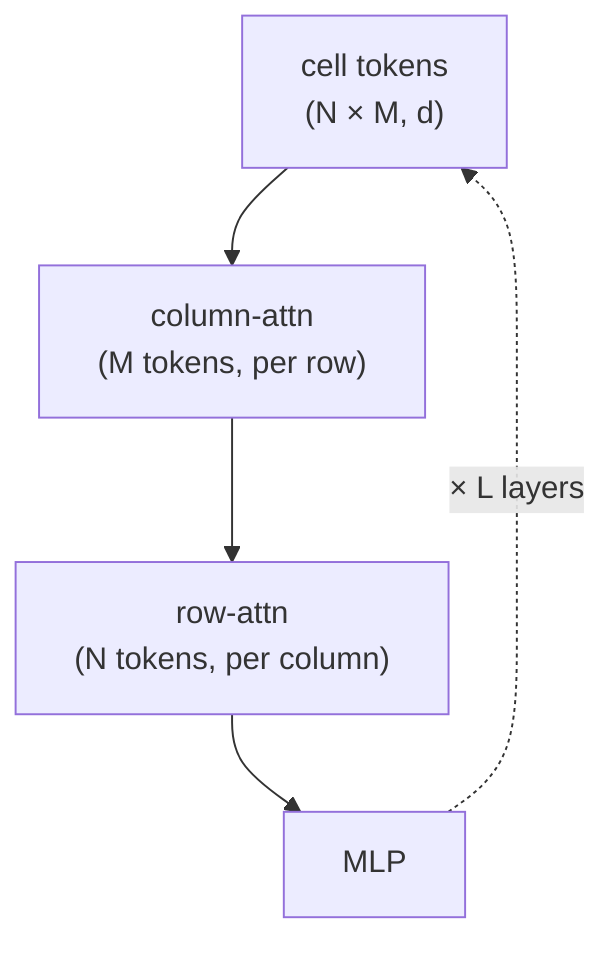

# TabPFN v2: Accurate Predictions on Small Data with a Tabular Foundation Model

**Source:** https://www.nature.com/articles/s41586-024-08328-6
**Title:** Accurate Predictions on Small Data with a Tabular Foundation Model
**Date ingested:** 2026-04-29
**Type:** paper
**Authors:** Noah Hollmann, Samuel Müller, Lennart Purucker, Arjun Garg, Marc Hutter
**Venue:** Nature 2025

![[Pasted image 20260519220730.png]]
## Summary

- **What:** v1 used **one token per row** with **learned per-slot column weights**.
	- Small tables only, numeric-only, classification-only.
	- Schema-invariant just on average (via rotation ensembling at inference).
- **How:** v2 uses **one token per** **cell**.
	- Per-(row, feature) tokens enable **factorized alternating row/column attention**.
	- **Randomized attribute tokens** replace learned column identity with architectural schema invariance.
- **So what:**
	- Schema-agnostic by construction — one checkpoint, any schema, one forward pass.
	- Mixed types, NaNs, and regression are first-class encoder steps.
	- Higher per-layer attention cost, absorbed by KV caching + multiquery test attention.
	- SOTA across hundreds of benchmarks; architectural ancestor of KumoRFM-2's Stage 1.

## Challenges & Novelty

**Notation:**

- $N$ — number of samples (rows)
- $M$ — number of features (columns)
- $d$ — hidden dim

(The papers use lowercase $n, m$; we use uppercase for table readability.)

v1's bottleneck is the row encoder: `Linear(M_max → d)` collapses each row to one token with **learned per-slot weights** $W_x[:, j]$. Per-cell tokens are the natural fix, but naive joint attention costs $O(N^2 M^2)$. v2's algorithmic moves:

- **Factorized alternating attention** — per-(row, feature) tokens with interleaved row- and column-attention; per-layer cost $O(N^2 M + N M^2)$.
- **Randomized attribute tokens** — $W_x[:, j]$ replaced by a random vector resampled each inference call; schema invariance becomes architectural.
- **Per-cell encoder steps** — categoricals, NaN indicators, and regression targets enter as extra channels per cell.

Mapping to v1's schema-shape limitations (see [hollmann2023tabpfnv1](hollmann2023tabpfnv1.md) §Limitations):

| Issue                  | v1                                                               | v2                                                                                                   |
| ---------------------- | ---------------------------------------------------------------- | ---------------------------------------------------------------------------------------------------- |
| Per-slot weights       | $W_x \in \mathbb{R}^{d \times 100}$, column $j$ uses $W_x[:, j]$ | Shared $W_x \in \mathbb{R}^{d \times g}$ ($g \in \{1, 2\}$), applied to every cell                   |
| Column identity        | Learned, position-specific; neutralized by rotation ensembling   | Random vector resampled per inference call (`feature_positional_embedding="subspace"`)               |
| Feature-count contract | Hard cap at $M_{\max} = 100$                                     | No $M_{\max}$ baked into the encoder                                                                 |
| Cat / NaN              | External imputation                                              | First-class encoder steps (`NanHandlingEncoderStep`, `CategoricalInputEncoderPerFeatureEncoderStep`) |

Higher per-layer cost is absorbed via KV caching and multiquery test attention. See [tabpfn-v2-code](tabpfn-v2-code.md) for code-level details.

## Relation to Prior Work

| Method | N limit | Schema-agnostic | Mixed types | Architecture | Attention complexity |
|---|---|---|---|---|---|
| [hollmann2023tabpfnv1](hollmann2023tabpfnv1.md) | 1000 | No | No | Full joint attention | $O(N^2)$ (one token per row, $M$ folded into $d$) |
| **TabPFN v2** | 10K | Yes (random attr. tokens) | Yes | Alternating row/col attn | $O(N^2 M + N M^2)$ |
| [qu2025tabicl](qu2025tabicl.md) | 500K | Yes | Yes | 3-stage (col→row→ICL) | $O(N M)$ (induced-point Set Transformer + factored stages) |

- [hollmann2023tabpfnv1](hollmann2023tabpfnv1.md): v1 is the conceptual foundation — PFN objective, SCM prior, single forward pass ICL; v2 fixes scale, schema, and type limitations.
- [qu2025tabicl](qu2025tabicl.md): TabICL targets the remaining 10K→500K gap by decoupling column embedding from the ICL Transformer, trading v2's joint attention for lower complexity.

## Technical Details

v2 = per-cell tokens + factorized row/column attention + randomized column identity, pretrained on synthetic SCM/BNN tables.

**Alternating row/column attention.** Each of $L$ encoder layers applies column-attention then row-attention then an MLP, all over the $N \times M$ grid of cell tokens:

- *Column attention*: within a row, the $M$ feature tokens attend to each other — captures feature correlations.
- *Row attention*: within a column, the $N$ sample tokens attend to each other — captures which training examples are similar to the test instance (the ICL signal).

Per-layer attention cost:

- $O(N^2 M + N M^2)$ — row-attn over $N$ tokens for each of $M$ columns, plus column-attn over $M$ tokens for each of $N$ rows.
- *Higher* than v1's $O(N^2)$ row-only attention — but the price of per-cell tokens, which is what enables randomized column identity and per-cell regression / mixed types / NaNs.
- Scale to $N \le 10\text{K}$ comes from KV caching + multiquery test attention amortizing the constants — not from a complexity drop.

**Randomized attribute tokens.** The core constraint: once you have per-cell tokens, each cell needs *some* identifier saying "I am from column $j$" — otherwise column-attention can't distinguish features within a row (they all look like generic scalars in $\mathbb{R}^d$).

Three choices:

- *None* — column-attn collapses; features are indistinguishable.
- *Learned per-column embedding (v1)* — slot $j$ specializes to whichever column distribution appeared at $j$ during pretraining; new schemas are mis-specialized, patched only on average by 32-way rotation ensembling.
- *Random, resampled each call (v2)* — columns get **distinct but uninformative** identities. The model must infer column semantics from the in-context training rows alone, like a few-shot learner inferring a new vocabulary.

This gives schema invariance *by construction*: pretraining cannot overfit to "column 0 is usually the target-like feature" because at every call, "column 0" is a fresh random vector. Columns become an exchangeable set — the symmetry that factorized column-attention assumes.

**Pretraining.** Trained on ~130M synthetic tabular datasets (SCMs + BNNs + diverse activation functions), with varied sizes, feature counts, class imbalances, and generating mechanisms.

## Experiments

- Wins on 26% of 261 classification/regression benchmarks (vs. 12% for ModernNCA, 10% for TabM); outperforms 4-hour AutoGluon in 2.8 seconds.
- Robust to uninformative features and outliers; handles missing values via context-based inference.
- Degrades on class-imbalanced datasets and high dimensionality — performance on minority classes is TabICL's primary motivation for further scaling.

## Entities & Concepts

- [tabular-learning](tabular-learning.md)
- [relational-foundation-model](relational-foundation-model.md)
- [tabular-icl-lineage](tabular-icl-lineage.md) — comparison across the PFN → TabPFN → TabICL lineage
