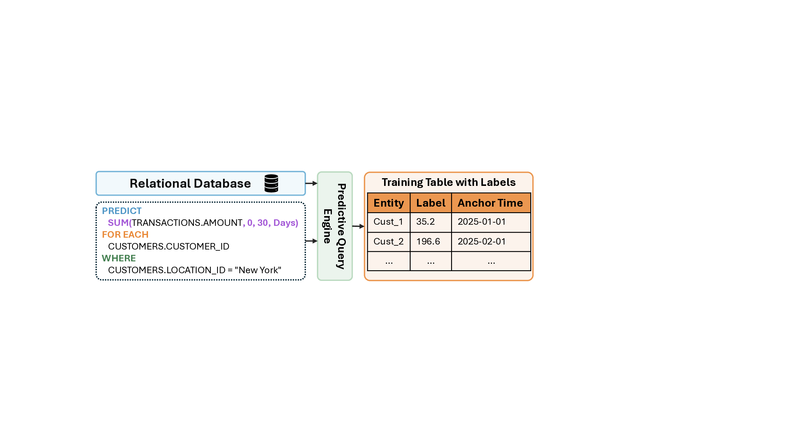

# Predictive Query Language: A DSL for Predictive Modeling on Relational Databases

**Source:** https://arxiv.org/abs/2602.09572
**Title:** Predictive Query Language: A Domain-Specific Language for Predictive Modeling on Relational Databases
**Date ingested:** 2026-05-06
**Type:** paper
**Authors:** Vid Kocijan, Jinu Sunil, Jan Eric Lenssen, Viman Deb, Xinwei Xe, Federico Reyes Gomez, Matthias Fey, Jure Leskovec
**Venue:** arXiv 2026 (VLDB submission)

## Summary

- **What:** Generating training labels from relational databases requires manual, error-prone SQL engineering — the last major bottleneck in the RDL pipeline after feature engineering and model training have been automated.
- **How:** PQL is a declarative DSL (PREDICT / FOR EACH / WHERE / ASSUMING) compiled via ANTLR4 into a deterministic query engine that automatically computes training tables with temporal consistency and zero leakage — no neural model involved.
- **So what:** A single PQL query replaces hundreds of lines of SQL; task type is auto-inferred; 40× faster training table generation than baseline SQL; used in KumoRFM to construct ICL context examples on-the-fly in under 1 second.

## Challenges & Novelty

Training table generation is the last manual bottleneck in the RDL pipeline: existing SQL tools were not designed to enforce temporal leakage prevention, infer task type, or express entity-centric aggregations across related tables concisely. A declarative language for this problem must guarantee point-in-time consistency, unambiguous timeframe inference, and automatic task-type derivation — properties SQL deliberately omits.

- **Temporal leakage is silent and pervasive:** complex multi-hop joins with time filters are easy to write incorrectly in SQL; PQL makes leakage structurally impossible by requiring all aggregations to reference an explicit anchor timestamp.
- **Task type must be machine-inferrable:** to enable automated model selection and ICL, the task type (regression/classification/link prediction) must be unambiguously derivable from the query syntax — SQL provides no such semantics.
- **Low-latency label generation for ICL:** KumoRFM needs to construct thousands of labeled context examples on-the-fly at inference time; standard batch SQL pipelines are too slow for this.

## Relation to Prior Work

| System | Label generation | Temporal leakage prevention | Task type inference | RDL-native |
|---|---|---|---|---|
| SQL / Pandas | Manual | Manual | No | No |
| AutoML (AutoGluon) | Assumes labels exist | No | No | No |
| Ludwig / Overton | Assumes labels exist | No | No | No |
| [fey2024rdlposition](fey2024rdlposition.md) (RDL blueprint) | Manual | Algorithm 1 (code) | No | Yes |
| **PQL** | Automatic | By construction | Yes | Yes |

- [fey2024rdlposition](fey2024rdlposition.md): the RDL blueprint introduced the Training Table abstraction and Algorithm 1 for temporal consistency but left label computation to manual SQL; PQL automates this step.
- [fey2025kumorfm](fey2025kumorfm.md): KumoRFM uses PQL's low-latency implementation to auto-generate ICL context examples; PQL is the data-layer interface to KumoRFM.
- [fey2025kumorfm2](fey2025kumorfm2.md): KumoRFM-2 continues using PQL and extends it as a "structured intermediate representation for natural language interfaces" — an LLM can generate PQL from natural language, which the engine then executes.

## Technical Details

**PQL is a compiled DSL, not a neural model.** Grammar implemented in ANTLR4; parsed and executed by a deterministic query engine. KumoRFM never reads PQL — PQL is executed upstream to produce labeled subgraphs that the model receives as context.

**Syntax.** Two mandatory clauses:
```
PREDICT <aggregation | condition | column>
FOR EACH <entity_column>
  [WHERE <condition>]
  [ASSUMING <future_condition>]
```

Example — predict 30-day spend for active NYC customers:
```
PREDICT SUM(transactions.value, 0, 30, days)
FOR EACH customers.customer_id
  WHERE COUNT(transactions.*, -30, 0, days) > 0
    AND customers.location = "New York"
```

**Aggregation syntax:** `AGGR_TYPE(column, start_offset, end_offset, time_unit)` — offsets are relative to the anchor timestamp. Supported: `SUM`, `AVG`, `MIN`, `MAX`, `COUNT`, `COUNT_DISTINCT`, `FIRST`, `LAST`, `LIST_DISTINCT`.

**ASSUMING clause.** Forward-looking filter for counterfactual/causal queries — restricts training examples to cases meeting a future condition, enabling causal effect estimation by comparing models with and without the assumption.

**Task type auto-inference:**
- Scalar aggregation → regression
- Boolean condition on aggregation → binary classification
- `LIST_DISTINCT` over values → multi-label classification
- `LIST_DISTINCT` over foreign key → link prediction / recommendation

**Temporal consistency.** All aggregations carry explicit time offsets, making the timeframe unambiguous. The engine samples anchor times such that prediction windows never overlap across train/val/test splits — temporal leakage is structurally impossible.



**Two implementations:**
1. *Batch (RDL training)*: large-scale SQL pushdown for training dataset construction; custom optimizations over baseline SQL.
2. *Low-latency (KumoRFM ICL)*: constructs context examples on-the-fly at inference time in <1 second; used to populate KumoRFM's ICL context window without precomputing the full training set.

## Experiments

- Custom PQL implementation computes training tables 40× faster than a comparable baseline SQL implementation.
- PQL covers the full range of RelBench v1 tasks (regression, classification, link prediction) with a single query per task, validated against manually-engineered baselines.
- Deployed in production for financial fraud detection, item recommendations (social media, food delivery), and medical complication prediction.

## Entities & Concepts

- [training-table](training-table.md)
- [relational-deep-learning](relational-deep-learning.md)
- [relational-entity-graph](relational-entity-graph.md)
- [relbench](relbench.md)
