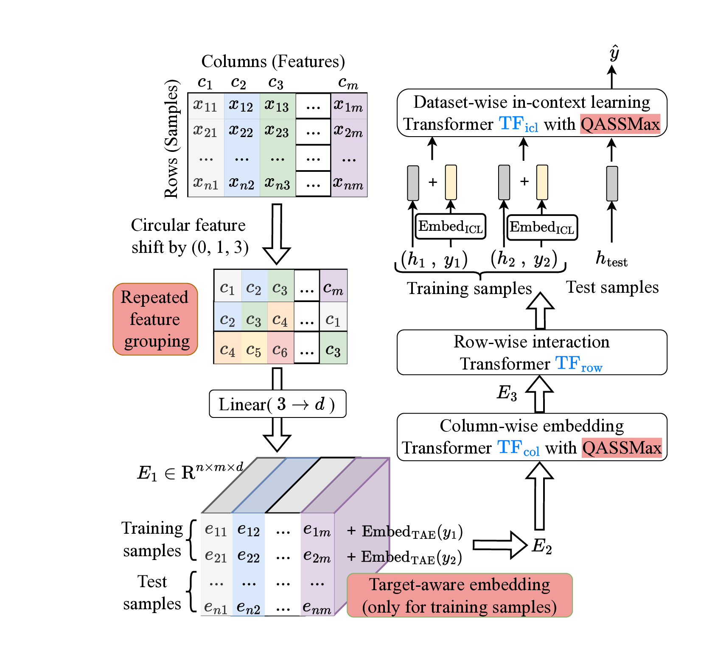
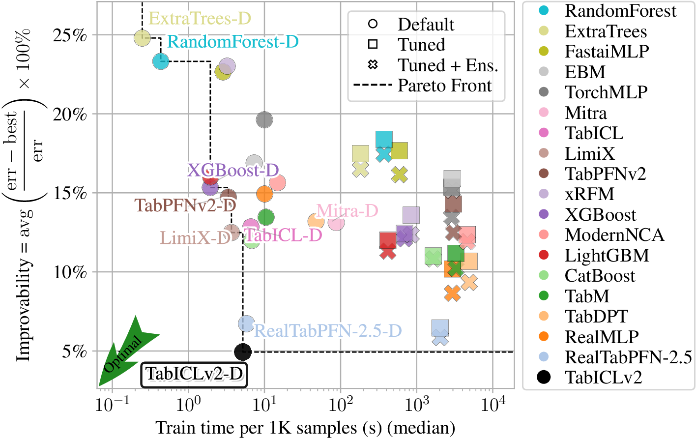

# TabICLv2: A better, faster, scalable, and open tabular foundation model

**Source:** https://arxiv.org/abs/2602.11139
**Title:** TabICLv2: A better, faster, scalable, and open tabular foundation model
**Date ingested:** 2026-05-11
**Type:** paper
**Authors:** Jingang Qu, David Holzmüller, Gaël Varoquaux, Marine Le Morvan
**Venue:** ICML 2026 (preprint)

## Summary

- **What:** Existing tabular foundation models (TFMs) either don't scale ([hollmann2025tabpfnv2](hollmann2025tabpfnv2.md) is $O(n^2m + nm^2)$, hits OOM beyond ~50K rows) or are not fully open ([RealTabPFN-2.5](hollmann2025tabpfnv2.md) tunes/finetunes on real data closed-source), blocking community progress at the SOTA frontier.
- **How:** Three pillars on top of TabICL's 3-stage pipeline ($\mathrm{TF}_{\text{col}} \to \mathrm{TF}_{\text{row}} \to \mathrm{TF}_{\text{icl}}$): a novel synthetic prior (Cauchy-graph DAG sampling + 8 random-function families with diverse smoothness/inductive biases); architectural innovations (*repeated feature grouping*, *target-aware embedding*, *QASSMax* query-aware scalable softmax, *mixed-radix ensembling* for >10 classes, 999-quantile regression head); and pretraining improvements (Muon optimizer + cautious weight decay, disk offloading at inference).
- **So what:** Without any tuning, TabICLv2 surpasses RealTabPFN-2.5 (tuned+ensembled+fine-tuned) on TabArena and TALENT improvability, runs 10× faster than TabPFN-2.5 at 50K samples on H100, and scales to 1M-row tables under 50 GB GPU — fully open including weights and code.

*Figure 1 (from the paper): TabICLv2 architecture. Repeated feature grouping breaks feature symmetry via circular-shift column triples; target-aware embedding injects $y_i$ into training tokens from the start; QASSMax replaces softmax in $\mathrm{TF}_{\text{col}}$'s inducing-point aggregation and in $\mathrm{TF}_{\text{icl}}$.*

## Challenges & Novelty

Tabular FMs based on Prior-data fitted networks have dethroned GBDTs on small-to-medium tables, but the recipe has several pain points: quadratic complexity blocks scaling to >50K rows, softmax-based attention fades at long context (entropy rises, accuracy drops as context grows), independent column embeddings collapse when features share similar distributions, and the strongest published TFM is closed-source.

- **Attention fading at scale:** standard softmax denominator grows linearly with context length $n$, flattening attention distributions; models trained on shorter contexts can't maintain sharpness at longer ones — limiting length generalization.
- **Feature representation collapse:** TabICL embeds each feature independently; columns with similar distributions yield nearly identical embeddings. TabPFNv2 mitigates this by grouping multiple columns per token but loses fine-grained per-feature signal.
- **Late target injection:** TabPFNv2 appends $y$ as an extra column processed by the model only at the ICL stage; TabICLv2 finds injecting target embeddings directly into every training token (post-feature-grouping) materially improves performance.
- **Synthetic prior diversity:** TabICL's prior is too narrow for the new architecture (training fails); a richer prior with new DAG topology (Cauchy graphs), 5 new random-function types (GP, EM-plateaus, products, quadratic, linear), and bootstrap-test filtering is essential.
- **Closed-source SOTA:** RealTabPFN-2.5 leads the leaderboard but ships closed weights and uses real-data continued pretraining. TabICLv2 commits to fully open weights, code, prior, and pretraining recipe.

## Relation to Prior Work

| Method | Tokenization | Complexity | Many-class | Open weights | Notes |
|---|---|---|---|---|---|
| [hollmann2023tabpfnv1](hollmann2023tabpfnv1.md) | Row token | $O(n^2 m)$ | ≤10 | Yes | First PFN-based TFM; $n\le1$K |
| [hollmann2025tabpfnv2](hollmann2025tabpfnv2.md) | Cell, alt. row/col attn | $O(n^2 m + nm^2)$ | ≤10 | Yes | $n<10$K; SOTA small tables |
| TabPFN-2.5 / RealTabPFN-2.5 | Cell, deeper | $O(n^2 m + nm^2)$ | ≤10 | No (closed) | Continued pretraining on real data |
| [qu2025tabicl](qu2025tabicl.md) | Per-column → row CLS | $O(n^2 + nm^2)$ | Hierarchical | Yes | 3-stage col→row→ICL; $n\le500$K |
| **TabICLv2** | Per-column (grouped) → row CLS | $O(n^2 + nm^2)$ | Mixed-radix + ECOC | Yes | + target-aware emb. + QASSMax + Muon + new prior |

- [qu2025tabicl](qu2025tabicl.md) — direct predecessor; v2 keeps the 3-Transformer pipeline and complexity but rewrites the prior, adds target-aware embedding, QASSMax, mixed-radix many-class handling, quantile regression, and Muon pretraining.
- [hollmann2025tabpfnv2](hollmann2025tabpfnv2.md) — inspires column-group tokenization; v2 retains per-feature resolution via *repeated* (overlapping) grouping rather than disjoint groups.
- [muller2022pfn](muller2022pfn.md) — the underlying PFN paradigm: train $q_\theta(y_{\text{test}}|x_{\text{test}}, \mathcal{D}_{\text{train}})$ on synthetic prior; one forward pass for ICL.
- [hollmann2023tabpfnv1](hollmann2023tabpfnv1.md) — first SCM-based prior; v2's prior is a substantially richer descendant (Cauchy graphs, 8 random-function types, bootstrap filtering).
- SSMax (Scalable Softmax) — provides the $s\log n$ scaling that QASSMax generalizes with per-element MLPs and query-aware gating.
- Set Transformer — used as $\mathrm{TF}_{\text{col}}$ (ISAB-style inducing points).
- Muon optimizer — replaces AdamW; combined with cautious weight decay and $\sqrt{\max(n,m)}$ per-parameter LR scaling.

## Technical Details

The architecture extends TabICL's three Transformer stages with five marked innovations.

### 1. Repeated feature grouping

For a table with $m$ columns, build $m$ groups via circular shifts; the $j$-th group encodes columns at positions $(j, j+1, j+3) \bmod m$. A shared linear layer $\mathrm{Lin}: \mathbb{R}^3 \to \mathbb{R}^d$ maps each triple to a token:

$$E_1[i,j] = \mathrm{Lin}\big(x_{i,j},\; x_{i,(j+1)\bmod m},\; x_{i,(j+3)\bmod m}\big)$$

The shift pattern $(0,1,3)$ guarantees, for $m \geq 7$, that no two columns co-occur in more than one group — preserving fine-grained feature identity while breaking the symmetry that causes representation collapse when columns share distributions.

### 2. Target-aware embedding (early label injection)

After feature grouping, training-row tokens get a target embedding added:

$$E_2[i,j] = E_1[i,j] + \mathrm{Embed}_{\text{TAE}}(y_i), \quad i \in \mathcal{D}_{\text{train}}$$

Linear layer for regression, learnable lookup for classification. Targets enter every feature token, not just one appended column — and importantly, *before* $\mathrm{TF}_{\text{col}}$, so column embedding is task-conditioned. (KumoRFM-2's "early label injection" parallels this idea at the relational scale.)

### 3. Three-stage compression then ICL

- **$\mathrm{TF}_{\text{col}}$** — Set Transformer over each column's values; ISAB-style inducing points aggregate per-column distribution. QASSMax applied where inducing points aggregate the input.
- **$\mathrm{TF}_{\text{row}}$** — collapses feature embeddings per row into one vector via [CLS] tokens.
- **$\mathrm{TF}_{\text{icl}}$** — ICL Transformer over row embeddings; test tokens attend to training tokens. QASSMax applied here.

### 4. Query-aware Scalable Softmax (QASSMax)

Combats *attention fading* — the loss of attention sharpness as context grows. Where SSMax rescales each query by a learnable per-head scalar $s_h \log n$, QASSMax rescales each query *element*:

$$\tilde q_{hi} = q_{hi} \cdot \underbrace{\mathrm{MLP}_{\text{base}}(\log n)_{hi}}_{\text{base scaling}} \cdot \underbrace{\big(1 + \tanh(\mathrm{MLP}_{\text{gate}}(q_h)_i)\big)}_{\text{query-aware gating} \in (0,2)}$$

The $\log n$ factor counteracts denominator growth; element-wise scaling lifts the per-head scalar to per-dimension; the bounded gate modulates without dominating. Toy needle-in-haystack experiment (one anchor + up to 15K negatives) shows QASSMax preserves 100% accuracy and low entropy while plain softmax collapses.

### 5. Mixed-radix ensembling (many-class classification)

Pretraining is restricted to $\le 10$ classes. For $C > 10$ classes, choose balanced bases $[k_0, \ldots, k_{D-1}]$ with $k_i \le 10$ and $\prod k_i \ge C$; decompose each label into $D$ mixed-radix digits $y^{(i)} \in \{0,\ldots,k_i-1\}$. Run $\mathrm{TF}_{\text{col}}$ once per digit and average:

$$O_{\text{avg}} = \frac{1}{D} \sum_{i=0}^{D-1} \mathrm{TF}_{\text{col}}\big(E_1 + \mathrm{Embed}_{\text{TAE}}(y^{(i)})\big)$$

Combined with hierarchical classification at the ICL stage, this scales to arbitrary class counts. ECOC (TabPFNv2) is marginally better but 3× slower.

### 6. Regression as 999-quantile prediction

Predicts 999 quantiles at $\alpha \in \{0.001, \ldots, 0.999\}$ with pinball loss. Inference: average for point estimates; sort/isotonic for distributions, with parametric exponential tail extrapolation yielding closed-form PDF/CDF/moments.

### 7. Pretraining recipe

- **Three stages** (TabICL-style curriculum): 500K steps × 1K samples → 40K × up-to-10K samples → 10K × up-to-60K samples; LR drops $8\text{e-}4 \to 1\text{e-}4 \to 2\text{e-}5$.
- **Optimizer:** Muon (instead of AdamW) with Moonlight-style $0.2\sqrt{\max(n,m)}$ LR scaling per parameter; cautious weight decay (decay only when update and parameter agree in sign); gradient clipping at 10 for stages 1–2.
- **Cost:** ~24.5 H100-days/model — lower than TabICL's 60 A100-days.

### 8. Synthetic prior

Entirely synthetic, following the SCM paradigm of TabPFN but enriched: novel *random Cauchy graphs* for non-tree DAG topologies; 8 random function families (MLP, Tree Ensemble, Discretize, GP, Linear, Quadratic, EM-plateaus, Product) covering varied smoothness and inductive biases; bootstrap-test filtering removes datasets where ExtraTrees cannot improve over a constant baseline; correlated sampling of "hyperparameters" (e.g., category counts shared across columns).

### 9. Inference optimizations

Disk offloading lets a 1M × 500 table run in <450 s on <24 GB CPU + <50 GB GPU. Selective $Q/K/V$ projection removes redundant computation. No retrieval or distillation needed for million-scale.

## Experiments

*Figure 2 (from the paper): TabArena improvability vs. 8-fold-CV train+inference time. TabICLv2 without tuning sits on the lower-left Pareto frontier, beating RealTabPFN-2.5 (tuned + ensembled + finetuned).*

- **TabArena (51 datasets):** TabICLv2 *without tuning* dominates the improvability–runtime Pareto front, surpassing RealTabPFN-2.5 *tuned + ensembled + fine-tuned*.
- **TALENT (300 datasets):** same — top of Pareto on improvability vs. inference time.
- **Runtime:** 10.6× faster than TabPFN-2.5 on H100 at 50K samples; 11.8× faster on CPU at 10K samples.
- **Many-class (12 TALENT datasets, >10 classes):** TabICLv2 + mixed-radix ensembling substantially outperforms all baselines; ECOC slightly better but 3× slower.
- **Scaling:** maintains top rank across $10^3$–$10^5$; outperforms RealTabPFN-2.5 on >20K samples; still strong on 600K-row TALENT-extension datasets where TabPFN-2.5 OOMs.
- **Ablation ordering (Elo):** new prior ≫ early target embedding ≈ Muon ≈ QASSMax ≫ repeated feature grouping ≈ prior filtering. Pretraining TabICLv2 with the *TabICL prior* fails — architecture and prior co-evolve.

## Entities & Concepts

- [tabular-learning](tabular-learning.md)
- [qu2025tabicl](qu2025tabicl.md)
- [hollmann2025tabpfnv2](hollmann2025tabpfnv2.md)
- [hollmann2023tabpfnv1](hollmann2023tabpfnv1.md)
- [muller2022pfn](muller2022pfn.md)
- [fey2025kumorfm2](fey2025kumorfm2.md)
