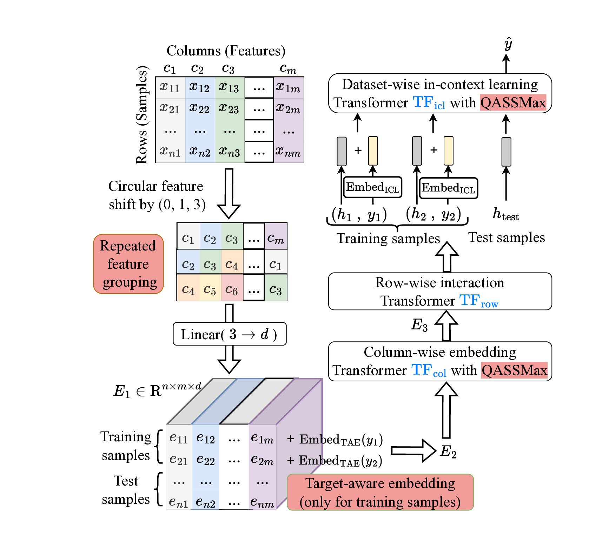
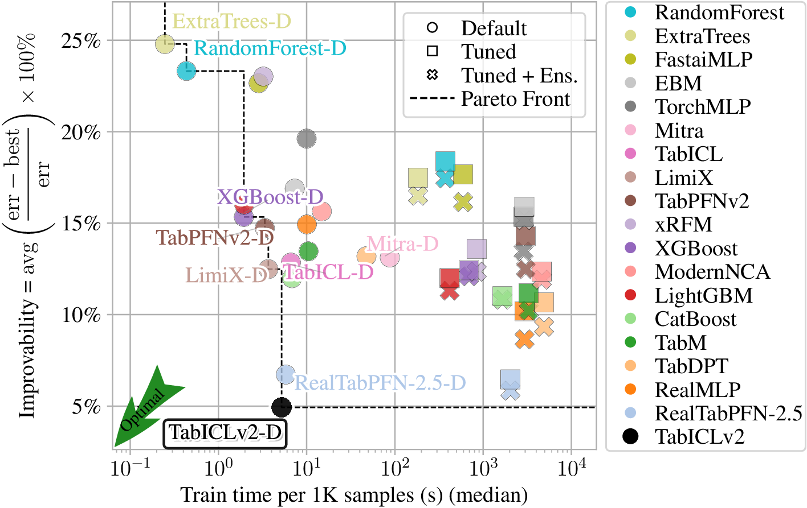

# TabICLv2: A better, faster, scalable, and open tabular foundation model

**Source:** https://arxiv.org/abs/2602.11139
**Title:** TabICLv2: A better, faster, scalable, and open tabular foundation model
**Date ingested:** 2026-05-11
**Type:** paper
**Authors:** Jingang Qu, David Holzmüller, Gaël Varoquaux, Marine Le Morvan
**Venue:** ICML 2026 (preprint)

## Summary

- **What:** TFMs hit OOM past ~50K rows; the SOTA model (RealTabPFN-2.5) is closed-source.
- **How:** Three pillars on top of TabICL's 3-stage pipeline:
	- **Richer synthetic prior** — Cauchy-graph DAGs + 8 random-function families.
	- **Architecture** — repeated feature grouping, target-aware embedding, QASSMax, mixed-radix many-class head, 999-quantile regression head.
	- **Pretraining** — Muon optimizer + cautious weight decay.
- **So what:** Beats RealTabPFN-2.5 *untuned*; 10× faster at 50K rows; scales to 1M rows; fully open.

*Figure 1: TabICLv2 architecture. Innovation highlighted in red.*
## Challenges & Novelty

PFN-based TFMs beat GBDTs on small-to-medium tables but hit four pain points (each addressed below in Technical Details):

- **Attention fading at scale** — softmax denominator grows with $n$, flattening attention; short-context pretraining can't maintain sharpness at long context.
- **Feature representation collapse** — independent per-column embeddings (TabICL v1) become near-identical when columns share marginals.
- **Late target injection** — TabPFNv2 appends $y$ as an extra feature column, and TabICL v1 sees $y$ only at the ICL stage; per-feature column embeddings never see the label directly.
- **Synthetic prior too narrow** — TabICL's prior collapses training under the new architecture.

## Relation to Prior Work

| Method | Tokenization | Complexity | Many-class | Open weights | Notes |
|---|---|---|---|---|---|
| [hollmann2023tabpfnv1](hollmann2023tabpfnv1.md) | Row token | $O(n^2 m)$ | ≤10 | Yes | First PFN-based TFM; $n\le1$K |
| [hollmann2025tabpfnv2](hollmann2025tabpfnv2.md) | Cell, alt. row/col attn | $O(n^2 m + nm^2)$ | ≤10 | Yes | $n<10$K; SOTA small tables |
| TabPFN-2.5 / RealTabPFN-2.5 | Cell, deeper | $O(n^2 m + nm^2)$ | ≤10 | No (closed) | Continued pretraining on real data |
| [qu2025tabicl](qu2025tabicl.md) | Per-column → row CLS | $O(n^2 + nm^2)$ | Hierarchical | Yes | 3-stage col→row→ICL; $n\le500$K |
| **TabICLv2** | Per-column (grouped) → row CLS | $O(n^2 + nm^2)$ | Mixed-radix + hierarchical | Yes | + target-aware emb. + QASSMax + Muon + new prior |

- [qu2025tabicl](qu2025tabicl.md) — direct predecessor; v2 keeps the 3-Transformer pipeline and complexity but rewrites the prior, adds target-aware embedding, QASSMax, mixed-radix many-class handling, quantile regression, and Muon pretraining. See [vs TabICL (v1)](#vs-tabicl-v1) below.
- [hollmann2025tabpfnv2](hollmann2025tabpfnv2.md) — inspires column-group tokenization; v2 retains per-feature resolution via *repeated* (overlapping) grouping rather than disjoint groups.
- [muller2022pfn](muller2022pfn.md) — the underlying PFN paradigm: train $q_\theta(y_{\text{test}}|x_{\text{test}}, \mathcal{D}_{\text{train}})$ on synthetic prior; one forward pass for ICL.
- [hollmann2023tabpfnv1](hollmann2023tabpfnv1.md) — first SCM-based prior; v2's prior is a substantially richer descendant (Cauchy graphs, 8 random-function types, bootstrap filtering).
- SSMax (Scalable Softmax) — provides the $s\log n$ scaling that QASSMax generalizes with per-element MLPs and query-aware gating.
- Set Transformer — used as $\mathrm{TF}_{\text{col}}$ (ISAB-style inducing points).
- Muon optimizer — replaces AdamW; combined with cautious weight decay and $\sqrt{\max(n,m)}$ per-parameter LR scaling.

### vs TabICL (v1)

High-level: v2 keeps the backbone, swaps every other axis.

| Design axis | TabICL (v1) | TabICLv2 |
|---|---|---|
| **Column tokenization** | Per-column, independent | Overlapping triples (*repeated feature grouping*) |
| **Target injection** | Late (at TF_icl) | Early (every training cell, pre-TF_col) |
| **Attention** | Softmax | QASSMax (length-generalizing) |
| **Many-class head** | Hierarchical tree | Mixed-radix + hierarchical |
| **Regression head** | Bar-distribution | 999-quantile pinball |
| **Optimizer** | AdamW | Muon + cautious weight decay |
| **Synthetic prior** | SCMs + tree-SCMs | Cauchy DAGs + 8 function families + bootstrap filter |
| **Inference at scale** | All-GPU permutation ensembling | + disk offloading, selective $QKV$ |
| **Unchanged** | 3-stage `TF_col → TF_row → TF_icl`, ISAB ($k{=}128$), 4×128 CLS → 512-d, $O(n^2 + nm^2)$, fully synthetic pretraining |

Mechanism for each row lives in Technical Details below.

## Technical Details

The architecture extends TabICL's three Transformer stages with localized innovations at every layer.

### 1. Repeated feature grouping

*Motivation:* TabICL v1's $\mathrm{TF}_{\text{col}}$ embeds each column independently, so columns with similar marginals $P(X_j)$ (e.g., both ~N(0,1)) produce near-identical per-cell embeddings. RoPE in $\mathrm{TF}_{\text{row}}$ adds positional identity but cannot recover feature distinction $\mathrm{TF}_{\text{col}}$ never encoded. Target-aware embedding (§2) attacks the same problem from the label side.

**Mechanism.** For $m$ columns, build $m$ groups via circular shifts; the $j$-th group is $(j, j+1, j+3) \bmod m$. A shared linear layer $\mathrm{Lin}: \mathbb{R}^3 \to \mathbb{R}^d$ maps each triple to a token:

$$E_1[i,j] = \mathrm{Lin}\big(x_{i,j},\; x_{i,(j+1)\bmod m},\; x_{i,(j+3)\bmod m}\big)$$

The shift pattern $(0,1,3)$ guarantees, for $m \geq 7$, that no two columns co-occur in more than one group (see [Appendix — Why the shift pattern $(0, 1, 3)$?](#appendix--why-the-shift-pattern-0-1-3)).

### 2. Target-aware embedding (early label injection)

*Motivation:* two purposes, both flowing from injecting $y$ before $\mathrm{TF}_{\text{col}}$ instead of at (or alongside) the encoder stack.

- **Task-conditioned column embedding** — TabPFNv2 appends $y$ as an extra column and TabICL v1 only sees $y$ at the ICL stage, so per-feature column embeddings stay task-agnostic. Pre-$\mathrm{TF}_{\text{col}}$ injection makes the column embedding depend on the label.
- **Anti-collapse** — columns with similar marginals associate with the target differently across rows; the label-conditioned signal pulls them apart even when their values look alike.

**Mechanism.** After feature grouping ($E_1$), training-row tokens get a target embedding added:

$$E_2[i,j] = E_1[i,j] + \mathrm{Embed}_{\text{TAE}}(y_i), \quad i \in \mathcal{D}_{\text{train}}$$

- $\mathrm{Embed}_{\text{TAE}}$ — linear layer for regression, learnable lookup table for classification.
- Contrast with TabPFNv2 — $y$ enters *every* feature token, not as one extra column.
- KumoRFM-2's "early label injection" parallels this idea at the relational scale.

### 3. Three-stage compression then ICL

*Motivation:* joint attention over the $n \times m$ grid is $O(n^2 m^2)$; factorizing into col → row → ICL drops it to $O(n^2 + nm^2)$ while keeping per-column distribution, per-row identity, and cross-row reasoning all addressable.

Backbone unchanged from TabICL v1 (paper §B.2); v2's diffs are localized inside each stage:

- **$\mathrm{TF}_{\text{col}}$** — Set Transformer with ISAB inducing points aggregating per-column distribution.
	- *v2:* input is $E_2$ (grouped + target-injected) instead of raw column scalars.
	- *v2:* QASSMax replaces softmax in the inducing-point aggregation.
	- *v2:* v1's post-$\mathrm{TF}_{\text{col}}$ extra transformation is dropped.
- **$\mathrm{TF}_{\text{row}}$** — 4 `[CLS]` tokens + RoPE + Transformer → concat to row vector.
	- *Identical to v1.*
- **$\mathrm{TF}_{\text{icl}}$** — ICL Transformer; test tokens attend to training tokens; MLP head.
	- *v2:* QASSMax replaces softmax.

### 4. Query-aware Scalable Softmax (QASSMax) to address attention fading

*Motivation:* softmax's denominator grows with context length $n$, flattening attention distributions; models pretrained on short context can't maintain sharpness at long context. QASSMax restores sharpness as $n$ grows.

**Notation.** Multi-head attention splits a query $q \in \mathbb{R}^d$ into $H$ heads of size $d_{\text{head}} = d/H$:

- $h$ — head index ($1 \ldots H$).
- $i$ — scalar position within a head's query vector ($1 \ldots d_{\text{head}}$).
- $q_{hi}$ — the scalar at head $h$, position $i$.
- $q_h = (q_{h,1}, \ldots, q_{h,d_{\text{head}}})$ — the full query vector of head $h$.

SSMax multiplies every $i$ within head $h$ by the *same* scalar $s_h$; QASSMax assigns a *different* learned multiplier to each $(h, i)$ pair — that's the "element-wise" part.

Where SSMax rescales each query by a learnable per-head scalar $s_h \log n$, QASSMax rescales each query *element*:

$$\tilde q_{hi} = q_{hi} \cdot \underbrace{\mathrm{MLP}_{\text{base}}(\log n)_{hi}}_{\text{base scaling}} \cdot \underbrace{\big(1 + \tanh(\mathrm{MLP}_{\text{gate}}(q_h)_i)\big)}_{\text{query-aware gating} \in (0,2)}$$

Both MLPs are 2-layer, hidden dim 64, GELU:

- $\mathrm{MLP}_{\text{base}}: \mathbb{R} \to \mathbb{R}^{H \times d_{\text{head}}}$ — scalar $\log n$ in, full per-$(h,i)$ base scaling out.
- $\mathrm{MLP}_{\text{gate}}: \mathbb{R}^{d_{\text{head}}} \to \mathbb{R}^{d_{\text{head}}}$ — one head's query in, per-position gate out (applied per-head, weights shared across heads). Last layer zero-init → initial modulation is identity ($\tanh 0 = 0$).

Three forces combine:

- **$\log n$ base scaling** — counteracts denominator growth as $n$ rises.
- **Element-wise multiplier** — lifts per-head scalar to per-dimension granularity.
- **Bounded gate $\in (0, 2)$** — modulates without dominating.

Toy needle-in-haystack (one anchor + up to 15K negatives): QASSMax preserves 100% accuracy and low entropy while plain softmax collapses.

### 5. Mixed-radix ensembling (many-class classification)

*Motivation:* pretraining is capped at $\le 10$ classes; need to scale to arbitrary $C$ at inference without retraining or a deep hierarchical tree.

**Notation recap.** $E_1 \in \mathbb{R}^{n \times m \times d}$ — the post-feature-grouping cell tokens from §1, before any label injection. "Ensemble" here means averaging *encoding-side* over different label-digit injections, not averaging independently trained models.

For $C > 10$ classes, choose balanced bases $[k_0, \ldots, k_{D-1}]$ with $k_i \le 10$ and $\prod k_i \ge C$; decompose each label into $D$ mixed-radix digits $y^{(i)} \in \{0,\ldots,k_i-1\}$ (e.g., $C{=}100$, bases $[10,10]$, label $47 \to (4, 7)$). Run $\mathrm{TF}_{\text{col}}$ once per digit — each pass adds that digit's TAE to $E_1$ — and average:

$$O_{\text{avg}} = \frac{1}{D} \sum_{i=0}^{D-1} \mathrm{TF}_{\text{col}}\big(E_1 + \mathrm{Embed}_{\text{TAE}}(y^{(i)})\big)$$

Combined with hierarchical classification at the ICL stage, this scales to arbitrary class counts. ECOC (TabPFNv2) is marginally better but 3× slower.

See [Appendix — Mixed-radix decomposition background](#appendix--mixed-radix-decomposition-background) for more details.

### 6. Regression as 999-quantile prediction

*Motivation:* v1's bar-distribution saturates at bin extremes and has no closed-form CDF; quantile regression gives unbounded support and clean tail extrapolation.

**Bar-distribution (v1) saturation.** Range $[y_{\min}, y_{\max}]$ split into $B$ fixed bins; softmax over bins treats regression as $B$-way classification.

- *Inside the range:* bin probabilities interpolate fine.
- *At the boundary:* if true $y > y_{\max}$, mass piles on the edge bin — CDF jumps to 1, no signal about how far outside.
- *No closed-form* PDF/CDF/moments outside the bin grid.

**Bar vs quantile — same trick, flipped axis.** Both reduce regression to multi-head prediction, but discretize *opposite* axes of the CDF:

| Approach          | Discretizes axis                          | Output                              | Predicts                                                                   |
| ----------------- | ----------------------------------------- | ----------------------------------- | -------------------------------------------------------------------------- |
| Bar (v1)          | $y$-axis, $B$ bins                        | softmax over $B$ bins               | $P(y \in \text{bin}_b \mid x)$                                             |
| **Quantile (v2)** | probability axis, 999 levels $\alpha_k$   | 999 real-valued heads, pinball loss | $\hat y_{\alpha_k}(x)$ with $P(y \le \hat y_{\alpha_k} \mid x) = \alpha_k$ |

Quantile's $\alpha$-grid is bounded in $[0,1]$, so the *value* axis stays unbounded — saturation goes away by construction.

**Mechanism.**

- 999 heads at $\alpha \in \{0.001, \ldots, 0.999\}$; pinball loss $\rho_\alpha(y - \hat y) = \max(\alpha(y-\hat y),\, (\alpha-1)(y-\hat y))$.
- Inference: average for point estimate; sort + isotonic regression for monotonic CDF.
- Parametric exponential on top/bottom quantiles → closed-form PDF/CDF/moments in the tails — the piece bars can't provide.

### 7. Pretraining recipe

*Motivation:*

- New architecture's wider parameter spread + longer-context curriculum stress AdamW.
- Muon's orthogonalized updates + cautious weight decay preserve signal-bearing weights and stabilize training.

- **Three stages** (TabICL-style curriculum): 500K steps × 1K samples → 40K × up-to-10K samples → 10K × up-to-60K samples; LR drops $8\text{e-}4 \to 1\text{e-}4 \to 2\text{e-}5$.
- **Optimizer:** Muon (instead of AdamW) with Moonlight-style $0.2\sqrt{\max(n,m)}$ LR scaling per parameter; cautious weight decay (decay only when update and parameter agree in sign); gradient clipping at 10 for stages 1–2.
- **Cost:** ~24.5 H100-days/model — lower than TabICL's 60 A100-days.

### 8. Synthetic prior

Entirely synthetic, following the SCM paradigm of TabPFN but enriched:

- **Cauchy-graph DAGs** — non-tree topologies (v1 was tree-SCMs).
- **8 random function families** — MLP, Tree Ensemble, Discretize, GP, Linear, Quadratic, EM-plateaus, Product — covering varied smoothness and inductive biases.
- **Bootstrap-test filter** — drops datasets where ExtraTrees can't improve over a constant baseline.
- **Correlated hyperparameter sampling** — e.g., category counts shared across columns.

v1's prior is too narrow for v2's architecture (training collapses); ablation Elo confirms this is the **single biggest lever**.

### 9. Inference optimizations

Disk offloading lets a 1M × 500 table run in <450 s on <24 GB CPU + <50 GB GPU. Selective $Q/K/V$ projection removes redundant computation. No retrieval or distillation needed for million-scale.

## Experiments

*Figure 2 (from the paper): TabArena improvability vs. 8-fold-CV train+inference time. TabICLv2 without tuning sits on the lower-left Pareto frontier, beating RealTabPFN-2.5 (tuned + ensembled + finetuned).*

- **TabArena (51 datasets):** TabICLv2 *without tuning* dominates the improvability–runtime Pareto front, surpassing RealTabPFN-2.5 *tuned + ensembled + fine-tuned*.
- **TALENT (300 datasets):** same — top of Pareto on improvability vs. inference time.
- **Runtime:** 10.6× faster than TabPFN-2.5 on H100 at 50K samples; 11.8× faster on CPU at 10K samples.
- **Many-class (12 TALENT datasets, >10 classes):** TabICLv2 + mixed-radix ensembling substantially outperforms all baselines.
- **Scaling:** maintains top rank across $10^3$–$10^5$; outperforms RealTabPFN-2.5 on >20K samples; still strong on 600K-row TALENT-extension datasets where TabPFN-2.5 OOMs.
- **Ablation ordering (Elo):** new prior ≫ early target embedding ≈ Muon ≈ QASSMax ≫ repeated feature grouping ≈ prior filtering. Pretraining TabICLv2 with the *TabICL prior* fails — architecture and prior co-evolve.

## Appendix — Why the shift pattern $(0, 1, 3)$?

From the paper's appendix B.1 + Lemma B.1:

- **General pattern.** For groups of size $k$, the offsets are $(2^0 - 1,\, 2^1 - 1,\, \ldots,\, 2^{k-1} - 1)$. For $k=3$ this is $(0, 1, 3)$; for $k=4$ it would be $(0, 1, 3, 7)$.
- **Why powers-of-two-minus-one?** Lemma B.1 proves: if $m \geq 2^k$, no pair of columns co-occurs in two groups. The proof hinges on the identity $2^b + 2^d = 2^a + 2^c \Rightarrow \{b,d\} = \{a,c\}$ — i.e., these offsets are a *Sidon-like* set whose pairwise sums are unique, which gives the intersection bound.
- **Why $k=3$ specifically?** Larger $k$ is *more* expressive in principle (the linear layer can learn to ignore columns), but the paper reports "larger values did not seem beneficial in initial experiments." So $k=3$ is the minimum that gives a non-trivial grouping while satisfying the no-pair-twice property.
- **Minor discrepancy.** Main text says the guarantee holds for "$m \geq 7$"; appendix lemma says "$m \geq 2^k = 8$." Effectively the same constraint at typical table widths.

## Appendix — Where $y$ enters the model (v1 / TabPFN v2 / v2)

Three injection points across the lineage, verified from paper/code:

| Model         | Where $y$ enters                                                        | What $y$ looks like                                                                                                                   |
| ------------- | ----------------------------------------------------------------------- | ------------------------------------------------------------------------------------------------------------------------------------- |
| **TabICL v1** | $\mathrm{TF}_{\text{icl}}$ stage only (post-$\mathrm{TF}_{\text{row}}$) | One-hot, lifted to $4d$, **added** to each training row vector $H_{\text{train}}$                                                     |
| **TabPFN v2** | After per-cell embedding, before the encoder stack                      | Encoded separately by `y_encoder`, **concatenated as one extra column** ($F{+}1$); test-row $y$ is NaN                                |
| **TabICL v2** | **Both** before $\mathrm{TF}_{\text{col}}$ *and* before $\mathrm{TF}_{\text{icl}}$ | (1) $\mathrm{Embed}_{\text{TAE}}$ added to every training cell: $E_2[i,j] = E_1[i,j] + \mathrm{Embed}_{\text{TAE}}(y_i)$. (2) $\mathrm{Embed}_{\text{ICL}}$ (inherited from TabICL v1) added to each post-$\mathrm{TF}_{\text{row}}$ training-row vector. |

Reading the spectrum (latest → earliest): **TabICL v1** (ICL only) → **TabPFN v2** (one extra column, throughout encoder) → **TabICL v2** (every cell, pre-$\mathrm{TF}_{\text{col}}$ — *plus* a retained TabICL-v1-style row-level injection at $\mathrm{TF}_{\text{icl}}$). This grounds the paper's "unlike TabPFNv2 appending the target as an additional column" framing in §2.

## Appendix — Mixed-radix decomposition background

**Radix decomposition** = writing an integer in a positional number system with a chosen base (radix).

- **Fixed radix.** Familiar case: base 10. $347 = 3 \cdot 10^2 + 4 \cdot 10^1 + 7 \cdot 10^0 \to (3, 4, 7)$. Same base at every position.
- **Mixed radix.** Each position has its *own* base $k_i$. For $y \in \{0, \ldots, C-1\}$ with $C = \prod_i k_i$:

  $$y = y^{(D-1)} \cdot (k_{D-2} \cdots k_0) + \cdots + y^{(1)} \cdot k_0 + y^{(0)}, \quad y^{(i)} \in \{0, \ldots, k_i-1\}$$

  Real-world example: time. 90061 s = (1 day, 1 h, 1 min, 1 s) with bases $(\infty, 24, 60, 60)$. Bijection $y \leftrightarrow (y^{(D-1)}, \ldots, y^{(0)})$ is exact.
- **Why TabICLv2 wants it.** TAE is a lookup table of size 10 (pretraining cap). Mixed radix with $k_i \le 10$ guarantees every digit fits the pretrained TAE; $\prod k_i \ge C$ guarantees no two labels collide.
- **"Balanced" bases.** All $k_i$ close in value (e.g. $C{=}100 \to [10, 10]$, not $[2, 50]$). Minimizes $D$ given $k_i \le 10$ and equalizes information per digit.
- **Why "decomposition" not "encoding".** Invertible split — the $D$ digits jointly reconstruct $y$, but each digit alone is a much smaller classification problem the pretrained model can handle.

**As a label-encoding scheme.** Mixed-radix sits alongside one-hot, binary, ECOC, class hashing — each maps one big-class label to a tuple of small-class labels:

| Scheme          | Code length                    | Digit alphabet                         | Redundancy                     | Decode                   |
| --------------- | ------------------------------ | -------------------------------------- | ------------------------------ | ------------------------ |
| One-hot         | $C$                            | $\{0,1\}$                              | None (exactly one 1)           | argmax                   |
| Binary          | $\lceil \log_2 C \rceil$       | $\{0,1\}$                              | None — minimal                 | bit concat               |
| **Mixed-radix** | $D = \lceil \log_{k} C \rceil$ | $\{0, \ldots, k_i{-}1\}$, $k_i \le 10$ | None — minimal at chosen radix | digit concat             |
| ECOC            | $L$ (chosen)                   | $\{0,1\}$ or larger                    | Yes — Hamming error-correcting | nearest codeword         |
| Class hashing   | $D$                            | $\{0, \ldots, k{-}1\}$                 | Collisions possible            | argmax + collision rules |

- **vs binary.** Binary is mixed-radix with all $k_i = 2$. TabICLv2 picks $k_i \le 10$ because the pretrained TAE has exactly 10 slots, so digits go as large as the table allows.
- **vs ECOC.** ECOC adds redundant bits for error correction — robust but longer codes, more forward passes. Mixed-radix is the minimal-length scheme at the chosen radix. Paper reports ECOC is marginally more accurate but 3× slower.
- **vs class hashing (MACH).** [MACH (Medini et al., NeurIPS 2019)](https://proceedings.neurips.cc/paper/2019/hash/69cd21a0e0b7d5f05dc88a0be36950c7-Abstract.html) is the canonical class-hashing instance: $R$ random hash functions map $C$ classes into $B \ll C$ buckets; collisions are tolerated and decoded via a count-min sketch over the $R$ predictions, giving $O(\log K)$ memory at scale ($C$ up to $10^7$–$10^8$). Mixed-radix is the collision-free analogue: deterministic positional digits with $\prod k_i \ge C$, so no count-min recovery needed.

## Entities & Concepts

- [tabular-learning](tabular-learning.md)
- [qu2025tabicl](qu2025tabicl.md)
- [hollmann2025tabpfnv2](hollmann2025tabpfnv2.md)
- [hollmann2023tabpfnv1](hollmann2023tabpfnv1.md)
- [muller2022pfn](muller2022pfn.md)
- [fey2025kumorfm2](fey2025kumorfm2.md)
- [tabular-icl-lineage](tabular-icl-lineage.md) — comparison across the PFN → TabPFN → TabICL lineage
