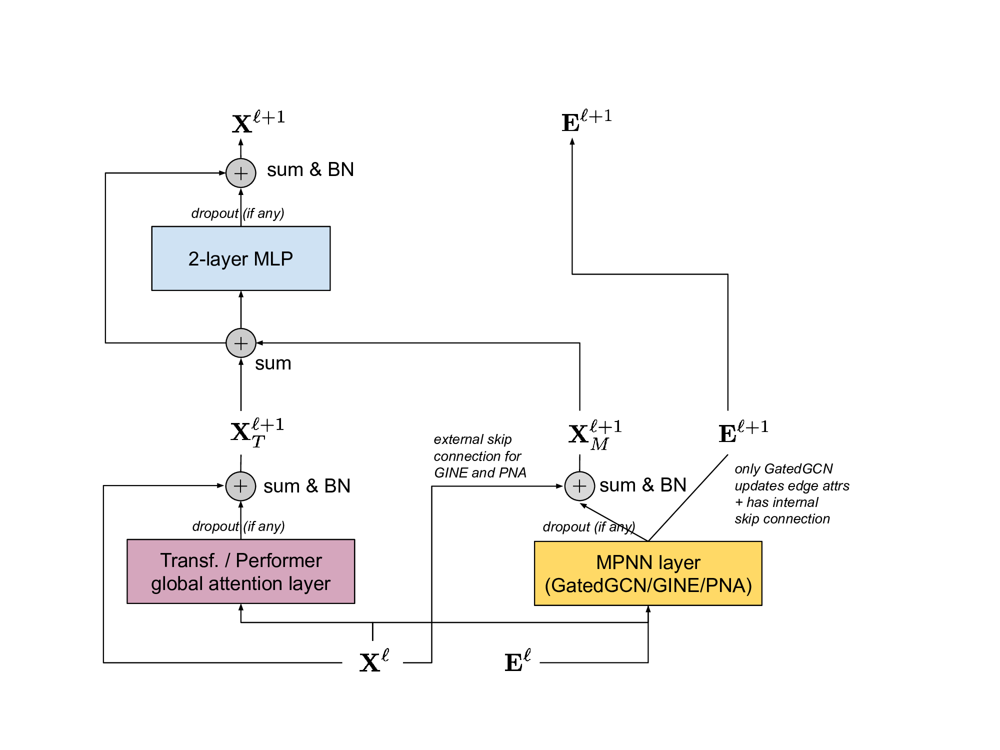

# GraphGPS: Recipe for a General, Powerful, Scalable Graph Transformer

**Source:** https://arxiv.org/abs/2205.12454
**Title:** Recipe for a General, Powerful, Scalable Graph Transformer
**Date ingested:** 2026-04-29
**Type:** paper
**Authors:** Ladislav Rampášek, Michael Galkin, Vijay Prakash Dwivedi, Anh Tuan Lim, Guillaume Wolf, Dominique Beaini
**Venue:** NeurIPS 2022

## Summary

- **What:** Existing Graph Transformers lack a common PE/SE framework and suffer from O(N²) complexity, limiting them to small graphs; there was no principled way to combine local and global information.
- **How:** GraphGPS provides a modular 3-ingredient recipe: a PE/SE taxonomy (global/local/relative), a GPS layer combining MPNN and GlobalAttn in parallel, and linear-complexity attention (Performer/BigBird) for scalability.
- **So what:** GPS achieves SOTA on 8/16 and top-3 on 11/16 diverse benchmarks, scales to 5000-node graphs and 3.8M-molecule datasets, and serves as the architectural backbone of RelGT.

## Challenges & Novelty

Prior GTs were designed for specific settings — Graphormer for molecular graphs, SAN for small graphs with full attention, HGT for heterogeneous graphs — with no common framework for positional/structural encodings. Combining local neighborhood structure with global attention was ad-hoc. GPS systematizes both problems.

- **No PE/SE taxonomy:** prior work mixed local structure (RWSE), global identifiers (LapPE), and relative distances (SPD) without distinguishing their roles; GPS formalizes three orthogonal encoding levels.
- **O(N²) global attention:** full attention is infeasible on large graphs; but restricting to local attention (MPNN) loses long-range dependencies; GPS shows linear Transformers can fill the global role.
- **Sequential local+global causes over-smoothing:** applying MPNN then attention causes early feature homogenization; GPS runs them in parallel, summing outputs, to preserve both signals at every layer.

## Relation to Prior Work

| Model | Local structure | Global attention | Complexity | PE/SE |
|---|---|---|---|---|
| GCN / GIN | MPNN only | No | O(N+E) | None |
| [ying2021graphormer](ying2021graphormer.md) | Via attention bias | Yes (O(N²)) | O(N²) | Centrality+Spatial |
| [kreuzer2021san](kreuzer2021san.md) | No MPNN | Yes (O(N²)) | O(N²) | Full LapPE |
| **GraphGPS** | MPNN | Yes (linear) | O(N+E) | RWSE / LapPE / Relative |
| [dwivedi2025relgt](dwivedi2025relgt.md) | Full attn (subgraph) | EMA centroids | O(K²) | 5-element tokenization |

- [kreuzer2021san](kreuzer2021san.md): SAN's full-spectrum LapPE is the most expressive global PE in GPS's taxonomy; GPS uses it as an option but prefers RWSE for cost-performance tradeoff.
- [ying2021graphormer](ying2021graphormer.md): Graphormer bakes structure into attention biases; GPS separates PE injection from the attention mechanism, enabling modular combination of any PE with any attention type.
- [dwivedi2025relgt](dwivedi2025relgt.md): RelGT adapts GPS's hybrid local+global design for relational entity graphs, replacing MPNN+Performer with full Transformer attention and swapping global PEs for the 5-element tokenization.

## Technical Details

**GPS Layer.** Each layer combines MPNN and GlobalAttn in parallel, then merges with MLP:

$$\mathbf{X}^{\ell+1}_M, \mathbf{E}^{\ell+1} = \texttt{MPNN}(\mathbf{X}^\ell, \mathbf{E}^\ell, \mathbf{A})$$
$$\mathbf{X}^{\ell+1}_T = \texttt{GlobalAttn}(\mathbf{X}^\ell)$$
$$\mathbf{X}^{\ell+1} = \texttt{MLP}(\mathbf{X}^{\ell+1}_M + \mathbf{X}^{\ell+1}_T)$$

Edge features go only to the MPNN (not global attention), enabling linear Transformers (Performer, BigBird) for the global stream — yielding overall O(N+E) complexity. The MPNN implicitly encodes edge information into node representations so global attention can exploit it indirectly.

**PE/SE Taxonomy.** First systematic categorization of graph encodings into three orthogonal levels:
- *Global PE* (LapPE, SignNet): inject global node identifiability — close nodes get similar PE
- *Local SE* (RWSE): capture local substructure membership — structurally similar nodes get similar SE
- *Relative PE*: pairwise distances as edge features used in attention bias

**Scalability.** Performer (random Fourier feature approximation of softmax attention) and BigBird (sparse attention) are used as drop-in replacements for full attention, reducing global attention from O(N²) to O(N). First GT to handle MalNet-Tiny (5k nodes) and OGB-LSC (3.8M molecules).

## Experiments

- SOTA on 8/16 and top-3 on 11/16 diverse benchmarks including ZINC, OGB (molhiv, molpcba, ppa, code2), OGB-LSC PCQM4Mv2, and LRGB (Peptides-func/struct).
- MPNN is non-negotiable: removing it causes catastrophic performance drops on every dataset — local neighborhood information is critical.
- RWSE is the most robust local SE across benchmarks; SignNet+DeepSets is the single best encoding but at higher compute cost.
- Performer is within ~1% of full Transformer while scaling to thousands of nodes.

## Entities & Concepts

- [graph-transformer](graph-transformer.md)
- [positional-encoding](positional-encoding.md)
- [linear-transformer](linear-transformer.md)
