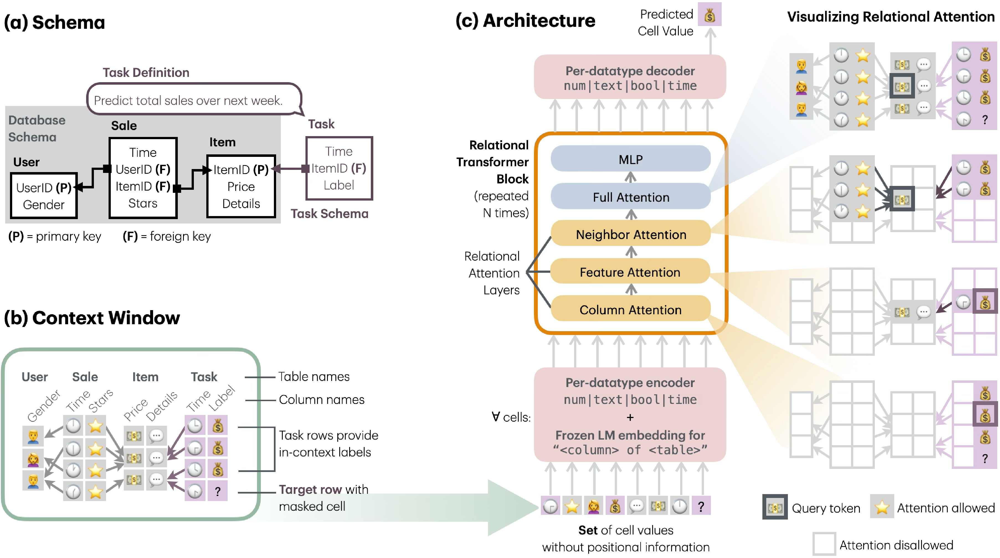

# Relational Transformer: Toward Zero-Shot Foundation Models for Relational Data

**Source:** https://arxiv.org/abs/2510.06377
**Title:** Relational Transformer: Toward Zero-Shot Foundation Models for Relational Data
**Date ingested:** 2026-04-28
**Type:** paper
**Authors:** Rishabh Ranjan, Valter Hudovernik, Mark Znidar, Charilaos Kanatsoulis, Roshan Upendra, Mahmoud Mohammadi, Joe Meyer, Tom Palczewski, Carlos Guestrin, Jure Leskovec
**Venue:** ICLR 2026

## Summary

- **What:** No prior approach to predictive modeling on relational data offers a viable foundation-model backbone — RDL is schema-locked, tabular FMs ignore multi-table structure, and LLM-based serialization doesn't scale.
- **How:** RT tokenizes at the *cell* level — each (value, column, table) triple is a token — enabling schema-agnostic self-supervised pretraining via masked token prediction, with relational structure encoded through four specialized attention masks.
- **So what:** A 22M-parameter RT achieves 93% of supervised AUROC zero-shot on RelBench, outperforming Gemma3-27B (84%) at 10⁵× lower inference FLOPs.

## Challenges & Novelty

Foundation models for relational data require **schema-agnostic representations**:

- Databases differ in table structure, column types, and relational topology, so any row-level or schema-specific encoding cannot transfer across databases.
- RT's key observation: **cells** (individual values) are the universal atomic unit of relational data, enabling a single pretraining objective across arbitrary schemas.

**Why no prior family is a viable RDB foundation-model backbone:**

- *RDL (GNN/GT)* — row-level tokenization tied to specific schemas; strong supervised performance but no cross-DB transfer.
- *Tabular FMs ([TabPFN](hollmann2025tabpfnv2.md), [TabICL](qu2025tabicl.md))* — generalize across single tables but have no notion of PK-FK structure and cannot model multi-table signal.
- *LLM-based* — serialize the DB to XML/JSON/CSV and prompt an LLM; suffers from scalability blowup and distributional mismatch with LLM pretraining data.

## Relation to Prior Work

| Family            | Model                                                          | Scope                   | Tokenization                 | PE                    | Pretraining            | Cross-schema zero-shot                         |
| ----------------- | -------------------------------------------------------------- | ----------------------- | ---------------------------- | --------------------- | ---------------------- | ---------------------------------------------- |
| RDL (GNN / GT)    | HeteroGNN baseline; [dwivedi2025relgt](dwivedi2025relgt.md)    | Multi-table             | Row (node)                   | None / 5-element      | No                     | No                                             |
| RDL (FM)          | [wang2025griffin](wang2025griffin.md)                          | Multi-table             | Row (node) + cell cross-attn | Implicit              | Yes (supervised + SSL) | Limited                                        |
| RDL (FM, ICL)     | [fey2025kumorfm](fey2025kumorfm.md) / [v2](fey2025kumorfm2.md) | Multi-table             | Row (subgraph node)          | RelGT-style / none    | Yes                    | Yes (via table-invariant row encoder)          |
| Tabular FM        | [TabPFN](hollmann2025tabpfnv2.md), [TabICL](qu2025tabicl.md)   | **Single table**        | Row                          | Column-perm-invariant | Yes (synthetic)        | Across single tables only                      |
| LLM serialization | Gemma3, GPT, etc. on XML/JSON/CSV                              | Multi-table (flattened) | Sub-word                     | Sequence              | Yes (web text)         | Yes, but distributional mismatch + scalability |
| **RDL (FM, MTP)** | **RT**                                                         | **Multi-table**         | **Cell** `(v, c, t)`         | **None**              | **Yes (MTP)**          | **Yes**                                        |

- [dwivedi2025relgt](dwivedi2025relgt.md): the key contrast — RelGT uses rich row-level schema-specific encodings for best supervised performance; RT omits all PEs for zero-shot generalization. Same problem, opposite design philosophy.
- [wang2025griffin](wang2025griffin.md) / [fey2025kumorfm](fey2025kumorfm.md): the other RDL foundation-model attempts — both keep the row-level graph view; RT is the cell-level alternative that achieves the strongest cross-schema generalization.
- Tabular FMs ([TabPFN](hollmann2025tabpfnv2.md), [TabICL](qu2025tabicl.md)): transfer across *flat* tables but have no PK-FK machinery; RT is the natural multi-table extension of their cell-as-token philosophy.
- LLM serialization: can in principle handle any schema by stringifying it, but suffers from token-blowup and distribution mismatch with web pretraining; RT beats Gemma3-27B at 10⁵× lower inference cost.
- [relbench](relbench.md): RT pretrained leave-one-DB-out on RelBench and evaluated zero-shot; also evaluated on RelBench v2 autocomplete tasks.
- [relational-foundation-model](relational-foundation-model.md): RT is the first pretrained foundation model for relational databases that achieves true cross-schema zero-shot; RelGT is the strongest supervised model.

### RT vs. KumoRFM v1 / v2 — row-vs-cell tokenisation fork

All three are RFMs for multi-table relational data, but they differ on **tokenisation granularity** and **how relational structure is injected**.

| Theme | [fey2025kumorfm2](fey2025kumorfm2.md) (v2) | RT |
|---|---|---|
| **Expressivity** | Row tokens preserve row-level conjunctions; but schema-agnosticism delegated to a learned encoder. | Cell tokens are universal across schemas; but no architectural guarantee for row conjunctions. |
| **Zero-shot transfer** | Works across schemas, but each call needs in-context labels from the target DB. | Strict zero-shot via task table prompting — no in-context labels required. |
| **Training & task spec** | Standardized PQL interface, but forecasting and autocomplete specified separately. | Single MTP objective unifies forecasting + autocomplete; task spec is ad hoc. |
| **Scalability / cost** | Asymmetric hierarchical attention scales to 500B+ rows. | Cell-level → context blow-up; relies on sparse attention kernels + BFS-bounded context. |

**Bottom line:** 
- KumoRFM v2 trades token-level schema-agnosticism for **scale and row expressivity**; 
- RT trades context-window efficiency for **strict zero-shot and a unified SSL objective**. 

**Framing:** 
- KumoRFM keeps the RDL **graph view** (rows = nodes, FKs = edges) and learns cross-table mixing with attention + PEs; 
- RT **drops the graph view** entirely — cells are tokens, structure is encoded by attention masks alone. 

## Technical Details

**Cell-level tokenization.** Each cell $(v, c, t)$ is a token. Value encoding is datatype-specific — numeric/boolean standardized by column $(\mu_c, \sigma_c)$; datetime standardized globally; text via a frozen LM. Schema is injected via a frozen LM embedding of the phrase `"<column_name> of <table_name>"`. Token: $\mathbf{x} = W_d \mathbf{r} + W \cdot \mathcal{E}^{\text{schema}}(c, t)$. Masked cells replace $W_d \mathbf{r}$ with a learned mask vector $\mathbf{m}_d$.

**Context window (BFS sampler).** Given a seed row, expand a bounded-width BFS over PK-FK links: always include F→P parents, subsample P→F children with width $w$, exclude rows past the seed timestamp. All non-missing cells of selected rows enter the context.

*Analogy to language modeling context.* Predicting a masked cell from this context is the relational analog of next-token prediction:
- *LM:* condition on a preceding **sequence**; causal mask hides future tokens.
- *RT:* condition on a **relational neighborhood** pulled by BFS over PK-FK edges; temporal filter hides post-seed rows.
- Same $p(\text{target} \mid \text{context})$ objective; conditioning structure differs (set of FK-linked cells vs. ordered sequence).

**Task table prompting.** Tasks are appended as ordinary relational tables; task rows act as seed rows, label cells are masked, both forecasting and autocomplete reduce to MTP. The *same* mask-and-predict mechanism is used end-to-end:
- *Pretraining* — no task table; mask arbitrary cells anywhere in the DB.
- *Fine-tuning* — attach a task table; mask its label cells; same MTP loss.
- *Zero-shot inference* — same setup, no weight updates: forward-pass yields the prediction.

No head swap, no special inference path — that's why pretraining transfers directly to downstream use.

**Relational Attention.** Standard masked SDPA, but four different masks $M \in \{0,1\}^{n \times n}$ select what each cell may attend to:

$$
\text{SDPA}(Q, K, V; M) = \mathrm{Softmax}\!\left(\frac{\mathrm{Mask}(QK^\top; M)}{\sqrt{d_k}}\right) V,
\quad \mathrm{Mask}(A; M)_{ij} = \begin{cases} A_{ij} & M_{ij}=1 \\ -\infty & M_{ij}=0 \end{cases}
$$

For token $i$, let $\mathrm{Col}(i)$, $\mathrm{Row}(i)$ be its column/row, and $\mathrm{OutLinks}(i)$ the rows pointed to by FKs of $\mathrm{Row}(i)$ (F→P parents). The four masks:

1. *Column* — $M^{\text{col}}[q,k] = \mathbf{1}\{\mathrm{Col}(k) = \mathrm{Col}(q)\}$ — value distribution within a column.
2. *Feature* — $M^{\text{feat}}[q,k] = \mathbf{1}\{\mathrm{Row}(k) = \mathrm{Row}(q) \;\lor\; \mathrm{Row}(k) \in \mathrm{OutLinks}(q)\}$ — same row + F→P parent rows (joined-row attention).
3. *Neighbor* — $M^{\text{nbr}}[q,k] = \mathbf{1}\{\mathrm{Row}(q) \in \mathrm{OutLinks}(k)\}$ — P→F child rows (GNN-style message passing; note the asymmetric direction vs. *feature*).
4. *Global* — $M^{\text{full}}[q,k] = 1$ — arbitrary pairwise interactions; recovers standard Transformer expressivity.

All four implemented as sparse masks compiled to FlashAttention kernels via FlexAttention.

**No positional encodings** — preserves permutation invariance across tables, rows, and columns; critical for cross-schema zero-shot.

**Training objective.** Per-datatype decoder heads; Huber loss for regression, BCE for binary classification, mean over masked cells. **Same loss in pretraining and fine-tuning** — cited as a sample-efficiency driver.

**Pretraining.** 6/7 RelBench databases (leave-one-DB-out), MTP, 22M parameters.

**Training data — real, not synthetic.**

- Real RelBench DBs only (no synthetic, unlike TabPFN/TabICL): `rel-amazon`, `rel-hm`, `rel-stack`, `rel-avito`, `rel-trial`, `rel-f1` (rel-event skipped — temporal-leakage issues).
- Per target DB: pretrain on all forecasting + autocomplete tasks from the other 6, with RelBench temporal splits.
- Headline limitation: 6 DBs is a thin corpus → pretraining overfits; mitigated by per-task validation-checkpoint selection. Expanding via RelBench v2 / ReDeLEx is flagged as next step.

**Compute.**

- Hardware: 8× A100, BFloat16; ~8 batches/s, ~2M tokens/s.
- Pretraining: **~2 h** — 50K steps, batch 256, context 1024 cells, AdamW (peak LR 1e-3, weight decay 0.1, 20% linear warmup + linear decay).
- Fine-tuning (per task): **~1.5 h** — 33K steps, same context/batch/optimizer, constant LR 1e-4, no weight decay.
- Text + schema-phrase encoder: frozen MiniLMv2 (384-dim).
- Several orders of magnitude cheaper than LLM training — RT trades pretraining-corpus size for inductive bias.

## Experiments

**Headline results:**

- Zero-shot RT achieves 93% of supervised AUROC on binary classification tasks — vs. 84% for Gemma3-27B at 10⁵× more inference FLOPs.
- Continued pretraining on the target database (not task) reaches 93.1% and fine-tunes 10–100× more sample-efficiently than baselines.
- RT underperforms RelGT in the fully-supervised setting — the PE-free design trades peak supervised accuracy for zero-shot generalizability.

**Attention-layer ablation** (Tab. 3 in paper). Each of the four attentions removed in turn, parameter count kept constant by adding blocks. Regression tasks (R² on 8 tasks); classification shows minor differences.

| Removed layer | Zero-shot impact | Fine-tuned impact |
|---|---|---|
| **Column** | **Largest drop** — drives cross-DB transfer | Smaller |
| **Feature** | Moderate | Significant |
| **Neighbor** | Moderate | Significant |
| **Full (global)** | **Smallest — sometimes improves performance** | Smallest |

Takeaways:
- The constrained relational masks are not redundant with full attention — they carry most of the signal.
- *Column attention* is the key zero-shot driver: schema-level value distributions are what generalize across DBs.
- *Feature / neighbor attention* matter more under fine-tuning, where task-specific cross-row reasoning kicks in.
- *Full attention* is the most expendable layer; layer order within a block also has little effect (App. order ablations).

## Entities & Concepts

- [relational-foundation-model](relational-foundation-model.md)
- [relational-attention](relational-attention.md)
- [relational-deep-learning](relational-deep-learning.md)
- [relational-entity-graph](relational-entity-graph.md)
- [relbench](relbench.md)
- [autocomplete-tasks](autocomplete-tasks.md)
- [graph-transformer](graph-transformer.md)
