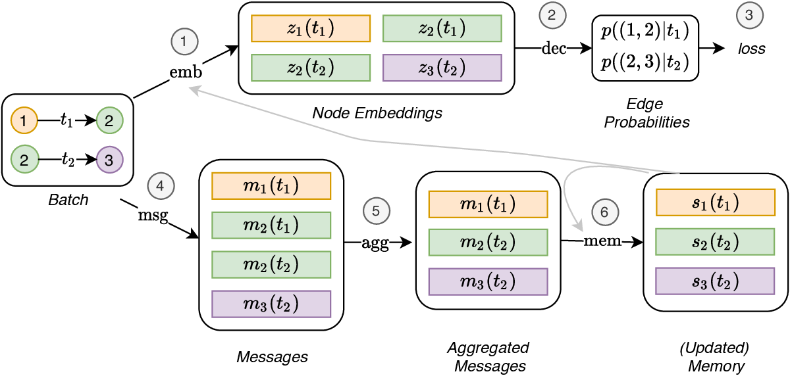

# Temporal Graph Networks for Deep Learning on Dynamic Graphs (TGN)

**Source:** https://arxiv.org/abs/2006.10637
**Title:** Temporal Graph Networks for Deep Learning on Dynamic Graphs
**Date ingested:** 2026-04-29
**Type:** paper
**Authors:** Rossi, Chamberlain, Frasca, Eynard, Monti, Bronstein
**Venue:** ICML 2020 Workshop on Graph Representation Learning

## Summary

- **What:** Prior CTDG methods either lacked long-term memory (TGAT) or required expensive multi-hop aggregation, causing a staleness–speed tradeoff.
- **How:** A modular 5-component framework (Memory, Message Function, Message Aggregator, Memory Updater, Embedding Module) where a per-node memory vector compresses full interaction history and a graph attention embedding aggregates recent local context on top.
- **So what:** TGN-attn is 30× faster per epoch than TGAT while outperforming it on all benchmarks; strictly generalizes TGAT, Jodie, and DyRep as special cases.

## Challenges & Novelty

TGAT (2020) showed that attention-based CTDG encoders are powerful but suffer from two problems: (1) without persistent node state, a node's embedding goes stale between interactions (must re-compute from neighbors each time), and (2) 2-layer temporal attention is needed to perform well, making inference slow. TGN resolves both with a memory module that pre-compresses history so 1-layer attention suffices.

- **Memory resolves staleness at no inference cost:** a node memory $\mathbf{s}_i(t)$ is updated at every event and read at embedding time — the model accesses the full interaction history without re-running multi-hop aggregation.
- **Modular composition exposes the design space:** by mixing and matching the 5 components, TGN recovers TGAT (no memory + attn), Jodie (GRU memory + time projection), and DyRep (GRU memory + graph attn in message function) as special cases, enabling controlled ablation.
- **Raw Message Store prevents training leakage:** memory must be updated from *previous-batch* messages before predicting the *current batch* — otherwise the model sees current-batch events before predicting them.

## Relation to Prior Work

| Model | Memory | Embedding | Speed (rel. TGAT) | Generalizes |
|---|---|---|---|---|
| [trivedi2019dyrep](trivedi2019dyrep.md) | GRU (implicit) | Graph attn in msg | — | — |
| [xu2020tgat](xu2020tgat.md) | None | 2-layer temporal attn | 1× | — |
| Jodie | GRU | Time projection | Fast | — |
| **TGN-attn** | GRU | 1-layer temporal attn | **30×** | TGAT, Jodie, DyRep |

- [xu2020tgat](xu2020tgat.md): TGAT = TGN with no memory and attn embedding; TGN-attn adds memory and outperforms TGAT with 1 instead of 2 layers.
- [trivedi2019dyrep](trivedi2019dyrep.md): DyRep = TGN with GRU memory and graph attention embedded in the message function; TGN separates these into distinct components.
- [yu2023dygformer](yu2023dygformer.md): DyGFormer replaces TGN's memory+GRU with long first-hop Transformer sequences, avoiding RNN gradient issues at the cost of requiring full history storage.

## Technical Details

**Five composable modules:**

1. **Memory** $\mathbf{s}_i(t) \in \mathbb{R}^d$: per-node vector, initialized to $\mathbf{0}$; updated after each event involving node $i$.

2. **Message Function**: on edge $(i, j, t)$, computes messages for both endpoints from their memories, elapsed time, and edge features:
$$\mathbf{m}_i(t) = \text{msg}_s\!\left(\mathbf{s}_i(t^-),\, \mathbf{s}_j(t^-),\, \Delta t,\, \mathbf{e}_{ij}(t)\right)$$

3. **Message Aggregator**: collapses multiple messages for one node in the same batch. Options: *most-recent* (keep last) or *mean*. Most-recent wins empirically.

4. **Memory Updater**: $\mathbf{s}_i(t) = \text{mem}\!\left(\bar{\mathbf{m}}_i(t),\, \mathbf{s}_i(t^-)\right)$ — typically a GRU.

5. **Embedding Module**: generates $\mathbf{z}_i(t)$ from memory plus neighbors:
   - *Identity*: $\mathbf{z}_i(t) = \mathbf{s}_i(t)$ — fastest, most stale
   - *Time projection* (Jodie): $(1 + \Delta t \mathbf{w}) \circ \mathbf{s}_i(t)$
   - *Temporal Graph Attention* (TGN-attn): multi-head attention over $L$-hop temporal neighbors, each encoded as $[\mathbf{h}_j(t) \| \mathbf{e}_{ij} \| \phi(t - t_j)]$ where $\phi$ is Bochner time encoding

**Why 1 layer + memory > 2 layers without.** With memory, each 1-hop neighbor $j$ carries compressed long-term history $\mathbf{s}_j(t)$ in its embedding — the model effectively looks deeper into $j$'s past without needing a 2nd aggregation layer.

**Raw Message Store (training).** Memory updated from *previous-batch* raw messages $\{(i, j, t', \mathbf{e})\}$ before predicting the *current batch*. Gradient flows through the GRU update path; leakage is prevented because current-batch labels are never seen during memory update.

## Experiments

- TGN-attn: Wikipedia transductive AP 98.46% (TGAT: 95.34%), inductive AP 97.81% (TGAT: 93.99%).
- 30× faster per epoch than TGAT across all reported datasets.
- Ablation: most-recent message aggregation outperforms mean; GRU memory updater outperforms LSTM.
- Memory ablation: identity embedding + GRU memory alone outperforms TGAT (2-layer attn, no memory), confirming memory's dominant contribution.

## Entities & Concepts

- [temporal-graph](temporal-graph.md)
