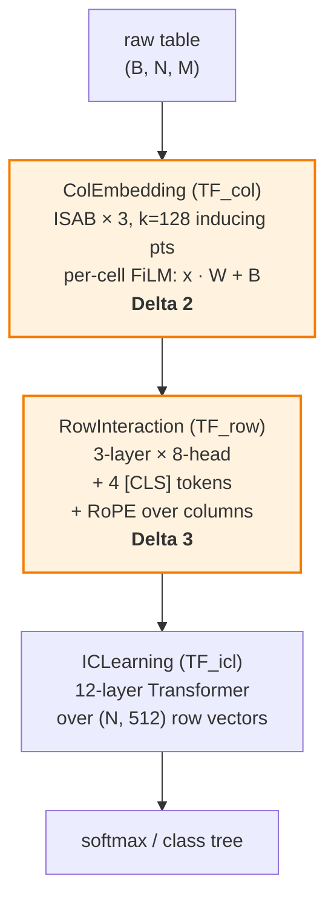

# TabICL — Code Walkthrough (delta vs TabPFN v2)

A code-grounded tour of what's *different* in TabICL relative to TabPFN v2. The PFN objective, synthetic-prior pretraining, single-forward-pass ICL, and frozen-weights-at-inference are unchanged — see [tabpfn-v2-code](tabpfn-v2-code.md) for the v2 baseline and [qu2025tabicl](qu2025tabicl.md) for the paper-side framing.

Source (`soda-inria/tabicl` at tag `v0.1.4`, the ICML 2025 release):

- [`src/tabicl/model/tabicl.py`](https://github.com/soda-inria/tabicl/blob/v0.1.4/src/tabicl/model/tabicl.py) — `TabICL`, the top-level model
- [`src/tabicl/model/embedding.py`](https://github.com/soda-inria/tabicl/blob/v0.1.4/src/tabicl/model/embedding.py) — `ColEmbedding` (TF_col)
- [`src/tabicl/model/interaction.py`](https://github.com/soda-inria/tabicl/blob/v0.1.4/src/tabicl/model/interaction.py) — `RowInteraction` (TF_row)
- [`src/tabicl/model/learning.py`](https://github.com/soda-inria/tabicl/blob/v0.1.4/src/tabicl/model/learning.py) — `ICLearning` (TF_icl)
- [`src/tabicl/model/layers.py`](https://github.com/soda-inria/tabicl/blob/v0.1.4/src/tabicl/model/layers.py) — `InducedSelfAttentionBlock`
- [`src/tabicl/sklearn/preprocessing.py`](https://github.com/soda-inria/tabicl/blob/v0.1.4/src/tabicl/sklearn/preprocessing.py) — preprocessing + ensemble generation

> The repo also has `v2.x` tags but those are TabICLv2 (a different paper). Use `v0.1.4` for the paper.

## What's the same as v2

- PFN training objective: minimize NLL of test labels conditioned on in-context train rows.
- One forward pass at inference; no gradient updates on the user's data.
- Pretraining prior: SCMs (TabPFN v1 style) over synthetic tables; v0.1.4 adds tree-based SCMs.
- Frozen pretrained weights ship with the package.

## What's different

The architectural skeleton replaces v2's "alternating attention forever" with a **3-stage pipeline that collapses the column dimension before ICL**. Three deltas carry the bulk of the change:

- **Architecture: alternating loop → 3-stage pipeline.**
    - *v2:* one encoder layer = `[col-attn → row-attn → MLP]`, repeated $L$ times. Cells stay tokens end-to-end.
    - *TabICL:* `ColEmbedding` → `RowInteraction` → `ICLearning`, called once each. The column dim is *terminated* between TF_row and TF_icl.
- **Column embedding: per-cell linear → Set Transformer + FiLM.**
    - *v2:* shared `Linear(g → d)` over feature groups, with random column identifier added once.
    - *TabICL:* ISAB Set Transformer over each column's $N$ values, producing per-cell `(W, B)` that *FiLM-modulate* the raw scalar.
- **Column identity: random per-call → RoPE over column index.**
    - *v2:* fresh random vector per column at every forward pass.
    - *TabICL:* deterministic Rotary Positional Embedding by column position, applied inside TF_row.



The orange nodes are the two architecturally novel stages; the third (TF_icl) is a standard ICL Transformer, distinguished mainly by what *isn't* fed to it (no column axis).

## Delta 1 — Pipeline, not loop

[`tabicl.py:75-144`](https://github.com/soda-inria/tabicl/blob/v0.1.4/src/tabicl/model/tabicl.py#L75-L144) — `TabICL.__init__`. The three stages are instantiated as three independent modules with their own weights:

```python
self.col_embedder   = ColEmbedding(embed_dim=128, num_blocks=3, num_inds=128, ...)
self.row_interactor = RowInteraction(embed_dim=128, num_blocks=3, nhead=8, num_cls=4, ...)
self.icl_predictor  = ICLearning(d_model=embed_dim * num_cls,  # 128 × 4 = 512
                                 num_blocks=12, nhead=4, ...)
```

The pipeline call ([`tabicl.py:183-188`](https://github.com/soda-inria/tabicl/blob/v0.1.4/src/tabicl/model/tabicl.py#L183-L188)):

```python
embeddings = self.col_embedder(X, ...)
row_repr   = self.row_interactor(embeddings, ...)
logits     = self.icl_predictor(row_repr, y_train, train_size)
```

Three things to note:

- **No looping back.** Unlike v2's $L$-times alternating sublayers, each stage runs exactly once. Cross-feature interactions are extracted in TF_row and frozen into the row vector before TF_icl sees anything.
- **Hidden-dim discontinuity at the TF_row → TF_icl boundary.** TF_col and TF_row run at `embed_dim=128`; TF_icl runs at `d_model = embed_dim × num_cls = 512`. The 4 CLS-token outputs concat, widening the representation only at the final pipeline edge — no internal cost.
- **Shape gate.** TF_icl never sees an `M` axis. The `forward` signatures of `RowInteraction` (returns shape `(B, N, 4 × embed_dim)`) and `ICLearning` (takes `(B, N, d_model)`) make the column termination explicit at the type level.

## Delta 2 — TF_col: ISAB + FiLM output

### Module declaration

[`embedding.py:59-93`](https://github.com/soda-inria/tabicl/blob/v0.1.4/src/tabicl/model/embedding.py#L59-L93) — `ColEmbedding.__init__`:

```python
self.in_linear  = nn.Linear(1, embed_dim)              # lift scalar → 128-d
self.tf_col     = SetTransformer(d_model=embed_dim,
                                 num_blocks=3,         # 3 stacked ISABs
                                 num_inds=128,         # k = 128 inducing pts
                                 ...)
self.out_w      = nn.Linear(embed_dim, embed_dim)      # → per-cell weight
self.out_b      = nn.Linear(embed_dim, embed_dim)      # → per-cell bias
```

The Set Transformer stack is in [`encoders.py:155-208`](https://github.com/soda-inria/tabicl/blob/v0.1.4/src/tabicl/model/encoders.py#L155-L208); each `ISAB` block lives in [`layers.py:470`](https://github.com/soda-inria/tabicl/blob/v0.1.4/src/tabicl/model/layers.py#L470).

### ISAB internals

[`layers.py:514-596`](https://github.com/soda-inria/tabicl/blob/v0.1.4/src/tabicl/model/layers.py#L514-L596) — `InducedSelfAttentionBlock`:

```python
self.ind_vectors = nn.Parameter(torch.randn(num_inds, d_model))   # k × d
# forward:
I = self.ind_vectors.expand(*batch_shape, num_inds, d_model)      # broadcast
M = MAB_1(I, X_train, X_train)         # k summary vectors per column
out = MAB_2(X, M, M)                   # all values attend back to M
```

Two non-paper details to flag:

- **Inducing points are shared across all columns and all tables in the batch.** One `nn.Parameter(num_inds, d_model)` per ISAB block ([`layers.py:555`](https://github.com/soda-inria/tabicl/blob/v0.1.4/src/tabicl/model/layers.py#L555)), `expand`-broadcast over batch dims. Not per-column. Total inducing-point parameters: $3 \times 128 \times 128 = 49\,152$.
- **MAB_1 keys/values are train-only.** Test cells query the same inducing-point summary, but the summary itself is computed over training values — this is how TabICL prevents test-data leakage through the column embedding.

### FiLM output (not an embedding)

[`embedding.py:118-145`](https://github.com/soda-inria/tabicl/blob/v0.1.4/src/tabicl/model/embedding.py#L118-L145) — the load-bearing computation:

```python
src     = self.in_linear(features)         # (B, N, M, 1) → (B, N, M, d)
src     = self.tf_col(src, train_size)     # ISAB stack
weights = self.out_w(src)                  # (B, N, M, d)
biases  = self.out_b(src)                  # (B, N, M, d)
output  = features * weights + biases      # FiLM modulation of the raw scalar
```

The paper writes this as $e_{ij} = W_{ij} \odot c_{ij} + B_{ij}$ but it's easy to read it as "TF_col emits an embedding." The code makes the FiLM nature explicit: TF_col emits *modulation coefficients*, and the actual cell representation is the raw scalar reshaped by those coefficients. The Set Transformer never directly produces the cell vector — it produces the affine that produces it.

This matters because:

- The cell representation always lives on a per-column-distribution-conditioned manifold (you cannot get the cell value back without the column's W, B).
- Pretraining cannot bake in raw-value-independent column embeddings — every cell's representation is *forced* to depend on its raw value through the affine.

## Delta 3 — TF_row: CLS-slot reservation + RoPE

### CLS slots are reserved up-front

A small but load-bearing detail: the 4 `[CLS]` tokens aren't prepended inside TF_row. They're *reserved as slots* by `ColEmbedding` ([`embedding.py:69`](https://github.com/soda-inria/tabicl/blob/v0.1.4/src/tabicl/model/embedding.py#L69) — `reserve_cls_tokens=4`), so TF_col emits a `(B, N, M+4, d)` tensor with the first 4 column-slots empty. `RowInteraction` then *overwrites* those slots with learned CLS parameters ([`interaction.py:89-119`](https://github.com/soda-inria/tabicl/blob/v0.1.4/src/tabicl/model/interaction.py#L89-L119)):

```python
self.cls_tokens = nn.Parameter(torch.randn(num_cls, embed_dim))  # 4 × 128
# in _aggregate_embeddings:
x[..., :num_cls, :] = self.cls_tokens                            # overwrite slots
x = self.tf_row(x)                                               # 3-layer encoder
cls_out = x[..., :num_cls, :]                                    # (B, N, 4, d)
row_vec = cls_out.reshape(B, N, num_cls * embed_dim)             # (B, N, 512)
```

The slot reservation avoids re-allocating tensors at the stage boundary. The 4 CLS outputs are *concatenated* (not pooled) into the 512-d row vector — see the appendix in [qu2025tabicl](qu2025tabicl.md) on why 4 × 128 is cheaper than 1 × 512.

### RoPE inside the Encoder blocks

[`interaction.py:53-87`](https://github.com/soda-inria/tabicl/blob/v0.1.4/src/tabicl/model/interaction.py#L53-L87) wires `use_rope=True` into the `Encoder`. The actual rotation happens per-block ([`encoders.py:75,111`](https://github.com/soda-inria/tabicl/blob/v0.1.4/src/tabicl/model/encoders.py#L75-L111)) using `RotaryEmbedding` from [`rope.py`](https://github.com/soda-inria/tabicl/blob/v0.1.4/src/tabicl/model/rope.py).

The position fed to RoPE is the **column index** inside the row sequence — so column 0 and column 1 produce different Q/K rotations even when their TF_col outputs are identical. This is what breaks the symmetry that causes representation collapse (see the RoPE blockquote in [qu2025tabicl](qu2025tabicl.md)).

The CLS slots are also rotated (they sit at positions 0..3), but that's fine — they have no semantic column identity to lose.

## TF_icl and the classification tree

### The stage itself is unsurprising

[`learning.py:52-82`](https://github.com/soda-inria/tabicl/blob/v0.1.4/src/tabicl/model/learning.py#L52-L82) — `ICLearning.__init__`:

```python
self.tf_icl    = Encoder(d_model=512, num_blocks=12, nhead=4, ...)  # 12 layers
self.y_encoder = OneHotAndLinear(max_classes=10, d_model=512)       # label embed
self.decoder   = MLP(...)                                           # 2-layer head
```

Training-row labels are one-hot-encoded and added to their row vectors before TF_icl; test rows attend to all train rows via causal masking. Standard ICL pattern.

### Hierarchical classification (>10 classes)

[`learning.py:84-130`](https://github.com/soda-inria/tabicl/blob/v0.1.4/src/tabicl/model/learning.py#L84-L130) — `_grouping`, and [`layers.py:12`](https://github.com/soda-inria/tabicl/blob/v0.1.4/src/tabicl/model/layers.py#L12) — `ClassNode`. When the dataset has more than `max_classes=10` classes, TabICL recursively builds a balanced classification *tree*:

- At each node, classes are grouped into ≤10 super-classes.
- TF_icl is invoked at each level with the current super-class labels.
- The final probability is the product along the chosen path.

This isn't in the paper's architecture diagram — it's an inference-time workaround for the fact that `max_classes=10` is baked into the y-encoder. Worth flagging because a naive "what's the max classes TabICL supports?" answer is "10", but with the tree it handles arbitrarily many.

## Inference-time ensembling

### Latin-square feature permutations

[`preprocessing.py:680`](https://github.com/soda-inria/tabicl/blob/v0.1.4/src/tabicl/sklearn/preprocessing.py#L680) — `FeatureShuffler`, with `_latin_squares` at line 772. Default `feat_shuffle_method='latin'` ([`classifier.py:182-207`](https://github.com/soda-inria/tabicl/blob/v0.1.4/src/tabicl/sklearn/classifier.py#L182-L207)).

A Latin square over $M$ columns gives a set of $M$ permutations such that each column appears in each position exactly once. This is the systematic way to "average out" RoPE's position-dependence: every column eventually sits at every column index across the ensemble.

### Ensemble generation

[`preprocessing.py:808`](https://github.com/soda-inria/tabicl/blob/v0.1.4/src/tabicl/sklearn/preprocessing.py#L808) — `EnsembleGenerator` combines three axes of variation:

- Normalization variants (standard scale, RTDL quantile, …)
- Feature permutations (Latin square)
- Class-label shifts (cyclic permutations of class indices)

Default `n_estimators=32` ([`classifier.py:182`](https://github.com/soda-inria/tabicl/blob/v0.1.4/src/tabicl/sklearn/classifier.py#L182)). Predictions are averaged with `softmax_temperature=0.9`.

### Speed trick: embed once, shuffle the embeddings

[`embedding.py:280-284`](https://github.com/soda-inria/tabicl/blob/v0.1.4/src/tabicl/model/embedding.py#L280-L284) — feature shuffles operate on the *cell embeddings*, not the raw input. So TF_col runs **once**; the 32-member ensemble re-runs only TF_row and TF_icl with shuffled column orders. This is a real speedup because TF_col's ISAB is the most parameter-heavy stage.

## "Curriculum" in code ≠ in paper

The paper describes a 1K → 40K → 60K **curriculum**, framed as a multi-stage optimizer schedule that gradually increases table size.

The code tells a different story. There is **no multi-phase training loop in [`train/run.py`](https://github.com/soda-inria/tabicl/blob/v0.1.4/src/tabicl/train/run.py)** — `Trainer.train()` (line 413) is a single-phase loop. What does exist is [`prior/dataset.py:242-277`](https://github.com/soda-inria/tabicl/blob/v0.1.4/src/tabicl/prior/dataset.py#L242-L277) — `PriorDataset.adjust_max_features`, a piecewise table mapping sequence length to max feature count:

```python
def adjust_max_features(seq_len):
    if seq_len >= X1: return 100
    if seq_len >= X2: return 80
    ...
    return 15
```

This is **sampling-time input shaping**, applied per group inside `__iter__` (around line 631) — small tables in a batch get more features, large tables get fewer. It induces a correlation between $N$ and $M$ in the training distribution, but it isn't a stage-based schedule.

Interpreting the discrepancy:

- The paper's ablation (training directly on 60K-sample tables fails to converge) is presumably about the training-time distribution: if the prior always generates large tables, optimization fails.
- The code achieves the same effect by *sampling* small tables alongside large ones throughout training, with the per-seq-len feature cap shaping how dense each batch can be.
- "Curriculum" in the paper = "the training distribution must include a mix of sizes" in the code — not a multi-phase schedule.

Worth knowing if you're reproducing TabICL: there's no schedule to copy, only a sampler to configure.

## Cross-references

- [qu2025tabicl](qu2025tabicl.md) — the paper, including the column-collapse framing this page implements.
- [tabpfn-v2-code](tabpfn-v2-code.md) — the v2 code walkthrough this delta is measured against.
- [hollmann2025tabpfnv2](hollmann2025tabpfnv2.md) — TabPFN v2 paper, the immediate ancestor of TabICL's design.
