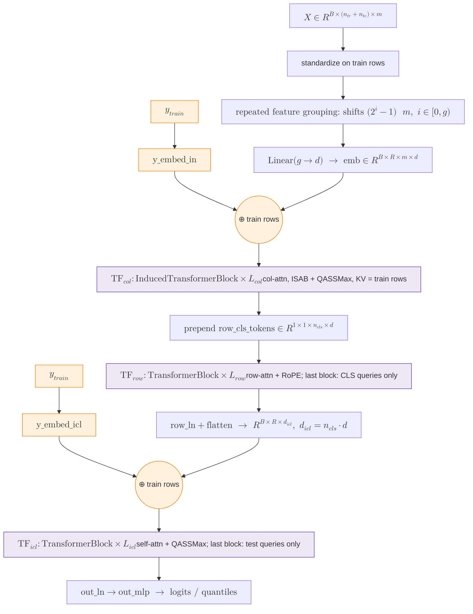

# TabICLv2 (nano) — Code Walkthrough

A code-grounded tour of [`soda-inria/nanotabicl`](https://github.com/soda-inria/nanotabicl), the authors' minimal (~170 LOC), single-file reference implementation of the TabICLv2 architecture. The repo's stated purpose is "minimal, fast + educational" — useful for reading the architecture end-to-end without production scaffolding.

- **Source:** [`model.py`](https://github.com/soda-inria/nanotabicl/blob/main/model.py) (173 LOC, Apache-2.0)
- **Paper:** [qu2026tabiclv2](qu2026tabiclv2.md)
- **What's in:** `NanoTabICLv2` (top-level model) + the three Transformer stages (`TF_col`, `TF_row`, `TF_icl`) + the novel layers (`QASSMax`, `Rope`) + supporting utilities (`ClassEmbedding`, `TableAttnBase`, `TransformerBlock`, `InducedTransformerBlock`).

## Data flow



Orange = the two y-injection points; purple = the three Transformer stages.

## 1. Tokenization: standardize → repeated feature grouping → label injection

[`model.py` forward, embedding block](https://github.com/soda-inria/nanotabicl/blob/main/model.py#L31-L40):

```python
def forward(self, x: torch.Tensor, y: torch.Tensor) -> torch.Tensor:
    n_batch, n_rows, n_cols = x.shape
    n_batch, n_train = y.shape

    # ----- Embedding: repeated feature grouping -> x embedding -> add y embedding to train
    x = x / (x[:, :n_train].std(dim=1, unbiased=False, keepdim=True) + 1e-8)  # standardize x based on train
    idxs = torch.arange(n_cols, dtype=torch.long, device=x.device)
    x = torch.stack([x[:, :, (idxs + (2 ** i - 1)) % n_cols] for i in range(self.feature_group_size)], dim=-1)
    emb = self.x_embed(x)  # emb.shape = (n_batch, n_rows, n_cols, embed_dim)
    emb[:, :n_train] += self.y_embed_in(y[:, :, None, None])
```

- **Standardization is in-model**, not a preprocessing wrapper — divides by the *train-only* std along the row axis. The model is meant to be called on raw $X$.
- **Repeated feature grouping in one line.** `(idxs + (2 ** i - 1)) % n_cols` for `i ∈ 0..feature_group_size-1` produces the offsets `(0, 1, 3, 7, ...)` — exactly the $2^l - 1$ family from the paper's Appendix B.1. With `feature_group_size=3` (default), the offsets are `(0, 1, 3)`. `torch.stack(..., dim=-1)` gives shape `(B, R, C, g)`; `x_embed: Linear(g → d)` collapses the last dim, yielding `(B, R, C, d)`.
- **`y_embed_in` is dual-typed.** `ClassEmbedding(max_classes, d)` for classification, `Linear(1, d)` for regression (`max_classes=0`). Added only to training rows (`emb[:, :n_train] += ...`) — test rows never see their own label, which is how PFN ICL works.
- **`y[:, :, None, None]`** broadcasts the per-row label across all column tokens. This is the paper's "early target injection": $y$ enters every (row, feature) cell, not as one extra column.

The `ClassEmbedding` itself is a 3-line override of `nn.Embedding` to fix the init scale:

```python
class ClassEmbedding(nn.Embedding):
    def reset_parameters(self) -> None:  # change init to match one-hot + linear
        nn.init.uniform_(self.weight, -1/math.sqrt(self.num_embeddings), 1/math.sqrt(self.num_embeddings))

    def forward(self, y: torch.Tensor) -> torch.Tensor:
        return super().forward(y.squeeze(-1).long())
```

The init is the variance-equivalent of a one-hot indicator passed through a linear layer — principled scale-matching, not arbitrary.

## 2. TF_col — induced self-attention within each column

[`model.py` forward, TF_col block](https://github.com/soda-inria/nanotabicl/blob/main/model.py#L42-L44):

```python
# ----- TF_col: induced self-attention within each column
for block in self.col_blocks:
    emb = block.col_attn(emb, kv_max_idx=n_train)  # all rows only attend to training rows
```

The whole TF_col stage is two lines because the column-attention semantics is delegated to two small helpers — `TableAttnBase.col_attn` and `InducedTransformerBlock` (covered in §5).

The input `emb` here is the **target-injected** tensor from §1 — i.e., paper's $E_2$ (grouped + $\mathrm{Embed}_{\text{TAE}}(y)$ added), not raw column scalars. This is one of the paper's named v1→v2 deltas at TF_col.

- For each of the `C` columns independently, `n_rows` cell tokens attend to each other. Equivalent to a Set Transformer over the column's row-values.
- **`kv_max_idx=n_train`** restricts the *keys/values* to training rows only — i.e., test rows query against training context, but training rows never see test rows. No attention mask; just a tensor slice (see §5 `TransformerBlock`).
- Each `InducedTransformerBlock` is ISAB: queries first attend to a fixed-size set of inducing vectors (`n_cls_rows=128` — these are the paper's ISAB inducing points $k=128$; the parameter name is unfortunate), then the original tokens attend to those summaries. Two attention calls per block instead of one `O(N²)`.

## 3. TF_row — CLS-prepend, row attention with RoPE, CLS-only final pass

[`model.py` forward, TF_row block](https://github.com/soda-inria/nanotabicl/blob/main/model.py#L46-L51):

```python
# ----- TF_row: concat CLS tokens as extra columns -> row attention -> norm + merge cls tokens
emb = torch.cat([self.row_cls_tokens.expand(n_batch, n_rows, -1, -1), emb], dim=2)
for block in self.row_blocks[:-1]:
    emb = block.row_attn(emb)
emb = self.row_blocks[-1].row_attn(emb, q_max_idx=self.row_cls_tokens.size(-2))  # need only the cls token values
emb = self.row_ln(emb).flatten(-2, -1)  # norm + merge cls tokens into one bigger token
```

- **CLS prepend along the column axis.** `row_cls_tokens` has shape `(1, 1, n_cls_cols, d)` with default `n_cls_cols=4`. Broadcast to `(B, R, 4, d)` and concatenated, the per-row token grid becomes `(B, R, 4 + C, d)`. The 4 CLS tokens act as parallel pooling queries — same trick as the paper's "4 × 128 instead of 1 × 512" decision (see [qu2025tabicl](qu2025tabicl.md) §TF_row).
- **Row attention** — each row's `4 + C` tokens attend to each other; rows are independent. RoPE is applied to Q/K inside each `TransformerBlock` (`use_rope=True`).
- **Last block uses `q_max_idx`.** Only the 4 CLS positions are passed as *queries*; KV stays full. The output of the last block has shape `(B, R, 4, d)` — we throw away the feature tokens because they're no longer needed.
- **Flatten 4 × d → icl_dim.** `flatten(-2, -1)` concatenates the 4 CLS tokens into a single `(B, R, 4d)` row vector. This is the paper's `icl_dim = n_cls_cols · embed_dim` (default `4 · 128 = 512`).

## 4. TF_icl — second y injection, train-attending self-attention, test-only final pass

[`model.py` forward, TF_icl block](https://github.com/soda-inria/nanotabicl/blob/main/model.py#L53-L60):

```python
# ----- TF_icl: add y embedding -> self-attention
# now emb.shape = (n_batch, n_rows, icl_dim)
emb[:, :n_train] += self.y_embed_icl(y[:, :, None])  # add y embeddings again
for block in self.icl_blocks[:-1]:
    emb = block(emb, kv_max_idx=n_train)  # all rows only attend to training rows
emb = self.icl_blocks[-1](emb[:, n_train:], emb[:, :n_train])  # need only test predictions

return self.out_mlp(self.out_ln(emb))  # output MLP
```

- **Second y-injection.** `y_embed_icl` (separate lookup/linear at `icl_dim`) is added to training rows again. This is the TabICL v1-style $\mathrm{Embed}_{\text{ICL}}$ row-level injection, retained in v2 on top of the new pre-TF_col `Embed_TAE`.
- **All-but-last block: `kv_max_idx=n_train`.** Same trick as TF_col — KV restricted to training rows; all rows can query.
- **Last block: queries are test rows only, KV is training rows.** `emb[:, n_train:]` as Q, `emb[:, :n_train]` as KV. Test predictions emerge here; train rows are dropped from the output entirely.
- **Output head.** `out_ln` (LayerNorm at `icl_dim`) + `out_mlp` (2-layer MLP with hidden `2 · icl_dim`, output `out_dim`). For classification, `out_dim = max_classes`; for regression, `out_dim = n_quantiles` (e.g., 999 — but nano's MLP just produces the values; quantile post-processing like sort/isotonic/exponential-tail is *not* in nano, see §6).

## 5. Supporting layers

### `TableAttnBase` — col-attention as transpose + row-attention

The structural primitive that makes the whole file compact:

```python
class TableAttnBase(nn.Module):  # base class with functions to apply attention on 2D tables instead of 1D sequences
    def row_attn(self, q, kv=None, **kwargs):  # apply attention within each row separately
        n_batch, n_rows, n_cols, embed_dim = q.shape
        q, kv = (None if t is None else t.flatten(0, 1) for t in [q, kv])  # merge rows dim into batch dim
        # apply attention -> unmerge rows dim from batch dim; dimension -2 might differ because of q_max_idx in kwargs
        return self(q, kv, **kwargs).reshape(n_batch, n_rows, -1, embed_dim)

    def col_attn(self, q, kv=None, **kwargs):  # apply attention within each column separately
        return self.row_attn(q.transpose(1, 2), None if kv is None else kv.transpose(1, 2), **kwargs).transpose(1, 2)
```

`row_attn` folds the rows dimension into the batch dimension (`flatten(0, 1)`), runs ordinary 1-D attention, then reshapes back. `col_attn` is a one-liner — transpose rows ↔ cols, call `row_attn`, transpose back. **The "alternating row/col attention" of the paper has zero dedicated kernel: it's the same Transformer block dispatched via two different reshape paths.**

### `TransformerBlock` — pre-norm Transformer with optional RoPE & QASSMax

```python
class TransformerBlock(nn.MultiheadAttention, TableAttnBase):
    def __init__(self, embed_dim: int, num_heads: int, use_rope: bool = False, ssmax: bool = False):
        super().__init__(embed_dim=embed_dim, num_heads=num_heads)
        self.rope = Rope(head_dim=embed_dim // num_heads, theta=100_000.0) if use_rope else None
        self.ssmax_layer = QASSMax(num_heads=num_heads, head_dim=embed_dim // num_heads) if ssmax else None
        self.mlp = get_mlp(embed_dim, embed_dim * 2, embed_dim)
        self.ln_attn = nn.LayerNorm(embed_dim)
        self.ln_mlp = nn.LayerNorm(embed_dim)

    def forward(self, q, kv=None, q_max_idx=None, kv_max_idx=None):
        x, q = q, self.ln_attn(q)
        kv = q if kv is None else self.ln_attn(kv)
        if kv_max_idx is not None: kv = kv[..., :kv_max_idx, :]
        if q_max_idx is not None: x, q = x[..., :q_max_idx, :], q[..., :q_max_idx, :]

        x = x + self.attn(q, kv)
        del q, kv  # save memory during inference
        return x + self.mlp(self.ln_mlp(x))  # we use pre-norm here and for the attention as well

    def attn(self, q, k):
        q, k, v = nn.functional._in_projection_packed(q, k, k, self.in_proj_weight, self.in_proj_bias)
        q, k, v = (t.unflatten(-1, (self.num_heads, self.head_dim)).transpose(-3, -2) for t in [q, k, v])

        q = q if self.ssmax_layer is None else self.ssmax_layer(q=q, n=k.size(-2))  # SSMax (optional)
        q, k = (t if self.rope is None else self.rope(t) for t in [q, k])  # RoPE (optional)

        attn_output = nn.functional.scaled_dot_product_attention(*[t.flatten(0, 1) for t in (q, k, v)]).view(q.shape)
        del q, k, v
        return self.out_proj(attn_output.transpose(-3, -2).flatten(-2, -1))
```

- **Inherits from `nn.MultiheadAttention`** — gets `in_proj_weight`, `in_proj_bias`, `out_proj` for free; only `attn` and `forward` are overridden. Avoids reimplementing Q/K/V projection.
- **Pre-norm** — `ln_attn` before attention, `ln_mlp` before MLP. Residuals on the raw input.
- **`kv_max_idx` / `q_max_idx` are just slicing** — no attention mask construction. Causal-style restrictions (e.g., "train-only KV") collapse to one Python index.
- **QASSMax wraps the query before RoPE.** Note the ordering: `q ← ssmax(q)` then `q, k ← rope(q, k)`. The element-wise scaling happens first; positional rotation second.
- **`scaled_dot_product_attention`** — PyTorch's fused kernel (FlashAttention when available). Heads are flattened into the batch dim per the docs' preference.

### `InducedTransformerBlock` — ISAB in 9 lines

```python
class InducedTransformerBlock(TableAttnBase):
    def __init__(self, embed_dim, num_heads, n_inducing, ssmax=False):
        super().__init__()
        self.tfm1 = TransformerBlock(embed_dim=embed_dim, num_heads=num_heads, ssmax=ssmax)
        self.tfm2 = TransformerBlock(embed_dim=embed_dim, num_heads=num_heads)  # fixed nb of ind. vectors -> no ssmax
        self.inducing_vectors = nn.Parameter(0.02 * torch.randn(1, n_inducing, embed_dim))

    def forward(self, q, kv=None, q_max_idx=None, kv_max_idx=None):
        kv = self.tfm1(self.inducing_vectors.expand(q.shape[0], -1, -1), q if kv is None else kv, kv_max_idx=kv_max_idx)
        return self.tfm2(q, kv, q_max_idx=q_max_idx)
```

Step 1: `inducing_vectors` query the input tokens → summary KV of fixed size `n_inducing` (default 128). Step 2: original `q` queries that summary. Two `O(N · k)` attentions replace one `O(N²)`. SSMax is enabled on the *first* sub-attention only — the second has fixed-size KV (`n_inducing`), so context-length scaling doesn't apply.

### `Rope` — rotary positional embedding with lazy sin/cos cache

```python
class Rope(nn.Module):  # rotary positional encoding
    def __init__(self, head_dim, theta):
        super().__init__()
        self.half = head_dim // 2
        self.register_buffer("inv_freq", theta ** torch.linspace(0.0, -1.0, self.half + 1)[:-1], persistent=False)
        self.register_buffer("sin", torch.empty(0), persistent=False)
        self.register_buffer("cos", torch.empty(0), persistent=False)

    @torch.autocast("cuda", enabled=False)
    def forward(self, x):
        batch_size, num_heads, seq_len, head_dim = x.shape

        if self.cos.numel() == 0 or self.cos.device != x.device or self.cos.size(0) < seq_len:
            pos = torch.arange(seq_len, device=x.device, dtype=self.inv_freq.dtype)
            angles = pos[:, None] * self.inv_freq[None, :]
            self.sin, self.cos = angles.sin(), angles.cos()

        sin, cos = self.sin[:seq_len], self.cos[:seq_len]
        x1, x2 = x[..., :self.half], x[..., self.half:]
        return torch.cat([x1 * cos - x2 * sin, x1 * sin + x2 * cos], dim=-1).to(x.dtype)
```

- **Split-half rotation.** Splits `head_dim` into two halves and applies a 2-D rotation matrix per pair. Standard RoPE convention (Su et al., 2023).
- **Cache extends on demand.** `sin`/`cos` start as empty buffers; first call computes them for `seq_len`, subsequent calls reuse the cache if length and device match. No precompute pass needed.
- **`@torch.autocast("cuda", enabled=False)`** — RoPE is done in fp32 even under autocast, then cast back to `x.dtype`. Avoids precision drift in the rotation angles.

### `QASSMax` — query-aware scalable softmax

```python
class QASSMax(nn.Module):  # query-aware scalable softmax for better context length scaling
    def __init__(self, num_heads, head_dim, n_hidden=64):
        super().__init__()
        self.base_mlp = get_mlp(1, n_hidden, num_heads * head_dim)
        self.query_mlp = get_mlp(head_dim, n_hidden, head_dim)
        nn.init.zeros_(self.query_mlp[-1].weight)  # ensures initial modulation is zero
        nn.init.zeros_(self.query_mlp[-1].bias)

    def forward(self, q, n):
        batch_size, num_heads, seq_len, head_dim = q.shape
        logn = q.new_tensor(math.log(max(1, n))).view(1, 1)
        return self.base_mlp(logn).view(1, num_heads, 1, head_dim) * (1 + torch.tanh(self.query_mlp(q))) * q
```

- **Two MLPs as in the paper.** `base_mlp: ℝ → ℝ^(H·d_head)` (scalar `log n` in; full per-`(h, i)` base scaling out). `query_mlp: ℝ^d_head → ℝ^d_head` (one head's query in; per-position gate out). Both are 2-layer with `n_hidden=64` and GELU — matches paper §4. **Name mapping:** nano's `base_mlp` = paper's `MLP_base`; nano's `query_mlp` = paper's `MLP_gate`.
- **`(1 + tanh(...))` ∈ (0, 2).** Bounded gate, with the last layer of `query_mlp` zero-initialized → at init, `tanh(0) = 0` → modulation is identity (factor of 1). The model recovers vanilla softmax at the start of training and learns to bend it.
- **`base_mlp` shares the result across the seq_len axis** — `view(1, num_heads, 1, head_dim)` broadcasts. The `log n` factor is the same for every token in a given forward pass.
- This is the entire formula from [qu2026tabiclv2](qu2026tabiclv2.md) §4 in 5 lines of forward.

## 6. What nano leaves out

Verbatim from the README (and verified by inspection):

- **No sklearn interface** — bring your own `fit`/`predict` loop.
- **No pretraining code** — model accepts checkpoints; training loop, optimizer (Muon), curriculum, and synthetic prior live in the [full repo](https://github.com/soda-inria/tabicl) (or follow [nanoTabPFN](https://github.com/automl/nanoTabPFN) for the PFN-style template).
- **No inference wrappers** — disk offloading, selective Q/K/V projection (paper §9) are not here; nano just runs the forward in one shot.
- **No preprocessing beyond standardization** — categorical handling, NaN policies, column-permutation ensembling all live outside the model.
- **No mixed-radix label ensembling** — `out_mlp` produces `out_dim` logits/values directly; the digit decomposition + averaging across `D` TF_col passes from paper §5 is a runtime wrapper around the model, not a head.
- **No quantile post-processing** — regression outputs `n_quantiles` values from the MLP; the sort + isotonic regression + exponential tail extrapolation (paper §6) is also a wrapper concern.
- **LayerNorm-with-bias only** — the full TabICLv2 classification checkpoint uses bias; the regression checkpoint uses no-bias. Nano hard-codes the bias variant; loading the regression checkpoint requires a tweak.

## Implementation tricks worth knowing

Four moves that account for most of nano's brevity:

1. **`(idxs + (2**i - 1)) % n_cols`** — the entire repeated-feature-grouping paper appendix in one line. With `feature_group_size=3` you get the canonical `(0, 1, 3)` shift pattern.
2. **`kv_max_idx` / `q_max_idx` instead of attention masks** — train-only KV and test-only final queries are implemented by *slicing the tensor*, not by building a `(seq_len, seq_len)` boolean mask. Compute and memory both scale with the smaller slice; PFN's train/test asymmetry comes for free.
3. **`ClassEmbedding.reset_parameters`** — overrides PyTorch's default `nn.Embedding` init with a uniform that matches the variance of a one-hot vector passed through a linear layer. Same trick used by the y-encoder of many PFN-family models; documented as such in the comment.
4. **`TableAttnBase.col_attn = transpose ∘ row_attn ∘ transpose`** — col-attention has zero dedicated kernel. The whole 2-D-table attention API is a `flatten(0, 1)` and a `transpose(1, 2)` away from 1-D attention.

## Entities & Concepts

- [qu2026tabiclv2](qu2026tabiclv2.md) — the paper
- [tabular-icl-lineage](tabular-icl-lineage.md) — comparison across the PFN → TabPFN → TabICL lineage
