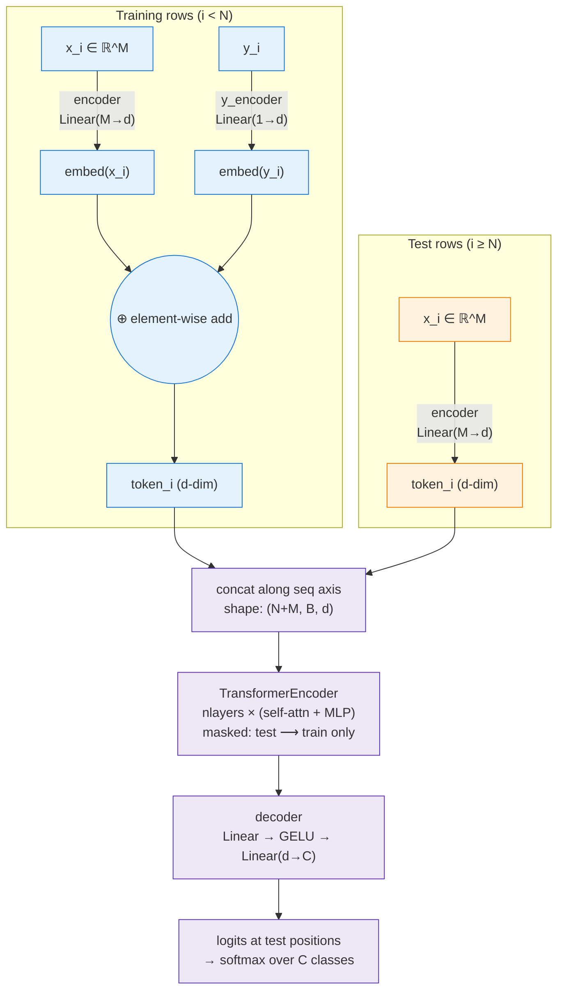
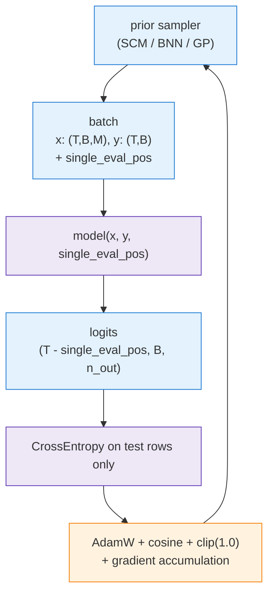
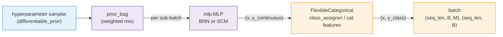

# TabPFN v1 — Transformer Architecture Walkthrough

> **Scope: the released TabPFN v1 model is classification-only.** Verified from the paper and shipped artifacts:
> - **Title**: "TabPFN: A Transformer That Solves Small Tabular *Classification* Problems in a Second."
> - **Stated scope**: dataset constraints frame the target as "≤ 10 classes" — no regression axis.
> - **Appendix A.6.1** lists "Multi-class support" as a v1 contribution over Müller 2022 (binary classification only).
> - **Evaluation**: only OpenML-CC18 (classification) vs. classification baselines (XGBoost, LightGBM, CatBoost, AutoML).
>
> Regression code paths exist in the framework (inherited from Müller 2022) but **no pretrained regression weights ship with v1**. First-class regression arrives in [[hollmann2025tabpfnv2]].

A code-grounded tour of the TabPFN v1 model. Source files (Apache-2.0, `automl/TabPFN` at tag `v1.0.0`):

- [`tabpfn/transformer.py`](https://github.com/automl/TabPFN/blob/v1.0.0/tabpfn/transformer.py) — 232 lines, the `TransformerModel` wrapper
- [`tabpfn/layer.py`](https://github.com/automl/TabPFN/blob/v1.0.0/tabpfn/layer.py) — 130 lines, custom `TransformerEncoderLayer`

The v1 model is a thin wrapper around `torch.nn.TransformerEncoder`. Custom logic is confined to: (a) how rows become tokens, (b) the attention mask, (c) the output decoder. The transformer block itself is textbook.

## Data flow



The two key asymmetries are visible at a glance: **training tokens** add `embed(y)` (blue path); **test tokens** don't (orange path). Inside `TransformerEncoder`, the attention mask lets test tokens read from train tokens but not vice versa.

## 1. Tokenization — one token per row, label added on training rows

[`transformer.py:106-133`](https://github.com/automl/TabPFN/blob/v1.0.0/tabpfn/transformer.py#L106-L133). The forward pass takes `src = (style, x, y)`:

```python
x_src = self.encoder(x_src)            # (N+M, B, d)
y_src = self.y_encoder(y_src.unsqueeze(-1))

train_x = x_src[:single_eval_pos] + y_src[:single_eval_pos]   # x + y for training rows
src = torch.cat([global_src, style_src, train_x, x_src[single_eval_pos:]], 0)
```

Key points:
- **`encoder` and `y_encoder` are injected from outside** — typically `Linear(M_max → d)` and `Linear(1 → d)`. The whole feature row collapses into one token via a single linear projection.
- **Label injection is additive**: training tokens are `embed(x) + embed(y)`; test tokens are `embed(x)` only. The model has to disentangle x and y from a sum.
    - *Why addition specifically:* both embeddings are $d$-dim, so summing keeps the token $d$-dim — no extra parameters, no longer sequence.
    - Same trick as BERT's `token + position + segment` embeddings.
    - Train/test asymmetry falls out for free: test rows just skip the y-term, no architectural switch needed.
    - Concatenation would need a $2d \to d$ projection; adding y as a separate token would double sequence length and quadruple the train-attention cost.
- **Optional `style` and `global` tokens** prepend to the sequence.

### Note: `style` and `global` tokens

Both are inherited from the **generic PFN codebase** that TabPFN configures, wired into the code but **disabled in the released TabPFN classifier**. For the model you actually run, the sequence is just `[train_tokens, test_tokens]`.

- **`style`** — a single per-dataset conditioning token.
    - *Origin:* the framework's "informed PFN" mode, where the model conditions on known prior hyperparameters $\phi$ (SCM depth, noise level, etc.) so it can specialize across dataset regimes.
    - *Why disabled:* real tables don't expose $\phi$ at inference; TabPFN instead marginalizes over $\phi$ implicitly via training-data diversity.
    - *Where:* hardcoded off via `style_def = None` in [`train.py:55`](https://github.com/automl/TabPFN/blob/v1.0.0/tabpfn/train.py#L55).
- **`global_src`** — $K$ learnable summary tokens that train rows attend *to* and test queries attend *only* to, bottlenecking the train context from $N$ to $K \ll N$.
    - *Origin:* Set-Transformer-style attention compression for large $N$.
    - *Why disabled:* not needed at TabPFN v1's $N \leq 1000$ scale; full attention is already cheap and more accurate.
    - *Where:* disabled via `num_global_att_tokens = 0`.

v2 drops both hooks entirely — `architectures/base/transformer.py` no longer has either.

### Note: variable column counts and feature rotation

- The fixed `Linear(M_max → d)` encoder assumes $M_{\max} = 100$ slots. Real datasets with $M < M_{\max}$ columns are zero-padded along the feature axis; $M > 100$ is not supported by released v1.
- Slot identity is *learned* (each column of $W_x$ specializes), so absolute column order would otherwise matter. Two complementary fixes neutralize this:
    - *Training-time, in data generation:* every synthetic dataset is cyclic-shifted by a random offset in [`priors/mlp.py:167-168`](https://github.com/automl/TabPFN/blob/v1.0.0/tabpfn/priors/mlp.py#L167-L168) *before* reaching the model — slots become exchangeable in expectation, so $W_x[:, j]$ has no incentive to specialize.
    - *Inference-time, in the sklearn wrapper:* `TabPFNClassifier(N_ensemble_configurations=32)` averages predictions over $k$ cyclically-rotated views of the test dataset (lives in `tabpfn/scripts/transformer_prediction_interface.py`).
- v2 replaces this entire workaround with **randomized attribute tokens** — column identity becomes random noise instead of a learned weight, so slot order carries no information by construction and rotation is no longer needed.

### Note: `y` encoding is `Linear(1 → d)`, not a lookup table

For classification, `y_encoder = nn.Linear(1, d)`, so the class index $k \in \{0, \ldots, C-1\}$ is fed as a **scalar float** and embedded as $W_y \cdot k + b_y$ — class embeddings are collinear and evenly spaced in $\mathbb{R}^d$. This is *not* an `nn.Embedding(C, d)` lookup. Random class-label rotation during training neutralizes the imposed ordering, and the same encoder works for regression (real-valued $y$) without modification.

## 2. No row-axis positional encoding

[`transformer.py:138-139`](https://github.com/automl/TabPFN/blob/v1.0.0/tabpfn/transformer.py#L138-L139):

```python
if self.pos_encoder is not None:
    src = self.pos_encoder(src)
```

`pos_encoder=None` for TabPFN. With no positional encoding on the row axis, the encoder is invariant to permutations of training rows — exactly what we want when the "sequence" is actually a set of training examples.

## 3. The attention mask — test rows attend to training rows only

[`transformer.py:53-59`](https://github.com/automl/TabPFN/blob/v1.0.0/tabpfn/transformer.py#L53-L59):

```python
@staticmethod
def generate_D_q_matrix(sz, query_size):
    train_size = sz - query_size
    mask = torch.zeros(sz, sz) == 0     # everything allowed
    mask[:, train_size:].zero_()        # ...except attention TO test tokens
    mask |= torch.eye(sz) == 1          # diagonal restored (self-attn)
```

`D_q` = **D**ataset rows + **q**ueries. Example with $N=3$, $M=2$ (rows = queriers, cols = keys; `1`=attend):

```
        d₁ d₂ d₃ q₁ q₂
   d₁ [  1  1  1  0  0 ]
   d₂ [  1  1  1  0  0 ]   train ↔ train
   d₃ [  1  1  1  0  0 ]
   q₁ [  1  1  1  1  0 ]   query → train + self
   q₂ [  1  1  1  0  1 ]
```

Cost: $N^2 + N\cdot M + M$ pairs. Queries are read-only sinks, train rows are the shared K/V bank — so test rows are independent at inference.

When `efficient_eval_masking=True` ([line 120-121](https://github.com/automl/TabPFN/blob/v1.0.0/tabpfn/transformer.py#L120-L121)), the mask collapses to a single integer (the train/test split position), and the custom encoder layer implements the same logic without materializing the full matrix.

## 4. Backbone — stock PyTorch `TransformerEncoder`

[`transformer.py:21-24`](https://github.com/automl/TabPFN/blob/v1.0.0/tabpfn/transformer.py#L21-L24):

```python
encoder_layer_creator = lambda: TransformerEncoderLayer(
    ninp, nhead, nhid, dropout, activation=activation, pre_norm=pre_norm, ...)
self.transformer_encoder = TransformerEncoder(encoder_layer_creator(), nlayers) \
    if all_layers_same_init else TransformerEncoderDiffInit(encoder_layer_creator, nlayers)
```

A stack of `nlayers` (=12 for the released model) standard encoder layers — self-attention + MLP + LayerNorm. Nothing tabular-specific inside the block; the custom `TransformerEncoderLayer` in `layer.py` mainly adds the integer-mask fast path and gradient-checkpointing support.

## 5. Zero-initialization — every layer starts as identity

[`transformer.py:92-98`](https://github.com/automl/TabPFN/blob/v1.0.0/tabpfn/transformer.py#L92-L98):

```python
for layer in self.transformer_encoder.layers:
    nn.init.zeros_(layer.linear2.weight)        # MLP output projection
    nn.init.zeros_(layer.linear2.bias)
    for attn in attns:
        nn.init.zeros_(attn.out_proj.weight)    # attention output projection
        nn.init.zeros_(attn.out_proj.bias)
```

The output side of each sublayer is zero-init, so residual + sublayer = residual at step 0. Each layer is the identity function at init; the network must learn to deviate. This stabilizes training of deep PFN stacks.

## 6. Output head — MLP per token, return test positions only

[`transformer.py:29, 141-143`](https://github.com/automl/TabPFN/blob/v1.0.0/tabpfn/transformer.py#L29-L29):

```python
self.decoder = nn.Sequential(nn.Linear(ninp, nhid), nn.GELU(), nn.Linear(nhid, n_out))
...
output = self.transformer_encoder(src, src_mask)
output = self.decoder(output)
return output[
	single_eval_pos
    + len(style_src)
    + (self.global_att_embeddings.num_embeddings if self.global_att_embeddings else 0):
    ]
```

The slice offset accounts for all three prepended-token regions: $K$ global tokens (if any), 1 style token (if any), and the $N$ train rows — so what's returned is the $M$ test-row positions only.

A two-layer MLP is applied at every token position; the function returns only the test-position outputs.

### What is `n_out`?

The width of the head's final layer. **Same architecture for every task; only `n_out` and the loss change.** Set in [`train.py:58-63`](https://github.com/automl/TabPFN/blob/v1.0.0/tabpfn/train.py#L58-L63) from the chosen criterion.

> **The released TabPFN v1 model is classification-only.** The paper title and pretrained weights (`pip install tabpfn` exposes only `TabPFNClassifier`) cover the cross-entropy case below. The other rows are *generic PFN framework* support inherited from the Müller-2022 codebase: the code paths exist and you could train your own regression PFN with them, but **no pretrained regression weights ship with v1**. First-class regression arrives in [hollmann2025tabpfnv2](hollmann2025tabpfnv2.md).

- **Classification — `CrossEntropyLoss`** *(released v1 model)*
    - `n_out = num_classes` (typically the configured maximum, $C_\max = 10$).
    - Output per test row: a length-$C$ logit vector → softmax → class probabilities.
- **Regression — Gaussian NLL (`GaussianNLLLoss`)** *(framework-only)*
    - `n_out = 2`: one scalar for the predicted mean, one for the variance.
    - Output is a per-test-row Gaussian $\mathcal{N}(\mu, \sigma^2)$.
- **Regression — point estimate (`MSELoss`)** *(framework-only)*
    - `n_out = 1`: a single scalar prediction per test row.
- **Binary classification — `BCEWithLogitsLoss`** *(framework-only)*
    - `n_out = 1`: one logit per test row → sigmoid.
- **Regression — bar / Riemann distribution head (`barnll`, see [`bar_distribution.py`](https://github.com/automl/TabPFN/blob/v1.0.0/tabpfn/bar_distribution.py))** *(framework-only)*
    - `n_out = num_buckets` (default 100). Outputs a categorical distribution over equi-probable bins covering $[\min_y, \max_y]$ — the discretized continuous-target trick from [muller2022pfn](muller2022pfn.md).

## 7. Training loop — synthetic batches, sampled split, loss on test positions only

The training entry point lives in [`tabpfn/train.py`](https://github.com/automl/TabPFN/blob/v1.0.0/tabpfn/train.py). Two things to understand: **how a batch is shaped**, and **what gets backpropped**.

### Where batches come from

Batches are produced by a **prior data loader** — there is no real-data training set. A `priordataloader_class` (e.g. SCM, BNN, GP) is instantiated per run and called like a stream:

```python
dl = priordataloader_class(
    num_steps=steps_per_epoch,
    batch_size=batch_size,
    eval_pos_seq_len_sampler=eval_pos_seq_len_sampler,   # samples (single_eval_pos, seq_len)
    seq_len_maximum=bptt + (bptt_extra_samples or 0),
    device=device,
    **extra_prior_kwargs_dict,
)
```

Each iteration yields one synthetic batch:

```python
for batch, (data, targets, single_eval_pos) in enumerate(dl):
    # data    = (style, x, y)        with x: (seq_len, B, M), y: (seq_len, B)
    # targets : (seq_len, B)
    # single_eval_pos : int  — the row index splitting train / test inside this sequence
```

Key shape facts:
- **`seq_len = bptt`** (typically 10–100) — total rows per synthetic dataset in the batch.
- **`B = batch_size`** synthetic datasets per step; they are independent — each has its own SCM/BNN draw and its own train/test split.
- **`single_eval_pos`** is *resampled every batch* by `eval_pos_seq_len_sampler`. The first `single_eval_pos` rows are training context; the rest are test queries. Varying it during training forces the model to handle different context sizes at inference.

### Forward pass and loss

The model takes the full sequence and the split position, then returns logits only at test positions ([line 127-128, 141-147](https://github.com/automl/TabPFN/blob/v1.0.0/tabpfn/train.py#L127-L147)):

```python
output = model(
    tuple(e.to(device) if torch.is_tensor(e) else e for e in data),
    single_eval_pos=single_eval_pos,
)
# output : (seq_len - single_eval_pos, B, n_out)

if single_eval_pos is not None:
    targets = targets[single_eval_pos:]               # only score test rows
if isinstance(criterion, nn.CrossEntropyLoss):
    losses = criterion(output.reshape(-1, n_out),
                       targets.to(device).long().flatten())
losses = losses.view(*output.shape[0:2])              # (seq_len - single_eval_pos, B)
loss, _ = utils.torch_nanmean(losses.mean(0), return_nanshare=True)
loss = loss / aggregate_k_gradients
```

This is exactly the PFN-NLL objective from [muller2022pfn](muller2022pfn.md):
$$\mathcal{L}_{\text{PFN}} = \mathbb{E}_{\mathcal{D} \sim p(\mathcal{D})}\big[-\log q_\theta(y_\text{test} \mid x_\text{test}, \mathcal{D}_\text{train})\big]$$
Each synthetic dataset $\mathcal{D}$ in the batch is one Monte-Carlo sample; the cross-entropy on test rows is one term of the outer expectation.

### Optimizer setup ([lines 92-98](https://github.com/automl/TabPFN/blob/v1.0.0/tabpfn/train.py#L92-L98))

```python
optimizer = torch.optim.AdamW(model.parameters(), lr=lr, weight_decay=weight_decay)
scheduler = get_cosine_schedule_with_warmup(optimizer, warmup_epochs, epochs)
scaler    = GradScaler() if train_mixed_precision else None
```

- **AdamW** with `lr ≈ get_openai_lr(model)` (scales with model size).
- **Cosine schedule** with linear warmup over `warmup_epochs` epochs.
- **Optional mixed precision** via `torch.cuda.amp`.

### Step loop and gradient handling ([lines 151-165](https://github.com/automl/TabPFN/blob/v1.0.0/tabpfn/train.py#L151-L165))

```python
if scaler: loss = scaler.scale(loss)
loss.backward()

if batch % aggregate_k_gradients == aggregate_k_gradients - 1:
    if scaler: scaler.unscale_(optimizer)
    torch.nn.utils.clip_grad_norm_(model.parameters(), 1.)
    if scaler:
        scaler.step(optimizer); scaler.update()
    else:
        optimizer.step()
    optimizer.zero_grad()
```

- **Gradient accumulation** over `aggregate_k_gradients` micro-batches → larger effective batch size without more memory.
- **Gradient clipping at norm 1.0** every effective step.
- **No early stopping, no validation-on-real-data gate** by default — training runs for a fixed number of epochs against the synthetic stream. `dl.validate(model)` is only called every `validation_period` epochs if the prior loader exposes it.

### Training-loop summary



Each gradient step is "draw one batch of fresh synthetic datasets → predict their held-out rows → backprop the cross-entropy." No epoch ever sees the same data twice; the model is trained directly against the prior.

## 8. Synthetic data generation — where the batches come from

The prior loader is what makes TabPFN a *PFN*. The code lives in [`tabpfn/priors/`](https://github.com/automl/TabPFN/tree/v1.0.0/tabpfn/priors):

| File | Role |
|---|---|
| [`prior.py`](https://github.com/automl/TabPFN/blob/v1.0.0/tabpfn/priors/prior.py) | Abstract `PriorDataLoader` interface |
| [`prior_bag.py`](https://github.com/automl/TabPFN/blob/v1.0.0/tabpfn/priors/prior_bag.py) | Mixes several base priors per batch |
| [`mlp.py`](https://github.com/automl/TabPFN/blob/v1.0.0/tabpfn/priors/mlp.py) | The unified **BNN / SCM** sampler |
| [`flexible_categorical.py`](https://github.com/automl/TabPFN/blob/v1.0.0/tabpfn/priors/flexible_categorical.py) | Continuous → multi-class / categorical wrapper |
| [`fast_gp.py`](https://github.com/automl/TabPFN/blob/v1.0.0/tabpfn/priors/fast_gp.py) | GP prior (used in ablations, not for the released classifier) |
| [`differentiable_prior.py`](https://github.com/automl/TabPFN/blob/v1.0.0/tabpfn/priors/differentiable_prior.py) | Hyperparameter sampler with learnable priors over priors |

Pipeline at a glance:



### 8.1 Prior bag — sample which prior to use, per sub-batch

[`prior_bag.py:14-23`](https://github.com/automl/TabPFN/blob/v1.0.0/tabpfn/priors/prior_bag.py#L14-L23). A batch of size `B` is split into `num_models` sub-batches of size 64; for each sub-batch a base prior is drawn from a categorical distribution:

```python
weights = torch.tensor(prior_bag_priors_p, dtype=torch.float)
batch_assignments = torch.multinomial(
    torch.softmax(weights, 0), num_models, replacement=True,
).numpy()

sample = [
    prior_bag_priors_get_batch[int(prior_idx)](hyperparameters=hyperparameters, **args, **kwargs)
    for prior_idx in batch_assignments
]
x, y, y_ = zip(*sample)
```

For the released classifier weights, `prior_bag_priors_get_batch` is essentially `[mlp_BNN, mlp_SCM]` with a weighting that biases toward SCM — this is the SCM+BNN mixture from the paper.

### 8.2 The BNN / SCM unified sampler ([`mlp.py`](https://github.com/automl/TabPFN/blob/v1.0.0/tabpfn/priors/mlp.py))

A single `MLP` class implements both priors, switched by the `is_causal` flag.

**Step 1 — sample a random MLP.** Layers are `Linear → activation → GaussianNoise`; weights are drawn from `N(0, init_std² / keep_prob)` with random per-layer dropout to enforce sparsity:

```python
self.layers  = [nn.Linear(self.num_causes, self.prior_mlp_hidden_dim)]
self.layers += [Sequential(activation, Linear(H, H), GaussianNoise(std))
                for _ in range(num_layers - 1)]
...
nn.init.normal_(p, std=self.init_std / (1. - dropout_prob)**0.5)
p *= torch.bernoulli(1. - dropout_prob)        # sparse weights
```

**Step 2 — sample root "causes" (latent inputs).** Each batch draws a fresh per-cause mean/std, then samples `seq_len` independent rows. Sampling mode can be Gaussian, multinomial, or Zipf — adding heavy-tailed and discrete variation on top of Gaussians:

```python
self.causes_mean, self.causes_std = causes_sampler_f(self.num_causes)  # N(0,1) per cause
...
if sampling == 'normal':
    causes = torch.normal(causes_mean, causes_std.abs())                # (T, 1, num_causes)
elif sampling == 'mixed':
    # mix of normal / multinomial / Zipf — see priors/mlp.py:109-125
```

**Step 3 — propagate causes through the MLP, collect *intermediate* activations.** All layer outputs are concatenated into a single pool of "nodes":

```python
outputs = [causes]
for layer in self.layers:
    outputs.append(layer(outputs[-1]))
outputs_flat = torch.cat(outputs[2:], -1)        # all activations from layer 2 onward
```

**Step 4 — pick which nodes are features and which is `y`.** This is where BNN and SCM diverge:

- **BNN (`is_causal=False`):** `x = causes` (the latent inputs) and `y = outputs[-1]` (final layer). Features are independent Gaussian draws; `y` is a deterministic MLP function of them. Like a standard random-NN prior.
- **SCM (`is_causal=True`):** randomly permute the node pool, pick the first slots as `y`, the next `num_features` as `x`:

  ```python
  random_perm = torch.randperm(outputs_flat.shape[-1] - 1)
  random_idx_y = list(range(-num_outputs, 0)) if y_is_effect else random_perm[0:num_outputs]
  random_idx   = random_perm[num_outputs : num_outputs + num_features]

  y = outputs_flat[..., random_idx_y]
  x = outputs_flat[..., random_idx]
  ```

  Now features can be *anywhere* in the computational DAG — including upstream or downstream of `y`. This is what gives SCM realistic feature-feature correlations and causal structure, vs. BNN's independent-input world.

**Step 5 — random feature rotation** (rotates which slot a feature lands in, so the fixed `Linear(M_max → d)` input encoder can't memorize column identity):

```python
if self.random_feature_rotation:
    shift = random.randrange(x.shape[-1])
    x = x[..., (torch.arange(x.shape[-1]) + shift) % x.shape[-1]]
```

### 8.3 Continuous → multi-class labels ([`flexible_categorical.py`](https://github.com/automl/TabPFN/blob/v1.0.0/tabpfn/priors/flexible_categorical.py))

The MLP outputs continuous `y`. `FlexibleCategorical` wraps it with a class-assigner that picks one of three discretization schemes (sampled per dataset).

**`MulticlassRank`** — pick $C-1$ rows uniformly at random; their `y` values become quantile-style class boundaries:

```python
class_boundaries = torch.randint(0, x.shape[0], (self.num_classes - 1,))
class_boundaries = x[class_boundaries].unsqueeze(1)
d = (x > class_boundaries).sum(axis=0)         # class id in {0,...,C-1}
```

This is Appendix A.6.1 of the paper, almost verbatim. Resulting class frequencies are naturally imbalanced (because boundaries are random data points, not equal-probability quantiles).

**`MulticlassValue`** — same idea, but the $C-1$ boundaries are random *N(0,1)* values instead of data-derived ones.

**`MulticlassMultiNode`** — different mechanism: take `C` separate output nodes from the MLP, softmax-sample (with temperature) — used when `multiclass_type='multi_node'`.

After class assignment, classes are *randomly relabeled* with probability `1 - ordered_p` so the model can't exploit class-label ordering:

```python
randomized_classes = torch.rand((d.shape[1],)) > self.ordered_p
d[:, randomized_classes] = randomize_classes(d[:, randomized_classes], self.num_classes)
```

### 8.4 Categorical features

`FlexibleCategorical` also discretizes a random subset of feature columns the same way `MulticlassRank` discretizes `y` — picks $k$ random boundaries within the column and replaces values with their bucket index. Fraction of columns to discretize is itself a hyperparameter sampled per dataset, so each synthetic table sees a different mix of numerical and categorical columns.

### 8.5 Why "Occam's razor bias"

The hyperparameters that govern the MLP (number of causes, hidden width, depth, dropout rate, noise std) are themselves sampled from priors with most mass on *small* values — see `differentiable_prior.py`. Most synthetic datasets are therefore shallow and sparse; very few are deep and complex. This biases the learned approximate posterior toward simpler hypotheses, matching the typical real-world tabular dataset.

### 8.6 What ends up in one batch

After the full pipeline:
- `x : (seq_len, B, M)` — `B` independent synthetic tables, each `seq_len` rows × `M` features. Each table comes from its *own* random MLP and its *own* hyperparameter draw.
- `y : (seq_len, B)` — discrete class labels with imbalanced, randomly-relabeled classes.
- A subset of columns may be categorical (bucketized).
- No two tables in the same batch share generating mechanism; the cross-entropy averaged across them is a Monte-Carlo estimate of the PFN-NLL outer expectation over the prior $p(\mathcal{D})$.

## What's *not* in v1 (and what later versions add)

- **No attention over features.** Feature-feature interaction must live inside the input `Linear(M_max → d)` and the per-token MLPs. v2 splits the row into per-feature tokens and adds an explicit feature-axis attention.
- **No randomized column identity.** The `Linear(M_max → d)` has a fixed learned weight slice for each input slot — column "age in slot 3" ≠ "age in slot 7." This is why v1 needs 32× ensembling over column rotations to approximate permutation invariance. v2 replaces this with random subspace embeddings.
- **No special handling of categoricals, NaNs, or feature groups in the architecture.** All of that lives in the surrounding preprocessing pipeline.

The conceptual leap of TabPFN v1 is in the *training data and objective* (PFN on synthetic SCM+BNN datasets), not the architecture. The transformer is deliberately vanilla.

## Related Pages

- [hollmann2023tabpfnv1](hollmann2023tabpfnv1.md) — the paper
- [hollmann2025tabpfnv2](hollmann2025tabpfnv2.md) — successor with per-feature tokens and randomized column embeddings
- [tabular-icl-lineage](tabular-icl-lineage.md) — PFN → TabPFN → TabICL comparison
