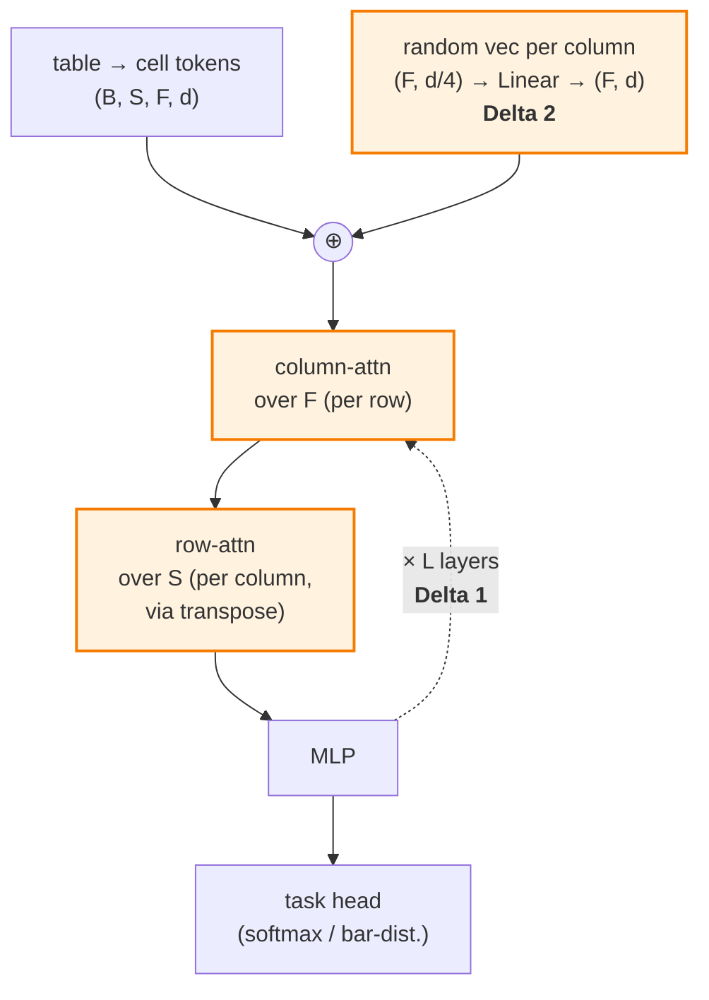

# TabPFN v2 — Code Walkthrough (delta vs v1)

A code-grounded tour of what *changed* in TabPFN v2 relative to v1. The PFN objective, single-forward-pass ICL, frozen-weights-at-inference, and synthetic-prior pretraining are unchanged — see [tabpfn-v1-code](tabpfn-v1-code.md) for the v1 baseline.

Source (Apache-2.0, `PriorLabs/TabPFN` at tag `v2.0.9_`):

- [`src/tabpfn/model/transformer.py`](https://github.com/PriorLabs/TabPFN/blob/v2.0.9_/src/tabpfn/model/transformer.py) — `PerFeatureTransformer`, the v2 model wrapper
- [`src/tabpfn/model/layer.py`](https://github.com/PriorLabs/TabPFN/blob/v2.0.9_/src/tabpfn/model/layer.py) — `PerFeatureEncoderLayer`, the alternating attention block

## What's the same as v1

- PFN training objective: minimize NLL of test labels conditioned on in-context train rows.
- One forward pass at inference; no gradient updates on the user's data.
- Pretraining prior: SCMs + BNNs over millions of synthetic tables (v2 just scales this up).
- Frozen pretrained weights ship with the package.

## What's different

Two coupled architectural changes carry the bulk of v2's capability gain:

- **Tokenization: row → cell.**
    - *v1:* each row collapsed to one token via `Linear(M_max → d)`.
    - *v2:* one token per **(row, feature-group)** cell.
- **Per-layer attention: row-only → alternating row + column.**
    - *v1:* one self-attention over rows.
    - *v2:* alternates `attn_between_features` (column-axis) then `attn_between_items` (row-axis) per layer.
- **Column identity: learned per-slot → randomized per-call.**
    - *v1:* baked into the columns of the input projection $W_x$ (learned at pretraining).
    - *v2:* a fresh random vector *added* per column at every inference call.

The next two sections cover the load-bearing pieces — alternating attention and randomized attribute tokens. NaN/categorical encoder steps and the regression bar-distribution head are mentioned at the end (real changes, but downstream of the two above).



The orange nodes are the two deltas: cell-wise random column identity (right branch, added once at the input) and the alternating column/row attention block (looping $L$ times).

## Delta 1 — Alternating row/column attention

### Module declarations

[`layer.py:182-203`](https://github.com/PriorLabs/TabPFN/blob/v2.0.9_/src/tabpfn/model/layer.py#L182-L203) — `PerFeatureEncoderLayer.__init__`:

```python
self.self_attn_between_features: MultiHeadAttention | None = None
if ...:
    self.self_attn_between_features = MultiHeadAttention(...)  # column-axis attn
...
self.self_attn_between_items = MultiHeadAttention(...)         # row-axis attn
```

Two distinct `MultiHeadAttention` modules — one for each axis. v1 had one.

### Forward logic

Input shape ([`layer.py:283-285`](https://github.com/PriorLabs/TabPFN/blob/v2.0.9_/src/tabpfn/model/layer.py#L283-L285)): `state` is `(B, S, F, d)` —
- `B` = batch (datasets),
- `S` = items (rows; first `single_eval_pos` are train, rest are test),
- `F` = feature blocks (columns, possibly grouped),
- `d` = hidden dim.

The same `state` tensor is threaded through three sublayers per encoder layer. Each sublayer keeps the `(B, S, F, d)` shape on the way out — only the axis it attends over changes between calls.

**Sublayer assembly** ([`layer.py:401-424`](https://github.com/PriorLabs/TabPFN/blob/v2.0.9_/src/tabpfn/model/layer.py#L401-L424)):

```python
sublayers = []
if self.self_attn_between_features is not None:
    sublayers.append(attn_between_features)   # 1. column-attn
sublayers += [
    attn_between_items,                       # 2. row-attn
    partial(self.mlp.__call__, ...),          # 3. MLP
]
```

**Sublayer loop** ([`layer.py:437-455`](https://github.com/PriorLabs/TabPFN/blob/v2.0.9_/src/tabpfn/model/layer.py#L437-L455)):

```python
for sublayer, layer_norm in zip(sublayers, self.layer_norms):
    state = sublayer(state)                   # residual is inside (add_input=True)
    state = layer_norm(state, ...)            # post-norm
```

Two things to notice:

- **Residual is inside the sublayer**, not around it — every `MultiHeadAttention(..., add_input=True)` call returns `x + attn(x)` directly, and the MLP does the same.
- **Post-norm**, not pre-norm — the `pre_norm` branch raises `AssertionError` (line 438-442). Each sublayer output goes through its own `LayerNorm` from `self.layer_norms` (one per sublayer).

### How each axis is attended

`MultiHeadAttention` always treats **dim -2 as the sequence dimension**. The trick is that each attention closure puts the relevant axis there:

- **Column-attn** ([`layer.py:332-339`](https://github.com/PriorLabs/TabPFN/blob/v2.0.9_/src/tabpfn/model/layer.py#L332-L339)):
    - Input shape: `(B, S, F, d)` — `F` is already at dim -2.
    - No transpose; call MHA directly.
    - Each `(B, S)` cell-batch attends over its own `F` feature tokens.
    - Attention is *within each row*: rows don't talk to each other in this step.
- **Row-attn** ([`layer.py:341-395`](https://github.com/PriorLabs/TabPFN/blob/v2.0.9_/src/tabpfn/model/layer.py#L341-L395)):
    - Need `S` at dim -2, so the closure does `x.transpose(1, 2)` to get `(B, F, S, d)`.
    - Run MHA, then `transpose(1, 2)` back to `(B, S, F, d)`.
    - Each `(B, F)` column-batch attends over its own `S` row tokens.
    - Attention is *within each column*: columns don't mix here.
    - Internally has **two execution paths**:
        - *Standard path* (lines 381-395):
            - With `cache_trainset_representation=True` and `single_eval_pos > 0`, train K/V is written to cache during prefill (line 391).
            - On subsequent test-only calls, K/V is read from cache (line 394) — train rows are never re-encoded.
        - *Multiquery test-side path* (lines 344-379, when `multiquery_item_attention_for_test_set=True`):
            - Splits the batch into train rows (lines 363-372) and test rows (lines 346-358).
            - Test rows attend to cached train K/V via `reuse_first_head_kv=True` — all heads share one K/V projection, cutting cache memory by `nhead×`.
            - Train rows only attend to train rows during prefill.
            - Net effect: full $N \times N$ attention is never materialized at inference — the engineering that makes $N \le 10\text{K}$ tractable.

So the two attentions are factorized: one mixes information across columns within a row, the other across rows within a column. Cross-talk between rows *and* columns happens only through the stack of $L$ layers — there's never a full $(NM)^2$ attention. The MLP afterward is per-token, mixing only the $d$ channels.

The full per-layer flow on `(B, S, F, d)`:

```
state ── column-attn ── LN ── row-attn ── LN ── MLP ── LN ── state'
         (over F)             (over S,
                              via transpose)
```

Each of the $L$ encoder layers repeats this; layer outputs feed into the next layer unchanged in shape.

## Delta 2 — Randomized attribute tokens

### Where it lives

[`transformer.py:700-740`](https://github.com/PriorLabs/TabPFN/blob/v2.0.9_/src/tabpfn/model/transformer.py#L700-L740), inside `PerFeatureTransformer.forward`, after embedding and before the encoder stack.

Five variants are implemented; only the choice matters here:

| Variant | What gets added per column |
|---|---|
| `None` | nothing — column-attn collapses |
| `"learned"` | sampled row of a 1000-entry `nn.Embedding` — closest to v1's fixed slot embeddings |
| `"normal_rand_vec"` / `"uni_rand_vec"` | pure Gaussian / uniform noise in $\mathbb{R}^d$, no learned lift |
| **`"subspace"`** (recommended in docstring) | Gaussian noise in $\mathbb{R}^{d/4}$ lifted to $\mathbb{R}^d$ via a learned linear map |

### The `subspace` branch

[`transformer.py:729-736`](https://github.com/PriorLabs/TabPFN/blob/v2.0.9_/src/tabpfn/model/transformer.py#L729-L736):

```python
elif self.feature_positional_embedding == "subspace":
    embs = torch.randn(
        (x.shape[2], x.shape[3] // 4),       # (F, d/4) — fresh noise per call
        device=x.device, dtype=x.dtype,
    )
    embs = self.feature_positional_embedding_embeddings(embs)  # Linear(d/4 → d)
    x += embs[None, None]                    # broadcast to all rows, all batch elements
```

Three things to note:

- **Per-column, per-call.** `x.shape[2]` is the feature-group axis $F$. One random vector is drawn per column on every `forward` call, then added identically to every row and every batch element via the `[None, None]` broadcast. v1's column identity was *one tensor per column, learned once*; v2's is *fresh random per column, every call*.
- **Direction-injection is learned; identity is random.** The Linear `feature_positional_embedding_embeddings` ([`transformer.py:306`](https://github.com/PriorLabs/TabPFN/blob/v2.0.9_/src/tabpfn/model/transformer.py#L306): `nn.Linear(ninp // 4, ninp)`) is trained — but what it projects is fresh noise, so the *which-column-is-which* identity carries no pretraining signal. Pretraining cannot bake in "column 0 is usually the label-correlated feature."
- **Reproducible per call, uncorrelated with weights.** Wrapped in `isolate_torch_rng(self.seed, ...)` at [`transformer.py:700`](https://github.com/PriorLabs/TabPFN/blob/v2.0.9_/src/tabpfn/model/transformer.py#L700), so a fixed `seed` reproduces the same noise but the global RNG is left untouched.

This is the code-level realization of "schema invariance by construction": column attention can route information because columns have distinct identities, but pretraining cannot specialize to any particular column slot because every slot is freshly random.

## Other v2 changes (briefly)

These are real but downstream of the two contributions above — included for completeness.

- **Shared per-cell input projection.** `Linear(g → d)` with `g ∈ {1, 2}` (`features_per_group`), applied to every cell. Replaces v1's `Linear(M_max → d)` with learned per-slot weights $W_x[:, j]$. Lives in `encoders.py:LinearInputEncoderStep`.
- **First-class NaN and categorical handling.** `NanHandlingEncoderStep` and `CategoricalInputEncoderPerFeatureEncoderStep` in `encoders.py` add type/missingness channels per cell instead of requiring external imputation.
- **Regression head.** `bar_distribution.py` implements a bucketed Riemann distribution over the target; classification still uses softmax logits. v1 was classification-only.

## Cross-references

- [hollmann2025tabpfnv2](hollmann2025tabpfnv2.md) — the paper, including the architectural framing this page implements.
- [tabpfn-v1-code](tabpfn-v1-code.md) — the v1 baseline this delta is measured against.
