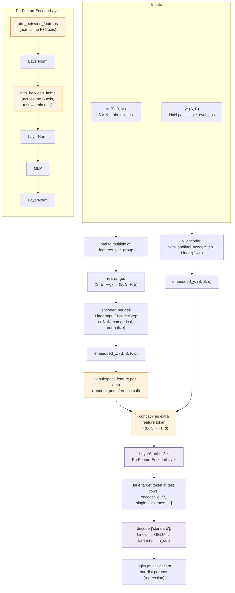

# TabPFN v2 — Transformer Architecture Walkthrough

> **Scope: TabPFN v2 ships both a classifier and a regressor.** Verified from the released code:
> - `InferenceConfig.task_type: Literal["multiclass", "regression"]` ([`model/config.py:31`](https://github.com/PriorLabs/TabPFN/blob/v2.0.9_/src/tabpfn/model/config.py#L31)).
> - Two top-level estimators: `TabPFNClassifier` and `TabPFNRegressor` (separate pretrained checkpoints).
> - Regression head: a **bar (Riemann) distribution** over `num_buckets ∈ {1000, 5000}` ([`model/bar_distribution.py`](https://github.com/PriorLabs/TabPFN/blob/v2.0.9_/src/tabpfn/model/bar_distribution.py)). Replaces v1's `Linear(d→C)` softmax.

A code-grounded tour of TabPFN v2 (`PriorLabs/TabPFN` at tag `v2.0.9_`), focused on what changed versus [[tabpfn-v1-code]]. Source files (Apache-2.0):

- [`model/transformer.py`](https://github.com/PriorLabs/TabPFN/blob/v2.0.9_/src/tabpfn/model/transformer.py) — 864 lines, `PerFeatureTransformer`
- [`model/layer.py`](https://github.com/PriorLabs/TabPFN/blob/v2.0.9_/src/tabpfn/model/layer.py) — 465 lines, `PerFeatureEncoderLayer`
- [`model/multi_head_attention.py`](https://github.com/PriorLabs/TabPFN/blob/v2.0.9_/src/tabpfn/model/multi_head_attention.py) — custom MHA with KV cache + multiquery
- [`model/encoders.py`](https://github.com/PriorLabs/TabPFN/blob/v2.0.9_/src/tabpfn/model/encoders.py) — stacked preprocessing/encoding steps
- [`model/config.py`](https://github.com/PriorLabs/TabPFN/blob/v2.0.9_/src/tabpfn/model/config.py) — released hyperparameters

The model is no longer a wrapper around `torch.nn.TransformerEncoder`: v2 ships a custom layer that runs **two attentions per block** (across features, then across rows). Everything else — encoders, decoders, preprocessing — is recognizable as the v1 family, just expanded.

## v1 vs v2 — at a glance

| Aspect                          | v1 ([[tabpfn-v1-code]])                                                   | v2                                                                                                   |
| ------------------------------- | ------------------------------------------------------------------------- | ---------------------------------------------------------------------------------------------------- |
| Token granularity               | **1 token per row** (all features collapsed by `Linear(M_max→d)`)         | **1 token per (row, feature group)** + 1 target token per row                                        |
| Tensor shape inside transformer | `(N+M, B, d)`                                                             | `(B, N+M, F+1, d)`                                                                                   |
| Attention block                 | Single MHA over the row axis (vanilla `TransformerEncoderLayer`)          | **`attn_between_features` then `attn_between_items`** — alternating                                  |
| Feature identity                | **Learned** per-column weights $W_x[:,j]$, neutralized by cyclic rotation | **Random embeddings** sampled fresh (`feature_positional_embedding="subspace"`)                      |
| Variable column count           | Zero-pad to $M_{\max}=100$, then rotate                                   | `features_per_group=1` (or 2); pad to multiple of group size, no $M_{\max}$ cap from the encoder     |
| Train/test asymmetry            | Test rows skip `+ embed(y)`                                               | Same: `y` is set to NaN past `single_eval_pos`, then appended as an extra "feature token"            |
| Attention mask                  | Custom `D_q` (test → train only)                                          | Implicit via `att_src` / `single_eval_pos`: row-attention uses train-only keys                       |
| Task head                       | `Linear → GELU → Linear(d → n_out)`                                       | Same MLP shape; for regression, `n_out = num_buckets` (Riemann bar distribution)                     |
| Regression pretrained           | No (framework-only)                                                       | **Yes**, separate `TabPFNRegressor` checkpoint                                                       |
| Categoricals / NaNs             | Imputed externally                                                        | First-class encoder steps (`NanHandlingEncoderStep`, `CategoricalInputEncoderPerFeatureEncoderStep`) |
| Layers / width                  | 12 / 512 (paper)                                                          | **`nlayers=12`**, `emsize ∈ {128, 192}`, `nhead ∈ {4, 6}` (released configs)                         |
| N cap                           | ≤ 1000                                                                    | ≤ 10 000                                                                                             |
| Backbone                        | `torch.nn.TransformerEncoder` wrapper                                     | Custom `PerFeatureTransformer` + `PerFeatureEncoderLayer`                                            |

The two architectural pivots are highlighted: **per-(row, feature) tokens with two-axis attention**, and **randomized column identity**. Everything else follows.

## Data flow

**Notation:**
- **B** — batch size (datasets per step)
- **S** — sequence length = $N_\text{train} + N_\text{test}$ (rows along the in-context axis)
- **M** — number of raw input features (columns)
- **g** — `features_per_group` (1 or 2 in released configs)
- **F** — number of feature *groups* = $\lceil M / g \rceil$; each group becomes one token via shared `Linear(g → d)`
- **F+1** — feature axis after appending the target as an extra token
- **d** — embedding dim (`emsize ∈ {128, 192}`)
- **`single_eval_pos`** — index along S where train rows end and test rows begin



Orange = changes from v1. The two attentions inside each layer are the architectural heart.

## 1. Tokenization — one token per (row, feature group), `y` as an extra token

[`transformer.py:463-617`](https://github.com/PriorLabs/TabPFN/blob/v2.0.9_/src/tabpfn/model/transformer.py#L463-L617). Three things happen in sequence:

1. **Group features** into blocks of size `features_per_group` (released configs use 1 or 2):
   ```python
   x[k] = einops.rearrange(x[k], "s b (f n) -> b s f n", n=self.features_per_group)
   ```
   No hard $M_{\max}$ — just pad to the next multiple of `features_per_group`.

2. **Encode each cell** through the shared `encoder` (a `SequentialEncoder` of preprocessing steps + a `Linear(features_per_group → d)`). Categorical indices and NaN masks flow as extra channels (`nan_indicators`).

3. **Encode `y`** through `y_encoder = NanHandlingEncoderStep + Linear(2 → d)`. The `2` is `(value, nan_indicator)`. Training rows feed the real `y`; test rows have `y = NaN`, so the y-encoder cleanly emits a "no-label" token.

4. **Concat `y` as a feature token**:
   ```python
   embedded_input = torch.cat((embedded_x, embedded_y.unsqueeze(2)), dim=2)
   # (B, S, F, d) + (B, S, 1, d) → (B, S, F+1, d)
   ```
   The target now lives on the same axis as features. Cross-feature attention reads from `y` directly.

> **Key shift vs v1.** v1 added `embed(y)` to a single row-token. v2 treats `y` as an additional feature column on the same axis as `x`. This is the precondition for "attention across features can pull the label into any feature representation, and vice versa."

### Note: feature positional embedding — `subspace`

[`transformer.py:700-740`](https://github.com/PriorLabs/TabPFN/blob/v2.0.9_/src/tabpfn/model/transformer.py#L700-L740). The released configs set `feature_positional_embedding="subspace"`:

```python
embs = torch.randn((x.shape[2], x.shape[3] // 4), ...)  # one per feature group
embs = self.feature_positional_embedding_embeddings(embs)  # Linear(d/4 → d)
x += embs[None, None]
```

The vectors are **sampled from a Gaussian on every forward call** (wrapped in `isolate_torch_rng(self.seed)` to keep one call deterministic but make column identity stochastic across pretraining batches). The learned `Linear(d/4 → d)` shapes the subspace; the actual identity per column is random noise.

This is the *randomized attribute tokens* mechanism from the paper: column $j$ has no identity the model can memorize, so it must infer column meaning purely from the in-context training rows. The same checkpoint handles any schema zero-shot.

## 2. Inside one layer — two attentions per block

[`layer.py:272-457`](https://github.com/PriorLabs/TabPFN/blob/v2.0.9_/src/tabpfn/model/layer.py#L272-L457). Each `PerFeatureEncoderLayer` runs three sublayers (each with post-norm and residual):

```python
sublayers = [attn_between_features, attn_between_items, self.mlp]
```

- **`attn_between_features`** — for each (batch, row), the `F+1` tokens attend to each other. This is the "across features within one sample" axis. It's where feature interactions are modelled, and where the target token can pull in evidence from any feature.

- **`attn_between_items`** — for each (batch, feature group), the `S` row-tokens attend to each other. This is the "across rows within one feature" axis, the in-context part. Test rows attend to train rows only:
   ```python
   attention_src_x = x[:, :single_eval_pos].transpose(1, 2)  # train as KV
   return self.self_attn_between_items(x.transpose(1, 2), attention_src_x, ...)
   ```
   This replaces v1's explicit `D_q` mask: instead of masking a single joint attention, v2 just passes different `K, V` tensors to the row-attention.

- **MLP** — feed-forward, applied per token.

Complexity per layer drops from v1's $O((N \cdot M)^2)$ joint attention (had v1 tried per-cell tokens) to $O(N^2 \cdot F + S \cdot F^2)$ — linear in the cross-axis size.

### Note: KV caching and multiquery for inference

[`multi_head_attention.py`](https://github.com/PriorLabs/TabPFN/blob/v2.0.9_/src/tabpfn/model/multi_head_attention.py). Two optimizations the paper hints at but v1 didn't have:

- **`cache_trainset_representation`** — on a first pass, the row-attention caches the train rows' K and V. New test queries skip recomputing the entire train context, a huge win at $N = 10K$.
- **`multiquery_item_attention_for_test_set=True`** (released config) — test queries share K/V across heads (multiquery attention), shrinking the memory footprint of the test-side cache.

## 3. Output head — same MLP shape, different `n_out` and loss

[`transformer.py:286-300`](https://github.com/PriorLabs/TabPFN/blob/v2.0.9_/src/tabpfn/model/transformer.py#L286-L300):

```python
decoder_dict = {"standard": (None, n_out)}  # None → default MLP
nn.Sequential(nn.Linear(ninp, nhid), nn.GELU(), nn.Linear(nhid, decoder_n_out))
```

Identical MLP shape to v1. Only the last dim and loss differ:

- **Multiclass:** `n_out = max_num_classes = 10`, cross-entropy.
- **Regression:** `n_out = num_buckets ∈ {1000, 5000}`, **bar (Riemann) distribution** loss from [`bar_distribution.py`](https://github.com/PriorLabs/TabPFN/blob/v2.0.9_/src/tabpfn/model/bar_distribution.py). The output is a categorical over a discretized continuous axis with a fixed grid; predictions are turned into a piecewise-uniform density and the loss is the discrete NLL.

The target token is read out at test positions only:
```python
test_encoder_out = encoder_out[:, single_eval_pos_:, -1].transpose(0, 1)
# -1 picks the y-token slice along the F+1 axis
```

## 4. Preprocessing pipeline — moved into the encoder

In v1, normalization and feature-rotation lived in the sklearn wrapper. In v2, preprocessing is a stack of `SeqEncStep`s composed inside the `encoder` ([`encoders.py:282-873`](https://github.com/PriorLabs/TabPFN/blob/v2.0.9_/src/tabpfn/model/encoders.py)):

- `RemoveEmptyFeaturesEncoderStep`
- `RemoveDuplicateFeaturesEncoderStep`
- `NanHandlingEncoderStep` — appends a NaN indicator channel
- `VariableNumFeaturesEncoderStep` — handles padding to `features_per_group`
- `InputNormalizationEncoderStep` — z-score on train rows, applied to test
- `CategoricalInputEncoderPerFeatureEncoderStep` — encodes categorical columns
- `LinearInputEncoderStep` — final `Linear(num_features → emsize)`

This is the "first-class mixed types + missing values" claim from the paper — implemented as composable encoder steps, no external imputation needed.

## 5. Verification against the paper

The paper claims four headline contributions. The code matches each:

| Paper claim | Where in code |
|---|---|
| Alternating row/column attention | `PerFeatureEncoderLayer.forward` runs `attn_between_features` then `attn_between_items` ([`layer.py:401-411`](https://github.com/PriorLabs/TabPFN/blob/v2.0.9_/src/tabpfn/model/layer.py#L401-L411)) |
| Randomized attribute tokens | `feature_positional_embedding="subspace"` resamples a Gaussian per call ([`transformer.py:729-736`](https://github.com/PriorLabs/TabPFN/blob/v2.0.9_/src/tabpfn/model/transformer.py#L729-L736)); locked in the released config ([`config.py:45`](https://github.com/PriorLabs/TabPFN/blob/v2.0.9_/src/tabpfn/model/config.py#L45)) |
| Regression, mixed types, NaNs | Bar-distribution decoder + `task_type="regression"` config; `NanHandlingEncoderStep`, `CategoricalInputEncoderPerFeatureEncoderStep` in the encoder stack |
| Scale to N ≤ 10K | `seq_len ∈ {2000, 4000}` in released configs; KV caching + multiquery test attention bring the constants down enough to push inference to 10K |

## Entities & Concepts

- [[hollmann2025tabpfnv2]] — the paper
- [[tabpfn-v1-code]] — v1 walkthrough; this page is a delta
- [[tabular-icl-lineage]] — broader lineage comparison
