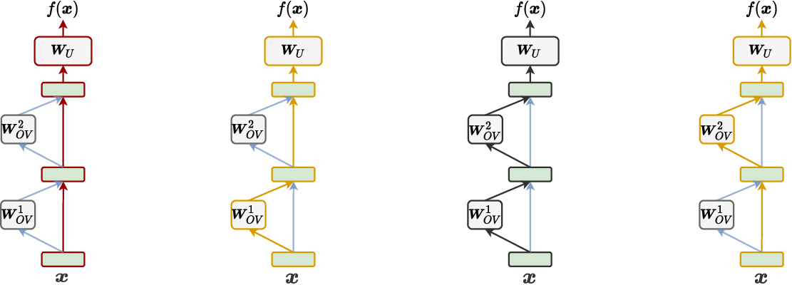

# Transformer Background

The algebraic perspective on Transformer forward passes that underpins modern mech-interp. Each token has a *residual stream* — a $d$-dimensional vector that every layer reads from and writes to additively. Three key rewrites — attention as OV/QK circuits, FFN as key-value memory, logits as a sum of component contributions — turn the network into an interpretable algebraic object.

## Notation

- $d$ — model width; $|V|$ — vocab size.
- $l$ — layer index; $h$ — head index; $i, j$ — token positions.
- $\mathbf{x}^l_i \in \mathbb{R}^d$ — residual stream at layer $l$, position $i$.
- $\mathbf{W}_Q, \mathbf{W}_K, \mathbf{W}_V, \mathbf{W}_O$ — attention projections; $\mathbf{W}_U \in \mathbb{R}^{d \times |V|}$ — unembedding.
- $\text{LN}(\mathbf{x}) = \frac{\mathbf{x} - \mu}{\sigma}\odot\boldsymbol{\gamma} + \boldsymbol{\beta}$ — LayerNorm, per-token, before each sublayer (Pre-LN).

## Key rewrites

- **Residual stream — additive updates.** The "stream" is the central object: every sublayer reads a normalized copy and writes its output back into the un-normalized stream.
  $$\mathbf{x}^l_i = \mathbf{x}^{l-1}_i + \text{Attn}^l(\text{LN}(\mathbf{x}^{l-1}_i)) + \text{FFN}^l(\text{LN}(\cdot))$$
    - **Sequential unroll.** The two sublayers compose; FFN's input depends on Attn's output, but each *write* is added independently:
      $$\mathbf{h} = \mathbf{x}^{l-1}_i + \text{Attn}^l(\text{LN}(\mathbf{x}^{l-1}_i)),\quad \mathbf{x}^l_i = \mathbf{h} + \text{FFN}^l(\text{LN}(\mathbf{h}))$$
    - **No privileged basis.** The stream has no canonical basis — any rotation is absorbable into adjacent weights. Features must be *discovered* (SAEs); only FFN neurons can be read directly.

- **Attention per head — read/write factorization.**
  $$\text{Attn}^{l,h}(\mathbf{x})_i = \sum_j a_{ij}\,(\mathbf{x}_j \mathbf{W}_V \mathbf{W}_O)$$
    - $\mathbf{W}_V \mathbf{W}_O$ = **OV circuit** — what is written into position $i$, copied from $j$.
    - $\mathbf{W}_Q \mathbf{W}_K^\top$ = **QK circuit** — where to read from (drives weights $a_{ij}$).

- **FFN as key-value memory.**
  $$\text{FFN}^l(\mathbf{x}) = \sum_u n_u \mathbf{w}_{\text{out}_u}$$
  Each neuron $u$ writes a fixed value $\mathbf{w}_{\text{out}_u}$ scaled by activation $n_u$; nonlinearity makes neurons a **privileged basis**.

- **Prediction-as-sum — logits decompose linearly** (Ferrando Eq. 10).
  $$f(\mathbf{x}) = \mathbf{x}^L_n \mathbf{W}_U = \underbrace{\sum_{l,h} \text{Attn}^{l,h}(\mathbf{X}^{l-1}_{\le n})\mathbf{W}_U}_{\text{attention head logit updates}} + \underbrace{\sum_l \text{FFN}^l(\mathbf{x}^{\text{mid},l}_n)\mathbf{W}_U}_{\text{FFN logit updates}} + \mathbf{x}_n\mathbf{W}_U$$
    - **Inputs.** $\mathbf{x}_n$ — embedding at predicted position; $\mathbf{X}^{l-1}_{\le n}$ — layer-$(l{-}1)$ residual over the **whole prefix** (heads read from all prior positions); $\mathbf{x}^{\text{mid},l}_n$ — post-attention mid-state (FFN's input).
    - **Reading.** Each summand is **one component's logit contribution** — foundation of DLA, DLDA, circuit analysis.
    - **Logit-lens corollary.** Apply $\mathbf{W}_U$ to any *intermediate* residual to get a partial-sum prediction — motivates the logit-lens / tuned-lens / [tabular-logit-lens](tabular-logit-lens.md) family.
    - **Caveat.** Exact modulo the final LN (treated as a fixed per-example rescaling).

- **Shallow-network ensemble view** (Ferrando Eq. 11). A two-layer attention-only model unrolls into 4 logit paths:
  $$f(\mathbf{x}) = \underbrace{\mathbf{x}\mathbf{W}_U}_{\text{direct}} + \underbrace{\mathbf{x}\mathbf{W}^1_{OV}\mathbf{W}_U + \mathbf{x}\mathbf{W}^2_{OV}\mathbf{W}_U}_{\text{full OV circuits}} + \underbrace{\mathbf{x}\mathbf{W}^1_{OV}\mathbf{W}^2_{OV}\mathbf{W}_U}_{\text{virtual head (V-composition)}}$$
  Q/K-composition generalizes this to deep Transformers — later heads read from earlier heads' OV outputs through their Q/K/V projections, forming circuits.

  

## Why it matters

- **Localization** — each Attn head and FFN contributes an additive logit term, so per-component importance is directly readable ([Direct Logit Attribution](ferrando2024primer.md)).
- **Decoding** — applying $\mathbf{W}_U$ to *intermediate* residuals exposes what the model "thinks" at every depth (logit-lens family).
- **Circuit discovery** — composition of OV circuits across layers defines edges in the computation graph that patching methods probe.

## Appearances in Sources

- [ferrando2024primer](ferrando2024primer.md) — the canonical exposition; every method in the primer is grounded in this view.

## Related Concepts

- [tabular-logit-lens](tabular-logit-lens.md) — applies the prediction-as-sum / logit-lens corollary to tabular foundation models.
- [probing-classifier](probing-classifier.md) — reads features from intermediate residuals (the same stream this page describes).
