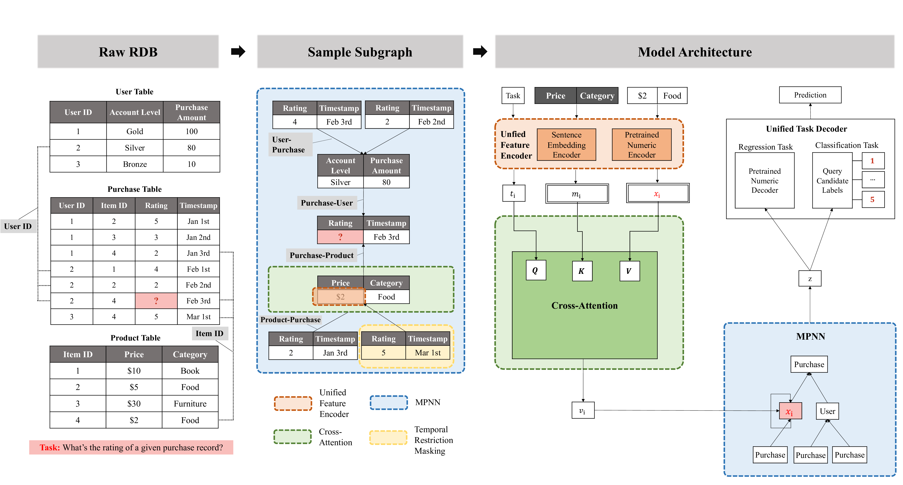

# Griffin: Towards a Graph-Centric Relational Database Foundation Model

**Source:** https://arxiv.org/abs/2505.05568
**Title:** Griffin: Towards a Graph-Centric Relational Database Foundation Model
**Date ingested:** 2026-04-29
**Type:** paper
**Authors:** Wang, Wang, Gan, Wang, Yang, Wipf, Zhang
**Venue:** ICML 2025

## Summary

- **What:** No pretrained foundation model existed for relational databases — all prior RDL methods required task-specific supervised training per database and task.
- **How:** Unified text and float encoders map all column types to a shared embedding space; cross-attention within rows and hierarchical GNN across tables handle schema-agnostic feature aggregation; 3-stage pretraining on 150M+ nodes via masked cell completion.
- **So what:** First explicitly pretrained RDB foundation model; architectural improvements alone (cross-attention + hierarchical aggregation) beat GNN baselines; pretraining most beneficial in low-data regimes.

## Challenges & Novelty

Relational databases have heterogeneous schemas — different table names, column names, data types, and value ranges across databases. A foundation model must encode all of these into a unified representation space without schema-specific engineering. The key challenge is that rows are internally structured (columns have meaning) but externally variable (different databases have different columns).

- **Unified encoders eliminate schema-specific engineering:** a pretrained text encoder (Nomic) handles categorical and text values; a pretrained float encoder (MLP trained with cosine loss) handles numerical values. Both map to the same $d$-dimensional space regardless of value type.
- **Cross-attention over row cells recovers column-specific signal:** mean-pooling all columns discards which cells are relevant to the prediction task. Cross-attention uses the task description (target column name) as a query and column names as keys — attending to the most task-relevant cells before aggregation.
- **Hierarchical aggregation stabilizes variable neighbor counts:** intra-relation mean pooling followed by inter-relation max pooling avoids the bias introduced when one relation type has many more neighbors than others.

## Relation to Prior Work

| Model | Multi-table | Schema-agnostic | Pretraining | Task type |
|---|---|---|---|---|
| HeteroGraphSAGE ([fey2024rdlposition](fey2024rdlposition.md)) | Yes | No | No | Supervised |
| [ranjan2025relationaltr](ranjan2025relationaltr.md) | Yes | Yes | Yes (MTP) | Foundation |
| [fey2025kumorfm](fey2025kumorfm.md) | Yes | Yes | No (ICL) | Foundation |
| [fey2025kumorfm2](fey2025kumorfm2.md) | Yes | Yes | Yes | Foundation |
| **Griffin** | Yes | Yes | Yes (masked cell) | Foundation |

- [ranjan2025relationaltr](ranjan2025relationaltr.md): both use masked/cell-level prediction as self-supervised pretraining; RT uses cell-level tokenization across tables, Griffin uses cross-attention within rows + GNN across tables.
- [fey2025kumorfm](fey2025kumorfm.md): KumoRFM v1 achieves better zero-shot performance via ICL (no pretraining); Griffin focuses on pretraining generalization instead.
- [gu2026relbenchv2](gu2026relbenchv2.md): Griffin's masked cell completion pretraining directly connects to RelBench v2's autocomplete tasks; ReDeLEx (integrated in v2) provides the pretraining corpus.

## Technical Details

**Architecture (3-component pipeline):**

1. *Unified data encoder.* Per-cell encoding:
   - Text/categorical: Nomic text encoder → $\mathbb{R}^d$
   - Numerical: pretrained float encoder (MLP with cosine loss: predict float from embedding and vice versa) → $\mathbb{R}^d$
   - Metadata: table names, column names, edge types provide additional context embeddings
   - Task embedding: text of the target column name distinguishes which cell to predict

2. *MPNN with cross-attention.* Within each row, cross-attention uses the task embedding + current node representation as query, column names as keys, and cell features as values — selects the most task-relevant cells. Then hierarchical aggregation: mean over neighbors of the same relation type, then max over relation types.

3. *Unified task decoder.*
   - Classification: inner products with text embeddings of category labels → handles arbitrary label sets without fixed classifier heads
   - Regression: pretrained float decoder (denormalized per task)

**3-stage pretraining:**
1. *Masked cell completion* on single-table datasets: predict masked column embedding from other cells (cosine loss)
2. *Joint supervised fine-tuning (SFT)*: single-table + RDB tasks simultaneously
3. *Task-specific fine-tuning*: downstream task adaptation

Pretraining covers 150M+ nodes across heterogeneous and temporal graphs.

## Experiments

- Griffin-unpretrained (architecture only) outperforms HeteroGraphSAGE on many RelBench tasks — cross-attention + hierarchical aggregation provide architectural gains independent of pretraining.
- Griffin-pretrained > Griffin-unpretrained in low-data regimes; gap narrows with more downstream data.
- Griffin-RDB-SFT is most beneficial when pretraining and downstream task domains overlap.
- Does not consistently beat individually fine-tuned task-specific models at high data regimes — foundation model behavior consistent with LLM literature.

## Entities & Concepts

- [relational-deep-learning](relational-deep-learning.md)
- [relational-entity-graph](relational-entity-graph.md)
- [relational-foundation-model](relational-foundation-model.md)
- [relbench](relbench.md)
- [autocomplete-tasks](autocomplete-tasks.md)
