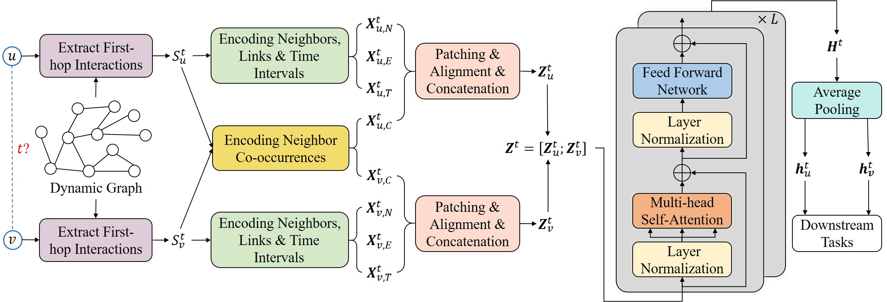

# DyGFormer: Towards Better Dynamic Graph Learning

**Source:** https://arxiv.org/abs/2303.13047
**Title:** Towards Better Dynamic Graph Learning with History Distillation
**Date ingested:** 2026-04-29
**Type:** paper
**Authors:** Yu, Cao, Petzold
**Venue:** NeurIPS 2023

## Summary

- **What:** Prior CTDGs (TGAT, TGN) compute source and destination embeddings independently, missing structural correlations, and truncate long histories via fixed-size sampling or lossy RNN compression.
- **How:** Extract full first-hop interaction histories for both nodes, apply temporal patching to handle variable sequence lengths, then encode both sequences jointly in a single Transformer with an explicit neighbor co-occurrence feature.
- **So what:** NeurIPS 2023 SOTA across all negative sampling strategies; first to show first-hop-only Transformer outperforms multi-hop GNNs on CTDGs.

## Challenges & Novelty

TGAT and TGN sample a fixed number of temporal neighbors per node, truncating long histories. TGN's memory module compresses history into a fixed-size vector via GRU — lossy and prone to gradient issues. Neither model explicitly captures the correlation between source and destination nodes' neighborhoods, which is a strong signal for link prediction.

- **Neighbor co-occurrence captures link propensity directly:** if source $u$ and destination $v$ share many historical neighbors, they are more likely to interact. DyGFormer encodes per-neighbor co-occurrence frequencies (how often each neighbor appears in $\mathcal{S}_u^t$ vs. $\mathcal{S}_v^t$) as a 2D feature — a direct structural similarity signal.
- **Patching solves the variable-length bottleneck:** instead of fixed-size sampling or RNN memory, patching divides each node's history into non-overlapping windows of $P$ events; the Transformer sees $\lceil |\mathcal{S}|/P \rceil$ patch tokens regardless of history length, keeping computation constant.
- **Joint Transformer over concatenated $u$-$v$ sequences:** attention flows both within each node's history and across the two nodes' histories — effectively computing a joint $(u, v)$ embedding in a single forward pass.

## Relation to Prior Work

| Model | Long history | $u$-$v$ correlation | Memory | First-hop only |
|---|---|---|---|---|
| [xu2020tgat](xu2020tgat.md) | Truncated (fixed-size) | No | No | No (2-hop) |
| [rossi2020tgn](rossi2020tgn.md) | GRU memory (lossy) | No | Yes | No |
| [trivedi2019dyrep](trivedi2019dyrep.md) | RNN (lossy) | No | Implicit | No |
| **DyGFormer** | Patching (lossless) | Yes (co-occurrence) | No | Yes |

- [xu2020tgat](xu2020tgat.md): DyGFormer reuses TGAT's Bochner time encoding but replaces 2-hop graph attention with a long first-hop Transformer sequence.
- [rossi2020tgn](rossi2020tgn.md): DyGFormer eliminates TGN's memory and GRU; patching handles the long-context problem that memory was designed to solve, without gradient issues.
- [chmura2026tgm](chmura2026tgm.md): DyGLib (DyGFormer's companion library) focuses on CTDG standardization; TGM supersedes it with broader CTDG+DTDG support.

## Technical Details

**Input:** interaction $(u, v, t)$. First-hop histories $\mathcal{S}_u^t$ and $\mathcal{S}_v^t$ — all prior interactions of $u$ (resp. $v$) before time $t$.

**Four encodings per interaction** (for each neighbor entry $w$ in $\mathcal{S}_*^t$):
- Neighbor features $\mathbf{X}_{*,N}^t$: node features of encountered neighbors
- Edge features $\mathbf{X}_{*,E}^t$: features on the interaction edge
- Time interval encoding $\mathbf{X}_{*,T}^t$: Bochner cosine/sine encoding of $\Delta t = t - t'$ (same as TGAT)
- **Neighbor co-occurrence** $\mathbf{X}_{*,C}^t$: 2D vector per neighbor counting its frequency in $\mathcal{S}_u^t$ and $\mathcal{S}_v^t$ respectively

**Patching.** Each history sequence is divided into non-overlapping patches of $P$ consecutive interactions. Adaptive $P$: larger histories use larger patches to keep the number of tokens constant. Each patch is flattened (all 4 features of $P$ interactions concatenated) → linear projection → patch token.

**Joint Transformer.** Concatenate patch tokens from both nodes: $\mathbf{Z}^t = [\mathbf{Z}_u^t;\, \mathbf{Z}_v^t]$. Standard pre-LN Transformer (ViT-style: GELU, LayerNorm before each block). Attention flows within and across both sequences simultaneously.

**Readout.** Average Transformer output rows belonging to $u$ (resp. $v$) → linear layer → $\mathbf{h}_u^t$, $\mathbf{h}_v^t$. Predict link with dot product + sigmoid.

**DyGLib.** Standardized CTDG evaluation pipeline: unified data format, same trainer for all methods, 13 datasets, 9 methods, three negative sampling strategies (random / historical / inductive). Identifies previously unreported implementation bugs in prior baselines.

## Experiments

- NeurIPS 2023 SOTA on most datasets across all three negative sampling strategies (random, historical, inductive) and both transductive/inductive settings.
- Historical and inductive negative sampling expose model differences that random-NS masks — simple baselines appear competitive under random NS but are easily distinguished under harder settings.
- Ablation: removing co-occurrence feature degrades performance most on dense graphs where shared-neighbor signal is strongest.
- Patching vs. fixed-size sampling: patching with full history consistently outperforms fixed-size sampling at equivalent compute budgets.

## Entities & Concepts

- [temporal-graph](temporal-graph.md)
